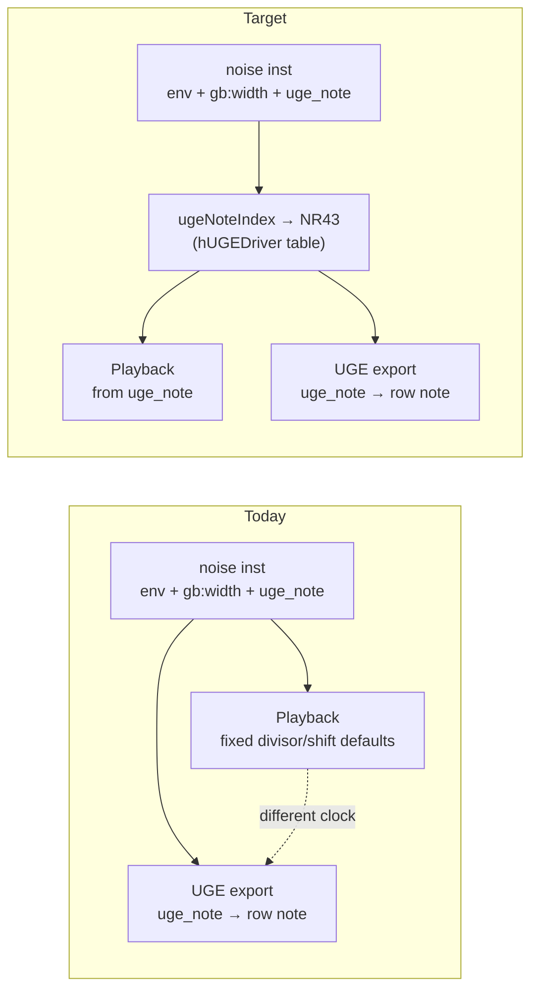

# Next Feature: Game Boy Noise UGE Playback Parity (revised)

## Recommendation

Implement [docs/features/gameboy-noise-uge-playback-parity.md](docs/features/gameboy-noise-uge-playback-parity.md) ([issue #149](https://github.com/kadraman/beatbax/issues/149)), **revised to match hUGETracker's authoring model**.

## Key design decision (user feedback)

hUGETracker noise **instruments** expose only what UGE stores: initial volume, volume sweep, noise mode (7-bit vs 15-bit), length, and subpatterns. **Noise pitch/brightness is set by the pattern-row note** — there is no divisor/shift on the instrument editor.

BeatBax already has BeatBax-only `divisor`/`shift` inst params (parsed, used in playback, never exported). Pushing authors to use them would be confusing because they have no hUGETracker equivalent.

**Decision: remove `divisor`/`shift` from Game Boy noise instruments entirely.** They are unused in all songs, have no hUGETracker equivalent, and no other chip uses those exact inst param names. Derive NR43 clock from `uge_note` (or legacy `note=`) via the hUGEDriver note-index table.

### What stays (different names, different meaning)


| Param                                | Chip                           | Meaning                                                                        |
| ------------------------------------ | ------------------------------ | ------------------------------------------------------------------------------ |
| `shift` inside `sweep=`              | Game Boy pulse1                | NR10 frequency sweep (e.g. `sweep=4,down,3`) — **keep**                        |
| `sweep_shift`                        | NES pulse                      | Hardware sweep shift — **keep**                                                |
| `noise_rate`                         | SMS (`0–3`), Spectrum (`0–31`) | Same name, **different semantics** — nomenclature debt (see below)             |
| `noise=clockShift,width,divisor` CSV | Game Boy (deprecated)          | Normalizes to `inst.noise` object; playback never read it — **remove or warn** |


### What goes (Game Boy noise only)


| Param                                        | Usage today                                                                   | Action                                             |
| -------------------------------------------- | ----------------------------------------------------------------------------- | -------------------------------------------------- |
| `divisor`, `shift`, `gb:divisor`, `gb:shift` | Top-level noise inst props; read in `noise.ts`, `pcmRenderer.ts`, `plugin.ts` | **Remove** from parser known-props, playback, docs |
| Defaults `divisor=3`, `shift=4`              | Silent fallback when omitted                                                  | **Replace** with `gb:uge_note` → NR43 lookup       |


## Instrument parameter nomenclature audit

BeatBax aims for **generic cross-chip params** where the concept is shared, and `**chip:`-prefixed params** where hardware semantics differ. Current state is mixed — this feature aligns Game Boy noise; broader cleanup is follow-up.

### Naming rules (target convention)


| Tier                       | Rule                                                | Examples                                                                 |
| -------------------------- | --------------------------------------------------- | ------------------------------------------------------------------------ |
| **Generic**                | Same meaning on every chip that supports it         | `type=`, `env=`, `note=`, `gm=`, `pan=`                                  |
| **Generic macros**         | FamiTracker-style software envelopes (tick-stepped) | `vol_env=`, `arp_env=`, `pitch_env=`, `duty_env=`                        |
| **Chip-prefixed**          | Hardware-specific or export-format-specific         | `gb:width`, `gb:pan`, `gb:uge_note`, `gg:pan`, `nes:noise_period`        |
| **Type-scoped unprefixed** | OK when param applies to one `type=` on one chip    | `wave=`, `duty=` (GB+NES pulse), `linear=` (NES triangle), `dmc_sample=` |


Parser supports `chip:key=value` via vendor prefix stripping in [peggy/index.ts](packages/engine/src/parser/peggy/index.ts). `gb:pan` and `gg:pan` already follow this pattern.

### What is already well-aligned


| Param                             | Status                                     |
| --------------------------------- | ------------------------------------------ |
| `type=`, `env=`, `note=`, `gm=`   | Generic across chips                       |
| `gb:pan`, `gg:pan`                | Chip-prefixed stereo                       |
| `vol_env`, `arp_env`, `pitch_env` | Generic macros (NES, SMS, Spectrum)        |
| `dmc_*`                           | Type-scoped NES DMC only                   |
| `duty`                            | Shared GB+NES pulse concept — keep generic |


### Inconsistencies found


| Issue               | Current                                   | Recommended                                                | Scope        |
| ------------------- | ----------------------------------------- | ---------------------------------------------------------- | ------------ |
| GB noise width      | `width=` and `gb:width=` both work        | `**gb:width=`** in docs; bare `width=` deprecation warning | This feature |
| GB export note      | `uge_note=` unprefixed                    | `**gb:uge_note=**` canonical; `uge_note=` alias            | This feature |
| GB noise clock      | `divisor`/`shift`                         | **Remove** — internal from `gb:uge_note`                   | This feature |
| Volume              | GB `volume=100` vs NES/SMS `vol=15`       | Document split; optional alias                             | Follow-up    |
| `noise_rate`        | SMS 0–3 vs Spectrum 0–31 same name        | `sms:noise_rate` / `ay:noise_rate`                         | Follow-up    |
| NES noise/sweep     | `noise_mode`, `sweep_en`, etc. unprefixed | `nes:` prefix with alias                                   | Follow-up    |
| Spectrum percussion | `tone_mix`, `noise_frames` unprefixed     | `ay:` prefix                                               | Follow-up    |


### Other chips — no `divisor`/`shift` impact

Removing GB `divisor`/`shift` does not affect NES `sweep_shift`, SMS `noise_rate`, or Spectrum `noise_rate`.

## hUGE-aligned authoring model

What authors set on a noise `inst` (matches hUGETracker):


| BeatBax param       | hUGETracker / UGE equivalent                                    |
| ------------------- | --------------------------------------------------------------- |
| `env`               | Initial volume + volume sweep                                   |
| `gb:width=7` / `15` | Noise mode (7-bit metallic vs 15-bit)                           |
| `length`            | Length enabled + length value                                   |
| `gb:uge_note=C-7`   | Pattern-row note for named hits (`uge_note=` accepted as alias) |


What authors do **not** set (removed from BeatBax):


| BeatBax param                                | Status                                                                                                |
| -------------------------------------------- | ----------------------------------------------------------------------------------------------------- |
| `divisor`, `shift`, `gb:divisor`, `gb:shift` | **Removed** — parser warns "unknown property"; playback ignores; derive clock from `uge_note` instead |
| `noise=clockShift,width,divisor` CSV         | **Removed** — was already deprecated and unused in playback                                           |


Recommended authoring (same mental model as hUGETracker):

```bax
inst kick  type=noise gb:width=7  env=14,down,1 length=16 gb:uge_note=C-6
inst snare type=noise gb:width=7  env=10,down,2 length=16 gb:uge_note=C-7
inst hat   type=noise gb:width=15 env=4,down,1  length=8  gb:uge_note=C-8

pat drums = kick hat snare hat
```

In hUGETracker, changing the snare's brightness means changing the **note in the pattern row** (e.g. C-7 → D-7). `gb:uge_note=` declares that row note for named-token hits.

## The problem (confirmed in code)

Today preview and export disagree because they use different frequency sources:

- **Playback** ([noise.ts](packages/engine/src/chips/gameboy/noise.ts)): hardcoded defaults `divisor=3`, `shift=4` unless BeatBax-only params are set — ignores `uge_note=`.
- **UGE export** ([ugeWriter.ts](packages/engine/src/export/ugeWriter.ts)): writes `uge_note` as the pattern-row note index; instrument block has env + noise mode only (per [uge-v6-spec.md](docs/formats/uge-v6-spec.md)).

[uge-export-guide.md](docs/exports/uge-export-guide.md) explicitly says `uge_note=` is export-only and playback uses "noise parameters" — which today means the wrong thing (divisor/shift defaults, not the note).




## Implementation approach (revised phases)

### Phase 1 — hUGEDriver note table audit

- Locate or port hUGEDriver's noise note-index → NR43 (`divisor` + `shift`) mapping into engine (new module e.g. `packages/engine/src/chips/gameboy/noiseNoteTable.ts`).
- Document how `gb:width=7` metallic mode adjusts the note index (+72 offset per existing export behavior in [gb_percussion_demo.bax](songs/gameboy/instruments/gb_percussion_demo.bax)).
- Golden fixtures: kick (`C-6`), snare (`C-7`), hat (`C-8`) — assert derived NR43 matches what UGE row note would produce.
- Key files: [ugeWriter.ts](packages/engine/src/export/ugeWriter.ts) (`hugeTrackerNoteToIndex`), [noise.ts](packages/engine/src/chips/gameboy/noise.ts), [pcmRenderer.ts](packages/engine/src/audio/pcmRenderer.ts).

### Phase 2 — Shared mapping + remove divisor/shift

- `resolveNoisePlayback(inst, noteContext)`:
  1. Resolve UGE note index from `uge_note=` (named hits) or explicit pattern note / legacy `note=`.
  2. Apply `gb:width=7` metallic index offset if applicable.
  3. Look up NR43 divisor/shift from shared table (internal only — not author-facing).
  4. Combine with `env`, `length`, width mode for LFSR playback.
- Wire into [noise.ts](packages/engine/src/chips/gameboy/noise.ts), [pcmRenderer.ts](packages/engine/src/audio/pcmRenderer.ts), [plugin.ts](packages/engine/src/chips/gameboy/plugin.ts).
- **Remove** `divisor`/`shift` from `INST_TYPE_PROPS.noise` in [peggy/index.ts](packages/engine/src/parser/peggy/index.ts) — unknown-property warnings if present in old songs.
- Remove `parseNoiseValue` CSV path (`noise=clockShift,width,divisor`) or leave with hard deprecation warning.
- Update tests: [chip-registry.test.ts](packages/engine/tests/chip-registry.test.ts) (programmatic `divisor`/`shift` inst), serialization tests.
- Update [docs/features/gameboy-noise-uge-playback-parity.md](docs/features/gameboy-noise-uge-playback-parity.md) and [gameboy-uge-instrument-subpatterns.md](docs/features/gameboy-uge-instrument-subpatterns.md) proposed syntax (subpattern steps should use note overrides, not divisor/shift).

### Phase 3 — UGE preview mode

- `previewMode: 'uge' | 'legacy'` in app-core playback (default `**uge`** for Game Boy noise once mapping lands, or opt-in first if backwards-compat risk is high).
- Settings toggle in web/desktop near transport or export.
- Badge when UGE preview is active so authors know preview matches export path.

### Phase 4 — Docs, examples, and **create missing spec files**

**Document inventory** (what exists today):


| Path                                                                                                     | Status                  | Action in this feature                                                                                     |
| -------------------------------------------------------------------------------------------------------- | ----------------------- | ---------------------------------------------------------------------------------------------------------- |
| [docs/features/gameboy-noise-uge-playback-parity.md](docs/features/gameboy-noise-uge-playback-parity.md) | **Exists** (`proposed`) | **Revise in place** — hUGE model, remove `divisor`/`shift`, add `gb:uge_note`                              |
| [docs/grammar/instrument-parameters.md](docs/grammar/instrument-parameters.md)                           | **Does not exist**      | **Create** — author-facing naming matrix (stub OK: generic / macro / chip-prefixed tiers + GB noise table) |
| [docs/features/instrument-parameter-nomenclature.md](docs/features/instrument-parameter-nomenclature.md) | **Does not exist**      | **Create** — `status: proposed`; cross-chip migration phases from audit (implementation deferred)          |


Other doc updates (existing files only):

- **Standardize Game Boy noise examples on chip-prefixed params:**
  - `gb:width=7` (not bare `width=7`)
  - `gb:uge_note=C-7` as canonical; keep `uge_note=` as accepted alias in parser/export
- Update [instrument-meta.ts](packages/app-core/src/editor/instrument-meta.ts): `width` → document as `gb:width`; add `gb:uge_note` to autocomplete.
- Update [docs/grammar/instruments.md](docs/grammar/instruments.md), [docs/exports/uge-export-guide.md](docs/exports/uge-export-guide.md), [docs/chips/gameboy/composition_guide.md](docs/chips/gameboy/composition_guide.md), [docs/exports/wav-export-guide.md](docs/exports/wav-export-guide.md), ui-contributions, example songs.
- Clarify: hUGETracker noise octave labels (C-6, C-7) are clock-rate labels, not musical pitch.

### Phase 4b — Create cross-chip nomenclature feature spec (docs only)

Create [docs/features/instrument-parameter-nomenclature.md](docs/features/instrument-parameter-nomenclature.md) using [FEATURE_TEMPLATE.md](docs/features/FEATURE_TEMPLATE.md). No code in this step — spec only.

Minimum sections to draft from the audit above:

- **Summary** — generic vs `chip:`-prefixed inst params across plugins
- **Problem** — `noise_rate` collision (SMS vs Spectrum), unprefixed NES/Spectrum fields
- **Migration Path** — alias + deprecation phases per chip (no implementation yet)
- **Open Questions** — e.g. `vol` vs `volume`, timeline for bare-name removal
- **References** — link to [instrument-parameters.md](docs/grammar/instrument-parameters.md) (created in Phase 4)

Implementation of nomenclature migrations remains a **separate PR** after the spec is reviewed.

### Follow-up implementation (after docs exist)


| Work                                                   | Blocked on                                          |
| ------------------------------------------------------ | --------------------------------------------------- |
| Cross-chip renames (`sms:noise_rate`, `nes:`*, `ay:*`) | `instrument-parameter-nomenclature.md` approved     |
| Grammar matrix expansion                               | `instrument-parameters.md` stub landed in parity PR |


**Do not** fold cross-chip nomenclature into [gameboy-noise-uge-playback-parity.md](docs/features/gameboy-noise-uge-playback-parity.md) — different scope and chips.

Phased order:

1. GB noise parity (code + revise existing parity feature doc + create two new docs)
2. Cross-chip nomenclature implementation (per new feature spec)

## Acceptance criteria

- Named noise hit with `uge_note=C-7` sounds the same in preview (UGE mode) as after UGE export + hUGETracker playback, for representative kick/snare/hat/tom fixtures.
- Authors never need `divisor`/`shift` — params removed; clock derived internally from `uge_note`.
- If old `.bax` files contain `divisor`/`shift`, parser emits unknown-property warning and values are ignored.
- [instrument-parameters.md](docs/grammar/instrument-parameters.md) and [instrument-parameter-nomenclature.md](docs/features/instrument-parameter-nomenclature.md) **created** (stubs acceptable).
- Game Boy noise docs/examples use `gb:width` and `gb:uge_note` (with `uge_note=` alias); no `divisor`/`shift`.

## What comes after

1. [gameboy-uge-instrument-subpatterns.md](docs/features/gameboy-uge-instrument-subpatterns.md) — hUGE instrument subpatterns (also hUGE-native)
2. [song-timing-pattern-grid-inspector.md](docs/features/song-timing-pattern-grid-inspector.md) — UGE readiness warnings
3. [spectrum-cpc-arkos-exporter.md](docs/features/spectrum-cpc-arkos-exporter.md) — Spectrum export follow-up

## Estimated effort

**Medium** — core work is porting the hUGEDriver note table and rewiring playback. Removing unused `divisor`/`shift` is a small cleanup (3 playback files + parser known-props + docs). No breaking change for any committed song (zero `.bax` files use them).
