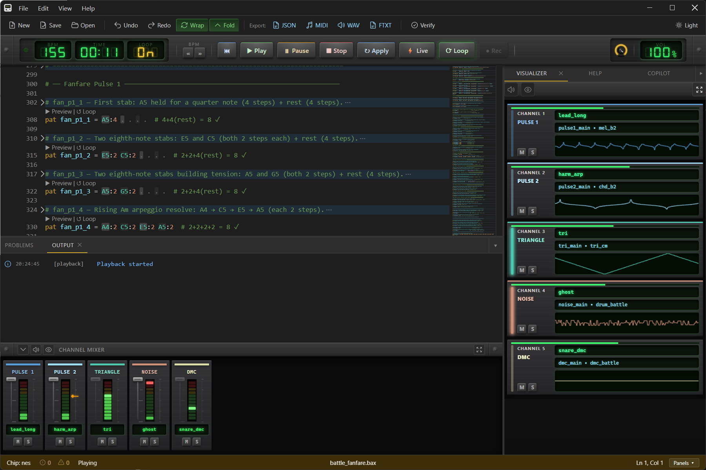

[](https://github.com/kadraman/beatbax/actions/workflows/ci.yml) [](https://github.com/kadraman/beatbax/actions/workflows/desktop-build.yaml) [](https://github.com/kadraman/beatbax/actions/workflows/beatbax-orchestration.yaml)

<p align="center">
  
</p>
<p align="center">
  <a href="https://github.com/kadraman/beatbax/releases">
    
  </a>
  <a href="https://app.beatbax.com">
    
  </a>
</p>

# BeatBax

**BeatBax** is a live coding language and creative toolchain for making chiptune music in the style of classic 8-bit and 16-bit computers and game consoles.
Instead of using a Tracker or DAW, you write songs in a simple but powerful text grammar — instruments, melodies, basslines, and beats — and BeatBax plays them back with hardware-faithful chip sound.

Songs declare a target chip (`chip gameboy`, `chip nes`, `chip sms`, …). The same grammar drives editing, live playback, WAV/MIDI export, and chip-specific tracker or register formats where available.

**Supported chips today:**

| Chip | Directive | Voices (overview) | Notable exports |
|------|-----------|-------------------|-----------------|
| Game Boy (DMG-01) | `chip gameboy` | 2× pulse, wave, noise | hUGETracker `.uge`, WAV, MIDI |
| NES (Ricoh 2A03) | `chip nes` | 2× pulse, triangle, noise, DMC | FamiTracker text, WAV, MIDI |
| Sega Master System / Game Gear (SN76489) | `chip sms` / `chip gg` | 3× tone, noise | VGM, WAV |
| ZX Spectrum 128 / Amstrad CPC (AY) | `chip spectrum-128` / `chip cpc` | 3× tone (+ noise/envelope) | WAV (+ format work ongoing) |

More backends are planned — see [ROADMAP.md](ROADMAP.md).

<p align="center">
  
  <br/>
  <em>BeatBax Desktop</em>
</p>

One goal of BeatBax is **homebrew-friendly export**: where possible, songs can be written out to tracker or driver formats games can consume (for example [hUGETracker](https://nickfa.ro/wiki/HUGETracker) `.uge` for Game Boy, [FamiTracker](http://famitracker.com/) text for NES, VGM for PSG targets). Common formats such as **WAV** and **MIDI** are available across chips; chip-specific formats are listed on the [ROADMAP](ROADMAP.md).

Creating chiptunes is rewarding but can be hard and time-consuming. **BeatBax Desktop** also includes **BeatBax Copilot*** — an AI assistant (with BYOK model) to help you write and edit songs. It is not a replacement for creativity, but it can help with construction, editing, and typical chiptune techniques in the BeatBax grammar.

## Features

- **Simple text-based grammar** — author instruments, patterns, sequences, and channel arrangements in `.bax` files
- **Multi-chip playback** — Game Boy, NES, SMS/Game Gear, and Spectrum/CPC AY backends with chip-accurate voices, envelopes, and software macros
- **Instrument macros** — pitch, volume, duty/timbre, and arp envelopes (plus chip-specific extras such as Game Boy `subpat` for hUGETracker)
- **Built-in effects** — vibrato, arpeggio, portamento, pitch bend, volume slide, tremolo, pan, note cut, retrigger, echo, and chip-specific effects (e.g. pulse sweep)
- **Reusable instrument libraries** — share instruments via `.ins` files; import locally or from GitHub / the web
- **Export formats** — WAV and MIDI for supported chips; chip-specific exports (UGE, FamiTracker, VGM, …) via plugins
- **Desktop IDE** — Electron + React client with native file I/O, export, Copilot, channel mixer, pattern grid, and Monaco editor
- **Web-lite browser client** — try-in-browser editor and playback for demos and light edits
- **BeatBax Copilot*** — AI assistant in the desktop app (BYOK / local Ollama)
- **CLI** — `play`, `verify`, `export`, `inspect`, sample conversion, and headless workflows
- **Extensible architecture** — additional chip backends and exporters as plugins without changing the core song grammar

> *BeatBax Copilot (desktop only) uses your own OpenAI-compatible provider for cloud models (BYOK). Local Ollama or LM Studio need no API key. Cloud API keys are stored in the OS secure credential store on your machine only.

## Grammar

A `.bax` song picks a chip, then defines instruments, effects, patterns, sequences, and a channel arrangement. The example below is a **Game Boy** song; for NES, SMS, AY, and other targets see [TUTORIAL.md](TUTORIAL.md) and [`songs/`](songs/).

```bash
song name "An example song"

chip gameboy
bpm 128

# Import a shared instrument library (local or remote)
import "github:kadraman/beatbax-instruments/main/melodic.ins"

# Instruments (types and fields depend on the active chip)
inst lead  type=pulse1 duty=50  env={"level":12,"direction":"down","period":1,"format":"gb"}
inst bass  type=pulse2 duty=25  env={"level":10,"direction":"down","period":1,"format":"gb"}
inst wave1 type=wave   wave=[0,2,3,5,6,8,9,11,12,11,9,8,6,5,3,2,0,2,3,5,6,8,9,11,12,11,9,8,6,5,3,2]
inst snare type=noise  env={"level":12,"direction":"down","period":1,"format":"gb"}

# Named effect presets (portable across chips unless noted)
effect wobble   = vib:8,4       # Vibrato: depth 8, rate 4
effect fadeIn   = volSlide:+5   # Volume fade-in
effect arpMajor = arp:4,7       # Major chord arpeggio (root + major 3rd + 5th)

# Patterns
pat melody   = C5<wobble> E4<fadeIn> G4<arpMajor> C5
pat bass_pat = C3 . G2<port:C4,50> .
pat drum_pat = snare . snare snare

# Sequences
seq lead_seq  = melody:inst(lead) melody:inst(lead)
seq bass_seq  = bass_pat:inst(bass)*2
seq wave_seq  = melody:oct(-1):inst(wave1) melody:oct(-2):inst(wave1)
seq drums_seq = drum_pat*2

# Channel arrangement
channel 1 => inst lead seq lead_seq
channel 2 => inst bass seq bass_seq
channel 3 => inst wave1 seq wave_seq
channel 4 => inst snare seq drums_seq

play auto repeat
```

See the [TUTORIAL](TUTORIAL.md) for chip-by-chip walkthroughs.

## Instruments

Instruments are declared with `inst <name> …` and assigned to channels. **`type=` and properties are chip-specific** — a Game Boy `type=wave` instrument is not the same as an NES `type=triangle` or SMS `type=tone1`.

| Concept | Examples | Notes |
|---------|----------|-------|
| Chip directive | `chip gameboy`, `chip nes`, `chip sms` | Selects the voice model and valid instrument types |
| Instrument type | `pulse1`, `noise`, `triangle`, `dmc`, `tone1`, … | Depends on the chip |
| Envelopes / volume | `env=…`, `vol=…`, `vol_env=[…]` | Hardware and/or software macros per chip |
| Timbre | `duty=…`, `wave=[…]`, `noise_mode=…` | Pulse width, wavetables, noise modes, … |
| Soft macros | `pitch_env=`, `arp_env=`, `duty_env=` | Shared macro style where the chip supports them |
| Defaults / export hints | `note=`, `uge_note=`, `gm=` | Percussion mapping, GM program, tracker export hints |

Reusable libraries: `import "…/*.ins"` (local or remote). Chip walkthroughs: [TUTORIAL.md](TUTORIAL.md). Game Boy field reference: [docs/grammar/instruments.md](docs/grammar/instruments.md). Examples: [`songs/`](songs/).

### Example: Game Boy types

| Type | Syntax | Role | Notes |
|------|--------|------|-------|
| Pulse 1 | `type=pulse1` | Lead / melody | Duty + optional hardware **sweep** |
| Pulse 2 | `type=pulse2` | Harmony / bass | Duty (no hardware sweep) |
| Wave | `type=wave` | Pads / bass / wavetable | 32-nibble Wave RAM via `wave=` |
| Noise | `type=noise` | Drums / FX | LFSR noise; `gb:width=` / `uge_note=` for percussion |

```bax
inst lead  type=pulse1 duty=50 env=gb:12,down,1
inst bass  type=pulse2 duty=25 env=gb:10,down,1
inst pad   type=wave   wave=[0,2,4,6,8,10,12,14,15,14,12,10,8,6,4,2] volume=100
inst snare type=noise  gb:width=7 env=gb:12,down,1 uge_note=C-7
```

## Effects

Most effects work as **note modifiers** (`C4<vib:8,4>`) or named `effect` presets. Availability can vary by chip and export target (live/WebAudio vs tracker formats).

| Effect | Syntax | Description |
|--------|--------|-------------|
| Pan | `pan:L\|C\|R` (chip variants e.g. `gb:pan:…`, `gg:pan:…`) | Stereo / hard pan |
| Vibrato | `vib:<depth>,<rate>[,<wave>[,<dur>[,<delay>]]]` | Pitch LFO |
| Portamento | `port:<speed>` or `port:<note>,<speed>` | Pitch glide |
| Pitch bend | `bend:<semitones>[,<curve>[,<delay>[,<time>]]]` | Musical pitch bend |
| Sweep | `sweep:<time>,<dir>,<shift>` | Hardware pulse sweep (where supported) |
| Arpeggio | `arp:<offset1>,<offset2>[,…]` | Rapid interval cycling |
| Volume slide | `volSlide:<±amount>` | Per-tick volume automation |
| Tremolo | `trem:<depth>,<rate>[,<wave>]` | Amplitude LFO |
| Note cut | `cut:<ticks>` | Gate note after N ticks |
| Retrigger | `retrig:<rate>[,<vol>]` | Rhythmic note restart (live/WebAudio) |
| Echo | `echo:<delay>,<feedback>` | Feedback delay (live/WebAudio) |

Annotated examples live under [songs/features/](songs/features/).

**Export compatibility (typical):**

| Effect | JSON | MIDI | Chip trackers / VGM | WAV |
|--------|------|------|---------------------|-----|
| pan, vib, port, arp, volSlide, cut | ✓ | ✓ | ✓ (where mapped) | ✓ |
| bend | ✓ | ✓ | Approx. / mapped | ✓ |
| sweep | ✓ | ✓ | Instrument-level / chip-specific | ✓ |
| trem | ✓ | ✓ | Metadata or mapped | ✓ |
| retrig, echo | ✓ | ✓ | — | — |

## CLI

The BeatBax CLI (`@beatbax/cli`) can **verify**, **play**, **export**, **inspect**, and convert samples from the terminal.

### Install from npm

```powershell
# One-off
npx @beatbax/cli --help

# Or install globally (exposes the `beatbax` command)
npm install -g @beatbax/cli
beatbax --help
```

Optional better headless audio quality:

```powershell
npm install -g --save-optional speaker
```

> **Windows note:** npm has limitations passing some flag arguments through `npm run`. Prefer the global `beatbax` command, `npx @beatbax/cli`, or `node bin/beatbax` / `bin\beatbax` from a clone.

### Run from source

Clone the repo, then `npm install` and `npm run build-all` (see [Development](#development)). From the repo root:

```powershell
node bin/beatbax --help
# or: npm run cli:dev
```

To expose a local build as `beatbax` on your PATH, use `npm link` after `build-all` (also under [Development](#development)).

### Commands

Examples below use `beatbax` (npm global / `npm link`). From a clone without linking, substitute `node bin/beatbax`.

```powershell
# Validate a song file
beatbax verify songs/sample.bax

# Play (headless by default in Node.js)
beatbax play songs/sample.bax
beatbax play songs/sample.bax --browser   # open Web UI instead

# Export (formats depend on chip / installed plugins)
beatbax export json songs/sample.bax output.json
beatbax export midi songs/sample.bax output.mid
beatbax export uge  songs/sample.bax output.uge
beatbax export wav  songs/sample.bax output.wav

# Convert a WAV into a raw NES DMC sample
beatbax convert wav2dmc samples/wav/low_kick.wav --dmc-rate 15 --emit-inst

# Inspect a .bax or .uge file
beatbax inspect songs/sample.bax
beatbax inspect output.uge --json
```

### Play options

| Flag | Description |
|------|-------------|
| `--browser` / `-b` | Launch browser-based playback via Vite |
| `--headless` | Force Node.js headless playback (default) |
| `--backend <name>` | `auto` (default), `node-webaudio`, `browser` |
| `--sample-rate <hz>` / `-r` | PCM sample rate (default: 44100) |
| `--buffer-frames <n>` | Offline render buffer size |

### Export options

| Flag | Applies to | Description |
|------|------------|-------------|
| `--out <path>` | all | Output file path |
| `--duration <seconds>` | midi, wav | Override auto-calculated duration |
| `--channels <list>` | midi, wav | Export only listed channels (e.g. `1,3`) |

### NES DMC sample conversion

`convert wav2dmc` turns a 16-bit mono/stereo PCM WAV into a raw NES `.dmc` sample for `type=dmc` instruments:

```powershell
beatbax convert wav2dmc samples/wav/low_kick.wav --dmc-rate 15 --emit-inst --play
```

The output is a headerless DMC byte stream. Playback settings live on the BeatBax instrument, so the converter prints the matching line when you pass `--emit-inst`:

```bax
inst kick type=dmc dmc_rate=15 dmc_loop=false dmc_sample="local:samples/wav/kick.dmc"
```

Useful controls:

| Flag | Description |
|------|-------------|
| `--dmc-rate <0-15>` / `-q` | DMC rate used for encoding and playback preview. `15` is fastest/highest quality; lower values are darker and shorter-bandwidth. |
| `--dmc-loop` | Use `dmc_loop=true` in emitted snippets and loop the preview. |
| `--trim-silence <db>` / `--no-trim-silence` | Trim quiet WAV tails before encoding; this is often the most useful control for reducing DMC hiss. |
| `--tail-ms <ms>` | Keep a small amount of audio after the last above-threshold sample. |
| `--fade-out-ms <ms>` | Fade the end before encoding to avoid noisy/clicky tails. |
| `--max-duration-ms <ms>` | Hard cap the source duration before encoding. |
| `--ntsc` / `--pal` | Select the DMC hardware rate table (`--ntsc` is default). |

### Headless audio fallback chain

1. `speaker` npm module (best quality — install with `npm install --save-optional speaker`)
2. `play-sound` wrapper (cross-platform system players)
3. System command (`PowerShell`/`afplay`/`aplay`)

### WAV export

WAV export uses a direct PCM renderer (`packages/engine/src/audio/pcmRenderer.ts`) with no WebAudio dependency. It renders the active chip’s voices to stereo 16-bit PCM (sample rate from settings / CLI defaults) for offline export and headless playback. See [docs/exports/wav-export-guide.md](docs/exports/wav-export-guide.md).

## Desktop

BeatBax Desktop ships the full IDE: native menus and file I/O, export, Copilot, channel mixer, pattern grid, advanced Monaco editor, and cross-platform
installers. See [apps/desktop/README.md](apps/desktop/README.md) for more details. For **local Copilot** with Ollama (no API key, on-device inference), see [docs/features/copilot-local-ollama.md](docs/features/copilot-local-ollama.md).

### Download

Grab prebuilt installers from [GitHub Releases](https://github.com/kadraman/beatbax/releases) (tags `desktop-v*` — Windows, macOS, and Linux).

**Installers are not code-signed yet.** Windows SmartScreen and macOS Gatekeeper may warn on first install or launch. See `README.txt` in the install folder (next to the BeatBax application) for platform-specific steps.

### Run from source

Clone the repo, then `npm install` and `npm run build-all` (see [Development](#development)). Start the desktop app with:

```powershell
npm run desktop:dev
```

Other scripts: `desktop:build`, `desktop:test`, `desktop:dist` — see [apps/desktop/README.md](apps/desktop/README.md).

## Web UI

The browser app is the **web-lite** profile: a lighter try-in-browser surface for editing, validation, and playback.
Export, Copilot, mixer, and other IDE features require the desktop app. See [apps/web-ui/README.md](apps/web-ui/README.md) for more details.

### Try online

Open the latest deployed build at [app.beatbax.com](https://app.beatbax.com) — no install required. Save downloads a `.bax` file; it does not write to an arbitrary disk path.

### Run from source

Clone the repo, then `npm install` and `npm run build-all` (see [Development](#development)). Start the Vite dev server with:

```powershell
npm run web-ui:dev
```

Then open [http://localhost:5173](http://localhost:5173). Engine rebuild / cache tips are under [Development](#development).

## Project layout

```
beatbax/
├── apps/
│   ├── desktop/               # BeatBax Desktop (Electron + React, desktop-full)
│   └── web-ui/                # BeatBax web-lite browser client
│
├── packages/
│   ├── engine/                # Live-coding language and runtime
│   ├── app-core/              # Shared client logic (web-lite + desktop-full)
│   ├── cli/                   # Command-line interface (@beatbax/cli)
│   ├── ui-tokens/             # Shared UI tokens (channel colours, etc.)
│   └── plugins/
│       ├── chip-sms           # Sega Master System / Game Gear SN76489
│       ├── chip-spectrum-128  # ZX Spectrum 128 / Amstrad CPC AY-3-8912
│       ├── export-famitracker # FamiTracker text exporter
│       ├── export-vgm         # VGM exporter
│       └── export-arkos       # Arkos Tracker exporter
│
├── bin/
│   └── beatbax                # CLI entry point (Node shebang wrapper)
│
├── songs/                     # Example .bax files (per chip + features)
├── samples/                   # Sample WAVs / DMC assets used by songs and tools
├── docs/                      # Documentation
├── schema/                    # JSON Schema (e.g. AST)
├── scripts/                   # Build and tooling scripts
├── tests/                     # Root-level integration tests
├── examples/                  # Standalone code examples
└── media/                     # Logo and promotional assets
```

## Documentation index

| Topic | Location |
|-------|----------|
| Tutorial | [TUTORIAL.md](TUTORIAL.md) |
| Roadmap | [ROADMAP.md](ROADMAP.md) |
| Desktop app | [apps/desktop/README.md](apps/desktop/README.md) |
| Web-lite client | [apps/web-ui/README.md](apps/web-ui/README.md) |
| Dev notes | [DEVNOTES.md](DEVNOTES.md) |
| Contributing guide | [CONTRIBUTING.md](CONTRIBUTING.md) |
| Releasing (npm + desktop) | [docs/releasing.md](docs/releasing.md) |

## Development

For local development from a clone (shared by CLI, Desktop, and Web UI):

```powershell
git clone https://github.com/kadraman/beatbax.git
cd beatbax
npm install
npm run clean-all
npm run build-all
npm test
```

Then start the tool you need:

```powershell
npm run desktop:dev          # Desktop IDE
npm run web-ui:dev           # Web-lite at http://localhost:5173
node bin/beatbax --help      # CLI from the checkout
# or: npm run cli:dev
```

Published / hosted entry points (no clone) stay in the sections above: npm for the CLI, GitHub Releases for Desktop, [app.beatbax.com](https://app.beatbax.com) for Web.

### Workspace scripts

| Script | Description |
|--------|-------------|
| `npm run engine:build` | Build `@beatbax/engine` |
| `npm run cli:build` | Build `@beatbax/cli` |
| `npm run web-ui:dev` | Start Web UI dev server |
| `npm run desktop:dev` | Start the desktop Electron + React app |
| `npm run desktop:build` | Build the desktop app bundles |
| `npm run desktop:test` | Run desktop unit tests |
| `npm run desktop:dist` | Create desktop installers |
| `npm run cli:dev` | Build engine + run CLI dev entry |
| `npm run build-all` | Full monorepo build |
| `npm run clean-all` | Clean all dist outputs |
| `npm test` | Run all test suites |

### Engine → Web UI workflow

```powershell
# Terminal 1
npm run web-ui:dev

# Terminal 2 — after changing packages/engine/src/
npm run engine:build
# Then press r+Enter in Terminal 1 to restart Vite
```

If the restart doesn't pick up changes:

```powershell
cd apps/web-ui && npm run dev:clean   # --force bypasses Vite cache
```

### Engine → CLI workflow

```powershell
npm run engine:build
node scripts/link-local-engine.cjs   # copies dist into node_modules
node bin/beatbax play songs/sample.bax --headless
```

### Global symlink

```powershell
npm run build-all
npm link
beatbax --help
```

## Contributing

Contributions welcome. Open issues for features and PRs against `main`. Keep changes small and include tests for parser/expansion behaviour. See [CONTRIBUTING.md](CONTRIBUTING.md).

## License

MIT — see [LICENSE](LICENSE).
