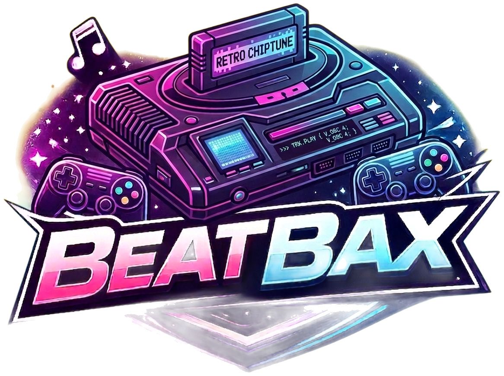
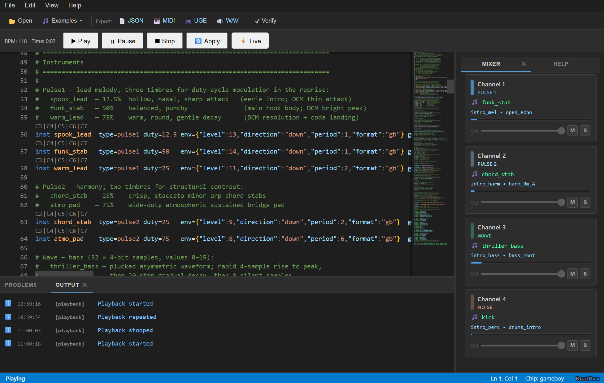

<p align="center"></p>

# BeatBax

[](https://github.com/kadraman/beatbax/actions/workflows/ci.yml) [](https://github.com/kadraman/beatbax/actions/workflows/beatbax-orchestration.yaml)

**BeatBax** is a live-coding language and toolchain for composing retro-console chiptunes. Target hardware is the Nintendo Game Boy (DMG-01) APU. The architecture is designed so additional chip backends (NES, SID, Genesis) can be added as plugins without reworking the core language or scheduler.

---

## Features

- **Live-coding language** — instruments, patterns, sequences, transforms, and named effect presets in a concise `.bax` syntax
- **11 effects** — pan, vibrato, portamento, pitch bend, sweep, arpeggio, volume slide, tremolo, note cut, retrigger, and echo
- **Authentic Game Boy APU model** — 4-channel emulation (pulse1, pulse2, wave, noise) with hardware-accurate envelopes, duty cycles, wavetables, and LFSR noise
- **Deterministic scheduler** — tick-accurate, reproducible playback independent of system timer jitter
- **Multiple audio backends** — browser WebAudio, Node.js headless playback, and an offline PCM renderer for WAV export
- **4 export formats** — ISM JSON, 4-track MIDI, hUGETracker v6 (`.uge`), WAV
- **UGE import** — read and inspect existing hUGETracker v1–v6 files
- **Reusable instrument libraries** — `.ins` files with local and remote (`github:`, `https://`) import, cycle detection, and last-wins merging
- **Web UI IDE** — Monaco editor, live validation, CodeLens previews, channel mixer, ⚡ Live mode, and command palette
- **BeatBax Copilot** — AI chat assistant in the Web UI backed by any OpenAI-compatible endpoint
- **CLI** — `play`, `verify`, `export`, and `inspect` commands for headless workflows

---

<p align="center"></p>

*An example screenshot of the BeatBax Web-UI.*

---

## Quick start

```powershell
git clone https://github.com/kadraman/beatbax.git
cd beatbax
npm install
npm run build-all
node bin/beatbax play songs/sample.bax
```

Open the Web UI:

```powershell
npm run web-ui:dev
# → http://localhost:5173
```

---

## Language overview

A `.bax` song defines instruments, effects, patterns, sequences, and a channel arrangement.

```
song name "An example song"

chip gameboy
bpm 128

# Import a shared instrument library (local or remote)
import "github:beatbax/instruments-gb/main/melodic.ins"

# Instruments
inst lead  type=pulse1 duty=50  env={"level":12,"direction":"down","period":1,"format":"gb"}
inst bass  type=pulse2 duty=25  env={"level":10,"direction":"down","period":1,"format":"gb"}
inst wave1 type=wave   wave=[0,3,6,9,12,9,6,3,0,3,6,9,12,9,6,3]
inst snare type=noise  env={"level":12,"direction":"down","period":1,"format":"gb"}

# Named effect presets
effect wobble   = vib:8,4       # Vibrato: depth 8, rate 4
effect fadeIn   = volSlide:+5   # Volume fade-in
effect arpMajor = arp:4,7       # Major chord arpeggio (root + major 3rd + 5th)

# Patterns
pat melody   = C5<wobble> E4<fadeIn> G4<arpMajor> C5
pat bass_pat = C3 . G2<port:C4,50> .
pat drum_pat = snare . snare snare

# Sequences
seq lead_seq  = melody:inst(lead) melody:inst(lead)
seq bass_seq  = bass_pat:inst(bass)*2
seq wave_seq  = melody:oct(-1):inst(wave1) melody:oct(-2):inst(wave1)
seq drums_seq = drum_pat*2

# Channel arrangement
arrange main = lead_seq | bass_seq | wave_seq | drums_seq

play auto repeat
```

The full language reference is in [docs/language/](docs/language/).

---

## Effects

| Effect | Syntax | Description |
|--------|--------|-------------|
| Pan | `pan:L\|C\|R` or `gb:pan:-1.0…1.0` | Stereo panning |
| Vibrato | `vib:<depth>,<rate>[,<wave>[,<dur>[,<delay>]]]` | Pitch LFO |
| Portamento | `port:<speed>` | Smooth pitch glide from previous note |
| Pitch bend | `bend:<semitones>[,<curve>[,<delay>[,<time>]]]` | Musical pitch bend |
| Sweep | `sweep:<time>,<dir>,<shift>` | GB hardware NR10 frequency sweep |
| Arpeggio | `arp:<offset1>,<offset2>[,…]` | Rapid note cycling to simulate chords |
| Volume slide | `volSlide:<±amount>` | Per-tick volume automation |
| Tremolo | `trem:<depth>,<rate>[,<wave>]` | Amplitude LFO |
| Note cut | `cut:<ticks>` | Gate note after N ticks |
| Retrigger | `retrig:<rate>[,<vol>]` | Rhythmic note restart (WebAudio only) |
| Echo | `echo:<delay>,<feedback>` | Feedback delay (WebAudio only) |

Annotated examples for every effect are in [songs/effects/](songs/effects/).

**Export compatibility:**

| Effect | JSON | MIDI | UGE | WAV |
|--------|------|------|-----|-----|
| pan, vib, port, arp, volSlide, cut | ✓ | ✓ | ✓ | ✓ |
| bend | ✓ | ✓ | Approx. (3xx portamento) | ✓ |
| sweep | ✓ | ✓ | Instrument-level only | ✓ |
| trem | ✓ | ✓ | Metadata only | ✓ |
| retrig, echo | ✓ | ✓ | — | — |

See [docs/exports/uge-export-guide.md](docs/exports/uge-export-guide.md) for per-effect UGE encoding details.

---

## CLI

> **Windows note:** npm has limitations passing flag arguments through `npm run`. Use `node bin/beatbax` or the `bin\beatbax` wrapper directly.

### Commands

```powershell
# Validate a song file
node bin/beatbax verify songs/sample.bax

# Play (headless by default in Node.js)
node bin/beatbax play songs/sample.bax
node bin/beatbax play songs/sample.bax --browser   # open Web UI instead

# Export
node bin/beatbax export json songs/sample.bax output.json
node bin/beatbax export midi songs/sample.bax output.mid
node bin/beatbax export uge  songs/sample.bax output.uge
node bin/beatbax export wav  songs/sample.bax output.wav

# Inspect a .bax or .uge file
node bin/beatbax inspect songs/sample.bax
node bin/beatbax inspect output.uge --json
```

### Play options

| Flag | Description |
|------|-------------|
| `--browser` / `-b` | Launch browser-based playback via Vite |
| `--headless` | Force Node.js headless playback (default) |
| `--backend <name>` | `auto` (default), `node-webaudio`, `browser` |
| `--sample-rate <hz>` / `-r` | PCM sample rate (default: 44100) |
| `--buffer-frames <n>` | Offline render buffer size |

### Export options

| Flag | Applies to | Description |
|------|-----------|-------------|
| `--out <path>` | all | Output file path |
| `--duration <seconds>` | midi, wav | Override auto-calculated duration |
| `--channels <list>` | midi, wav | Export only listed channels (e.g. `1,3`) |

### Headless audio fallback chain

1. `speaker` npm module (best quality — install with `npm install --save-optional speaker`)
2. `play-sound` wrapper (cross-platform system players)
3. System command (`PowerShell`/`afplay`/`aplay`)

### WAV export

WAV export uses a direct PCM renderer (`packages/engine/src/audio/pcmRenderer.ts`) with no WebAudio dependency. It implements all four Game Boy channels (duty, envelope, wavetable, LFSR noise) and outputs stereo 44100 Hz 16-bit PCM. See [docs/exports/wav-export-guide.md](docs/exports/wav-export-guide.md).

---

## Web UI

Start the development server:

```powershell
npm run web-ui:dev
# → http://localhost:5173
```

Features:

- Monaco editor with `.bax` syntax highlighting (15+ token types, dark/light themes)
- Live validation — red squiggles for undefined instruments, patterns, and sequences
- Resizable split-pane layout (state persisted to `localStorage`)
- Transport bar: Play, Pause, Stop, and ⚡ **Live mode** (800 ms debounce, auto-replays on edit)
- Menu bar with File, View, Playback, Export, and Help menus; full keyboard shortcut registry
- Unified channel mixer with per-channel mute, solo, and volume controls
- **CodeLens inline actions** — `▶ Preview` and `↺ Loop` above every `pat`, `seq`, and `effect`; five note buttons (`C3`–`C7`) above every `inst` for instant timbre checks
- **Play selected** (`Ctrl+Shift+Space`) — play one or more selected `pat`/`seq` lines simultaneously, each on its own channel
- **Command palette** (`F1` or `Ctrl+Alt+P`) — export, validate, generate snippets, format, mute/solo by name
- **BeatBax Copilot** — AI chat panel backed by any OpenAI-compatible endpoint (OpenAI, Groq, Ollama, LM Studio). Injects editor content and active diagnostics as context. **Edit mode** auto-applies generated code with up to 4 self-correction retries; **Ask mode** answers without touching the editor

See [docs/features/complete/ai-chatbot-assistant.md](docs/features/complete/ai-chatbot-assistant.md) and [docs/ui/web-ui-syntax-highlighting.md](docs/ui/web-ui-syntax-highlighting.md) for details.

---

## Security

Import statements are validated to prevent path traversal and unexpected file system access. See [docs/language/import-security.md](docs/language/import-security.md) for the full policy.

```
import "local:lib/common.ins"              # ✅ local-prefixed relative path
import "github:user/repo/branch/file.ins"  # ✅ remote GitHub
import "https://example.com/drums.ins"     # ✅ remote HTTPS
import "../../../etc/passwd"               # ❌ path traversal — rejected
import "/etc/passwd"                       # ❌ absolute path — rejected
```

**Important:** Never execute untrusted `.bax` files without reviewing their import statements.

---

## Project layout

```
beatbax/
├── packages/
│   ├── engine/              # @beatbax/engine — core library (ESM, browser + Node)
│   │   └── src/
│   │       ├── audio/       # WebAudio playback + offline PCM renderer
│   │       ├── chips/       # Chip backends (gameboy/: pulse, wave, noise, APU)
│   │       ├── effects/     # Effect processors (vib, port, arp, sweep, …)
│   │       ├── export/      # JSON / MIDI / UGE / WAV exporters
│   │       ├── import/      # UGE reader (v1–v6), remote fetch cache
│   │       ├── instruments/ # Instrument state management
│   │       ├── parser/      # Peggy grammar, AST types, structured helpers
│   │       ├── patterns/    # Pattern expansion and transforms
│   │       ├── scheduler/   # Deterministic tick scheduler
│   │       ├── sequences/   # Sequence expansion
│   │       ├── song/        # Song resolver and ISM model
│   │       └── util/        # Logger, diagnostics, parse utilities
│   │
│   └── cli/                 # @beatbax/cli — command-line interface
│       └── src/
│           ├── cli.ts       # play, verify, export, inspect commands
│           └── nodeAudioPlayer.ts  # Headless audio playback
│
├── apps/
│   └── web-ui/              # @beatbax/web-ui — browser IDE (Vite + TypeScript)
│       └── src/
│           ├── editor/      # Monaco integration, syntax highlighting, CodeLens
│           ├── panels/      # Channel mixer, Copilot, output panels
│           ├── playback/    # WebAudio playback bridge
│           └── export/      # Export dialogs and format handlers
│
├── bin/
│   └── beatbax              # CLI entry point (Node shebang wrapper)
│
├── songs/                   # Example .bax files
│   ├── *.bax                # Full songs (sample, heroes_call, night_hawk, …)
│   ├── effects/             # One .bax demo per effect
│   ├── features/            # Feature-demonstration songs
│   └── gameboy/             # GB-specific examples
│
├── docs/                    # Documentation
│   ├── language/            # Language reference (instruments, metadata, import security, …)
│   ├── exports/             # Export guides (UGE, WAV, MIDI)
│   ├── formats/             # Binary format specs (UGE v6, AST schema)
│   ├── api/                 # API reference (scheduler, logger, UGE reader)
│   ├── chips/               # Sound chip hardware references (gameboy.md, …)
│   ├── ui/                  # Web UI documentation
│   ├── contributing/        # Contributor guides (browser-safe imports, releasing)
│   └── features/            # Feature specs (active and complete/)
│
├── schema/
│   └── ast.schema.json      # JSON Schema for the BeatBax AST
│
├── tests/                   # Root-level integration tests
├── scripts/                 # Build and tooling scripts
├── examples/                # Standalone code examples
└── media/                   # Logo and promotional assets
```

---

## Documentation index

| Topic | Location |
|-------|----------|
| Language reference | [docs/language/](docs/language/) |
| Instrument definitions | [docs/language/instruments.md](docs/language/instruments.md) |
| Song metadata directives | [docs/language/metadata-directives.md](docs/language/metadata-directives.md) |
| Volume directive | [docs/language/volume-directive.md](docs/language/volume-directive.md) |
| Note mapping for instruments | [docs/language/instrument-note-mapping-guide.md](docs/language/instrument-note-mapping-guide.md) |
| Import security | [docs/language/import-security.md](docs/language/import-security.md) |
| UGE export guide | [docs/exports/uge-export-guide.md](docs/exports/uge-export-guide.md) |
| UGE transpose parameter | [docs/exports/uge-transpose.md](docs/exports/uge-transpose.md) |
| WAV export guide | [docs/exports/wav-export-guide.md](docs/exports/wav-export-guide.md) |
| hUGETracker v6 format spec | [docs/formats/uge-v6-spec.md](docs/formats/uge-v6-spec.md) |
| AST schema reference | [docs/formats/ast-schema.md](docs/formats/ast-schema.md) |
| Scheduler API | [docs/api/scheduler.md](docs/api/scheduler.md) |
| Logger API | [docs/api/logger.md](docs/api/logger.md) |
| UGE reader API | [docs/api/uge-reader.md](docs/api/uge-reader.md) |
| Game Boy chip reference | [docs/chips/gameboy.md](docs/chips/gameboy.md) |
| Web UI syntax highlighting | [docs/ui/web-ui-syntax-highlighting.md](docs/ui/web-ui-syntax-highlighting.md) |
| AI Copilot assistant | [docs/features/complete/ai-chatbot-assistant.md](docs/features/complete/ai-chatbot-assistant.md) |
| Plugin system (post-MVP) | [docs/features/plugin-system.md](docs/features/plugin-system.md) |
| Contributing guide | [CONTRIBUTING.md](CONTRIBUTING.md) |
| Roadmap | [ROADMAP.md](ROADMAP.md) |
| Tutorial | [TUTORIAL.md](TUTORIAL.md) |
| Dev notes | [DEVNOTES.md](DEVNOTES.md) |

---

## Development

```powershell
npm install
npm run clean-all
npm run build-all
npm test
```

### Workspace scripts

| Script | Description |
|--------|-------------|
| `npm run engine:build` | Build `@beatbax/engine` |
| `npm run cli:build` | Build `@beatbax/cli` |
| `npm run web-ui:dev` | Start Web UI dev server |
| `npm run cli:dev` | Build engine + run CLI dev entry |
| `npm run build-all` | Full monorepo build |
| `npm run clean-all` | Clean all dist outputs |
| `npm test` | Run all test suites |

### Engine → Web UI workflow

```powershell
# Terminal 1
npm run web-ui:dev

# Terminal 2 — after changing packages/engine/src/
npm run engine:build
# Then press r+Enter in Terminal 1 to restart Vite
```

If the restart doesn't pick up changes:

```powershell
cd apps/web-ui && npm run dev:clean   # --force bypasses Vite cache
```

### Engine → CLI workflow

```powershell
npm run engine:build
node scripts/link-local-engine.cjs   # copies dist into node_modules
node bin/beatbax play songs/sample.bax --headless
```

### Global symlink

```powershell
npm run build-all
npm link
beatbax --help
```

---

## Contributing

Contributions welcome. Open issues for features and PRs against `main`. Keep changes small and include tests for parser/expansion behaviour. See [CONTRIBUTING.md](CONTRIBUTING.md).

## License

MIT — see [LICENSE](LICENSE).
