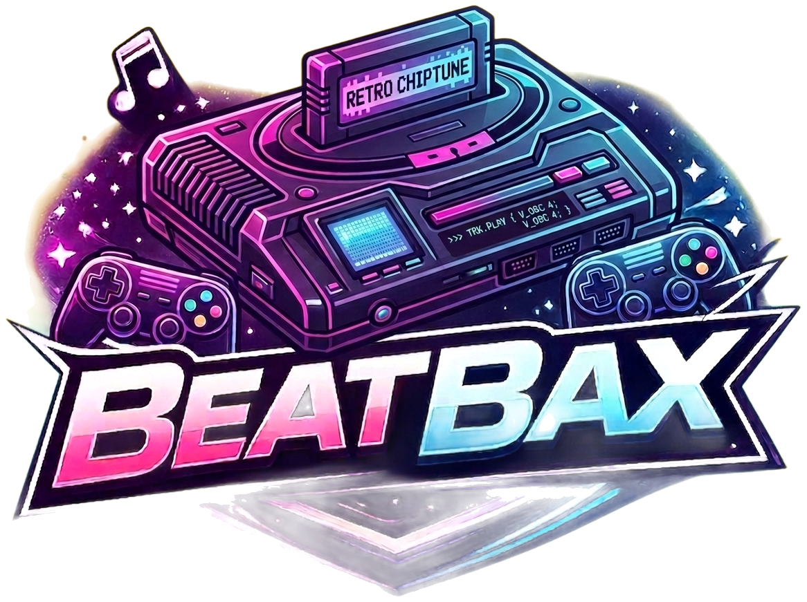
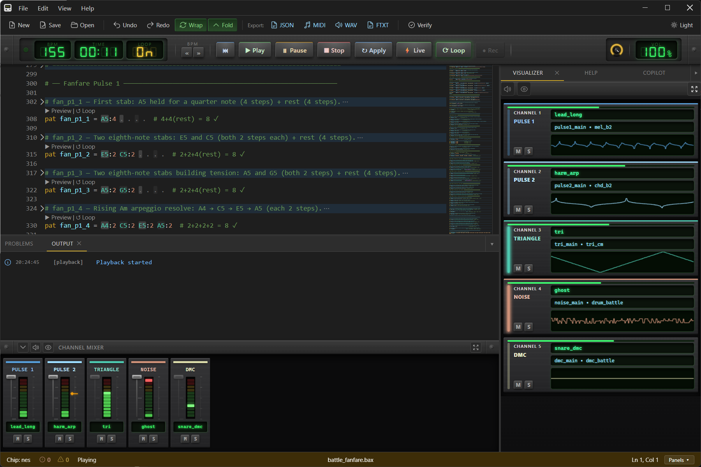

[](https://github.com/kadraman/beatbax/actions/workflows/ci.yml) [](https://github.com/kadraman/beatbax/actions/workflows/desktop-build.yaml) [](https://github.com/kadraman/beatbax/actions/workflows/beatbax-orchestration.yaml)

<p align="center">
  
</p>
<p align="center">
  <a href="https://beatbax.com/download">
    
  </a>
  <a href="https://app.beatbax.com">
    
  </a>
  <a href="https://beatbax.com/docs/intro">
    
  </a>
</p>

# BeatBax

**BeatBax** is a live-coding language and toolchain for making chiptune music in the style of classic 8-bit and 16-bit computers and game consoles. You write songs in a text grammar — instruments, patterns, sequences, and effects — and BeatBax plays them back with hardware-faithful chip sound.

Full documentation: **[beatbax.com/docs](https://beatbax.com/docs/intro)**

<p align="center">
  
  <br/>
  <em>BeatBax Desktop</em>
</p>

## Supported chips

| Chip | Directive | Notable exports |
|------|-----------|-----------------|
| Game Boy (DMG-01) | `chip gameboy` | hUGETracker `.uge`, WAV, MIDI |
| NES (Ricoh 2A03) | `chip nes` | FamiTracker text, WAV, MIDI |
| Sega Master System / Game Gear | `chip sms` / `chip gg` | VGM, WAV |
| ZX Spectrum 128 / Amstrad CPC (AY) | `chip spectrum-128` / `chip cpc` | WAV (+ more in progress) |

More backends are planned — see [ROADMAP.md](ROADMAP.md) and [Sound Chip Plugins](https://beatbax.com/docs/chips/overview).

## Features

- Text grammar for instruments, patterns, sequences, and channel arrangements (`.bax`)
- Multi-chip playback with chip-accurate voices, envelopes, and software macros
- Built-in effects (vibrato, arpeggio, portamento, and more)
- Homebrew-friendly export (UGE, FamiTracker, VGM, WAV, MIDI, …)
- **BeatBax Desktop** — full Electron IDE with Copilot, mixer, visualizer, and export
- **Web-lite client** — try in the browser at [app.beatbax.com](https://app.beatbax.com)
- **CLI** — `play`, `verify`, `export`, `inspect`, and sample conversion

## Quick example

```bax
song name "Hello BeatBax"

chip gameboy
bpm 128

inst lead type=pulse1 duty=50 env=gb:13,down,1
inst bass type=wave volume=100 wave=[0,2,4,6,8,10,12,14,15,14,12,10,8,6,4,2]

pat lead_pat = C5 . E5 G5 . E5 C5 .
pat bass_pat = C3 . . . G2 . . .

seq lead_seq = lead_pat*2
seq bass_seq = bass_pat*2

channel 1 => inst lead seq lead_seq
channel 3 => inst bass seq bass_seq

play
```

Build a complete song step by step in the [Tutorial](https://beatbax.com/docs/tutorial/overview). More examples live under [`songs/`](songs/).

## Get started

| Path | Link |
|------|------|
| Docs | [beatbax.com/docs](https://beatbax.com/docs/intro) |
| Tutorial | [Tutorial Groove walkthrough](https://beatbax.com/docs/tutorial/overview) |
| Desktop IDE | [Download](https://beatbax.com/download) |
| Browser | [app.beatbax.com](https://app.beatbax.com) |
| CLI | `npm install -g @beatbax/cli` — then `beatbax --help` |

```bash
npm install -g @beatbax/cli
beatbax play songs/gameboy/tutorial_groove.bax
```

CLI reference: [docs/tools/cli](https://beatbax.com/docs/tools/cli) · package notes: [`packages/cli/README.md`](packages/cli/README.md)

## Project layout

```
beatbax/
├── apps/
│   ├── desktop/      # BeatBax Desktop (Electron + React)
│   └── web-ui/       # Web-lite browser client
├── packages/
│   ├── engine/       # Language + runtime
│   ├── app-core/     # Shared client logic
│   ├── cli/          # @beatbax/cli
│   └── plugins/      # Chip + exporter plugins
├── songs/            # Example .bax songs
└── docs/             # In-repo technical notes (site docs live on beatbax.com)
```

## Development

```bash
git clone https://github.com/kadraman/beatbax.git
cd beatbax
npm install
npm run build-all
npm test

npm run desktop:dev    # Desktop IDE
npm run web-ui:dev     # Web-lite at http://localhost:5173
node bin/beatbax --help
```

Contributor guide: [CONTRIBUTING.md](CONTRIBUTING.md) · toolchain docs: [Development overview](https://beatbax.com/docs/development/overview)

## Documentation

| Topic | Location |
|-------|----------|
| Introduction | [beatbax.com/docs/intro](https://beatbax.com/docs/intro) |
| Tutorial | [Tutorial overview](https://beatbax.com/docs/tutorial/overview) |
| Language reference | [Language docs](https://beatbax.com/docs/language/instruments) |
| Tools (CLI / Desktop / Web) | [Tools](https://beatbax.com/docs/tools/cli) |
| Roadmap | [ROADMAP.md](ROADMAP.md) |
| Contributing | [CONTRIBUTING.md](CONTRIBUTING.md) |
| Releasing | [docs/releasing.md](docs/releasing.md) |

## Contributing

Contributions welcome. Open issues for features and PRs against `main`. Keep changes small and include tests for parser/expansion behaviour. See [CONTRIBUTING.md](CONTRIBUTING.md).

## License

MIT — see [LICENSE](LICENSE).
