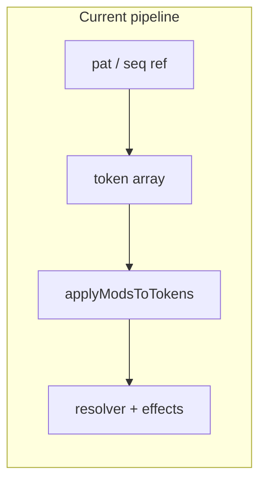

## Summary

Sequence and pattern references accept colon-chained transforms applied at **parse/expansion time** to a flat token array (notes, rests, sustain tokens, inline effects). Core implementation lives in [`packages/engine/src/expand/refExpander.ts`](packages/engine/src/expand/refExpander.ts).

| Modifier | Role |
|----------|------|
| `oct(N)` | Octave transpose |
| `+N` / `-N` / `st(N)` / `trans(N)` | Semitone transpose |
| `rev` | Reverse token order |
| `slow(N)` | Repeat each token N times (lengthen) |
| `fast(N)` | Keep every Nth token (shorten) |
| `inst(name)` | Override instrument for that slot |
| `pan(value)` | Wrap pattern in sequence-level pan |
| `presetName` | Apply named `effect` preset to every note (e.g. `melody:wobble`) |

Pattern syntax already covers **`*N` repetition**, **groups**, **durations** (`C4:4`), and **per-note effects** (`arp`, `vib`, `cut`, `port`, etc.) — see [`docs/features/complete/effects-system.md`](docs/features/complete/effects-system.md).

**Gap to be aware of:** the web UI help and command palette list `arp(0,3,7)` and `transpose(+1)` as transforms, but the engine only implements arpeggio as a **per-note effect** (`C4<arp:0,4,7>`), not as a sequence modifier. Closing that doc/implementation gap is a natural first step before adding more transforms.



New modifiers should stay in the **token-transform** layer unless they need tick-level scheduling (those belong in effects or BPM/time directives).

---

## Tier 1 — High value, fits the current model

These mirror how chip musicians already work in trackers and in your SMS/GB composition guides (variation from a small pattern vocabulary).

### `rot(N)` / `rotate(N)` — cyclic shift

Rotate the pattern left by N steps. Pairs naturally with `rev` and comma-separated `seq` items on a `channel` line.

```bax
seq verse = bass_a bass_b bass_c
seq verse_shifted = bass_a:rot(1) bass_b:rot(2)  # same motif, different downbeat
```

**Chiptune use:** pickup bars, polyrhythmic bass against straight drums, evolving ostinatos without rewriting notes.

### `pal` / `palindrome` — play forward then backward

`rev` only; palindrome is `tokens + tokens.reverse().slice(1)` (avoid duplicating the pivot note).

```bax
seq fill = lick:pal
```

**Chiptune use:** classic “mirror” fills, symmetrical lead runs, tension/release in one line.

### `arp(0,4,7)` — pattern-level arpeggiate (close the UI gap)

For each **note** token, emit a mini-cycle of transposed copies (or append `<arp:…>` to each note — prefer matching existing `arp` effect semantics for export).

```bax
seq pad = chord_bar:arp(0,4,7):slow(2)
```

**Chiptune use:** one held chord pattern becomes duty-cycle arps on GB pulse; harmonized bass without duplicating `pat` definitions. Align with [`docs/features/complete/arpeggio-effect.md`](docs/features/complete/arpeggio-effect.md).

### `clamp(C3,C6)` / `fold(C2,C7)` — range safety

- **clamp:** transpose notes below/above range to min/max (critical for GB noise index mapping and UGE export — see [`TUTORIAL.md`](TUTORIAL.md) noise section).
- **fold:** wrap out-of-range notes by octaves (musical “fold” rather than hard clip).

```bax
seq drums_safe = noise_groove:clamp(C2,C7)
```

**Chiptune use:** reusable melodic patterns across sections without breaking export; percussion templates that must stay in noise range.

### `mute` / `rest` — replace notes with rests

Map every note token to `.` (preserve rhythm skeleton, drop pitch).

```bax
seq rhythm_only = melody:mute
```

**Chiptune use:** rhythm-only channel layouts, reference channels without pitch, teaching/drafting layouts before harmony is written.

### `vel(N)` or `preset` shorthand — global articulation

Apply a fixed effect preset to all notes (you already support named presets; explicit sugar helps discoverability):

```bax
effect stacc = cut:2
seq stabs = stab_pat:stacc
```

**Chiptune use:** section-wide staccato, uniform tremolo on a reused `pat` without editing every note.

---

## Tier 2 — Strong chiptune / tracker idioms

### `invert` / `inv` — interval inversion

Invert around the first note (or pattern centroid). Complements `rev` (time) vs invert (pitch contour).

```bax
seq answer = motif:invert
```

**Chiptune use:** call-and-response bass, mirrored countermelodies on limited channels.

### `scale(major)` / `quantize(minor)` — snap to scale

Snap each note to nearest scale degree (optionally preserve rhythm). Live-coders use this heavily; chip composers use it for “wrong” transposed patterns that still sound in-key.

```bax
seq hook = riff:+7:scale(minor)
```

**Chiptune use:** transpose a generic riff across keys/sections on Game Boy/NES without rewriting.

### `every(N, MOD)` — conditional transform (Tidal-style)

Apply `MOD` only to every Nth token (1-based or 0-based — pick one and document).

```bax
seq bass = line:every(2,oct(+1))   # octave hop on offbeats
```

**Chiptune use:** alternating octave bass (SMS/GB classic), highlight backbeats, cheap variation via per-channel `seq` items.

### `off(N)` / `lag(N)` — insert rests before pattern

Prepend N sustain/rest tokens (or delay first note) — useful when chaining short `pat`s in a `seq`.

```bax
seq late_entry = fill:off(4)
```

**Chiptune use:** pickup timing, aligning a 1-bar lick to bar 2 without empty `pat` definitions.

### `zip(other)` / `alt(other)` — interleave two patterns

Alternate tokens from two patterns (pad shorter one with rests). Enables call-response in one sequence line.

```bax
seq call_response = lead_a:zip(lead_b)
```

**Chiptune use:** dialogue between two lead timbres on one channel timeline (when not using multiple `channel` lines).

### `duty(+1)` / `widen` — pulse timbre shift (chip-aware)

For pulse instruments only, bump duty or apply a duty_env step — maps to GB/NES hardware vocabulary. Could be implemented as “apply effect preset `duty_env:…`” under the hood.

**Chiptune use:** verse vs chorus brightness without duplicate instruments.

---

## Tier 3 — Rhythmic / timing (higher complexity)

These need **duration-aware** tokens (`_` sustain from `C4:4`) or tick metadata, not just string tokens — worth a separate design pass.

| Modifier | Idea | Why harder |
|----------|------|------------|
| `swing(66)` | Delay every 2nd event | Needs step grid / durations |
| `euclid(p,s)` | Euclidean rest mask | Needs fixed pattern length in steps |
| `humanize(5)` | Small random timing | Non-deterministic export |
| `stretch(2)` | Double each note’s written duration | Must rewrite `:N` suffixes and `_` runs |

If you add any of these, consider a **tick-native transform** phase after pattern expansion rather than extending `applyModsToTokens` only.

---

## Tier 4 — Nice-to-have / live-coding flourishes

Lower priority unless you want a more “pattern language” feel:

- **`pick(1,3,5)`** — keep only indices (sparse extraction; generalizes `fast`)
- **`shuffle` / `shuffle(seed)`** — randomize order (deterministic seed for reproducible songs)
- **`chunk(N)`** — group tokens and reverse/rotate within chunks (builds polyrhythms from `slow`/`fast`)
- **`echo_pat(N)`** — duplicate pattern with `oct(-1)` and implicit quieter preset (handy when chaining `seq` items on a channel)
- **`chord(3,7)`** — duplicate each note as extra tokens at offsets (static harmony vs time-multiplexed `arp`)

---

## Recommended implementation order (if you build later)

1. **`arp(...)` as transform** — UI already promises it; reuses export path.
2. **`rot` / `pal`** — tiny diffs, big variation wins on reused patterns (matches existing `:rev` / `:oct` usage in [`docs/chips/sms/composition_guide.md`](docs/chips/sms/composition_guide.md)).
3. **`clamp` / `fold`** — export-safe chip music.
4. **`every` / `mute`** — live-coding ergonomics.
5. **Scale quantize** — more parsing + music theory edge cases.
6. **Timing modifiers** — new subsystem.

Each new modifier should:

- Preserve rests (`.`, `_`, `-`) and non-note tokens unchanged (same rule as [`transposePattern`](packages/engine/src/patterns/expand.ts)).
- Merge into `parseSeqTransforms` / [`grammar.peggy`](packages/engine/src/parser/peggy/grammar.peggy) and `applyModsToTokens`.
- Update the warning string in `refExpander.ts`, command palette, and `TUTORIAL.md` transforms list.
- Add tests beside [`packages/engine/tests/transforms.test.ts`](packages/engine/tests/transforms.test.ts) and [`packages/engine/src/tests/refExpander.test.ts`](packages/engine/src/tests/refExpander.test.ts).

---

## What to avoid duplicating

Don’t add modifiers that overlap existing features without clear benefit:

| Already covered | Instead of new modifier |
|-----------------|-------------------------|
| Per-note pitch wobble | `vib`, `bend`, `port` effects |
| Time-multiplexed chords | `<arp:…>` on notes or `arp_env` on instrument |
| Double/half pattern length | `slow` / `fast` or `pat*2` |
| Section timbre | `:inst(name)` + instrument defs |
| Global loudness | channel gain / `volSlide` / `vol_env` |

---

## Summary pick list (best bang for chiptune)

If you only add five, these match how your songs and docs already compose:

1. **`arp(0,4,7)`** — pattern-level chord cycling
2. **`rot(N)`** — rhythmic/melodic variation without new `pat`s
3. **`pal`** — symmetrical fills
4. **`clamp` / `fold`** — safe transposition for GB noise and export
5. **`every(N, …)`** — alternating octave/instrument tricks in bass and leads

No implementation is included in this plan; say which tier you want built and we can scope engine + grammar + tests in a follow-up.
