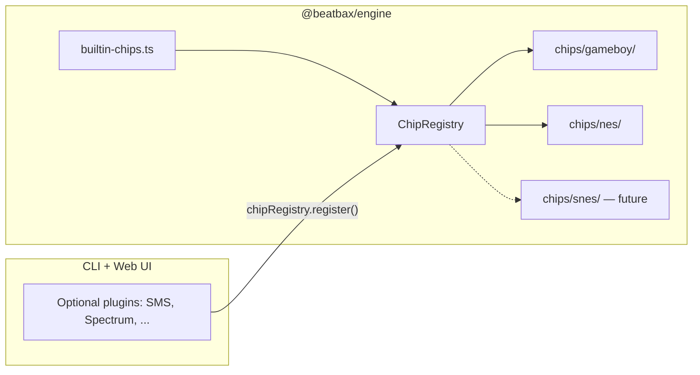

## Summary

Move the NES Ricoh 2A03 APU implementation from the standalone package `@beatbax/plugin-chip-nes` into `@beatbax/engine` as a **built-in chip**, registered automatically alongside Game Boy in `ChipRegistry`. Users get `chip nes` without installing or enabling a plugin. Game Boy remains built-in; parser/runtime fallbacks that default to `gameboy` when `chip` is omitted stay unchanged for now. Establish conventions so a future built-in SNES chip can follow the same pattern.

This supports BeatBax’s Nintendo-first product direction while keeping optional chips (SMS, Spectrum, community plugins) on the existing host-driven registration path.

---

## Problem Statement

Today NES and Game Boy are treated differently:

| Aspect | Game Boy | NES |
|--------|----------|-----|
| Code location | `packages/engine/src/chips/gameboy/` | `packages/plugins/chip-nes/src/` |
| Registry | Auto-registered in `ChipRegistry` constructor | Registered by CLI discovery or web-ui `loadPluginsFromStorage()` |
| Install | Bundled with `@beatbax/engine` | Requires `@beatbax/plugin-chip-nes` in CLI/web-ui `package.json` |
| Web UI | Always on (“Built-in” in Settings) | Toggle in Settings → Plugins (`ENABLED_PLUGINS`, default includes `nes`) |

Consequences:

- NES songs fail in environments that only depend on `@beatbax/engine` unless hosts remember to install and register the plugin.
- New-song wizard and parser validation only see NES after host-specific startup logic runs.
- Nintendo-first UX is undermined by NES behaving like an optional add-on.
- A second built-in Nintendo chip (SNES) would repeat the same split unless we standardize now.

Related prior work: NES was originally implemented as an external plugin per [`docs/features/complete/nes-apu-chip-plugin.md`](complete/nes-apu-chip-plugin.md) and [`docs/features/complete/plugin-system.md`](complete/plugin-system.md). Game Boy extraction to `@beatbax/plugin-chip-gameboy` ([`gameboy-plugin-extraction.md`](gameboy-plugin-extraction.md)) is the **opposite** direction and is not required for this feature.

---

## Proposed Solution

### Summary

1. **Inline** all NES source from `packages/plugins/chip-nes/src/` into `packages/engine/src/chips/nes/`.
2. **Register** `nesPlugin` via a central built-in list (e.g. `BUILTIN_CHIP_PLUGINS`) used by `ChipRegistry` at construction time.
3. **Export** chip-specific utilities from `@beatbax/engine/chips/nes` (DMC encode/decode, mixer settings, period tables).
4. **Retain** `@beatbax/plugin-chip-nes` as a thin npm **shim** re-exporting from the engine (backward compatibility).
5. **Update** CLI and web-ui to stop depending on the standalone package; promote NES in UI/docs without changing default `chip` to `nes`.

### Architecture (target)



### Built-in chip conventions (NES now, SNES later)

| Convention | Purpose |
|------------|---------|
| `engine/src/chips/<chipId>/` per built-in | SNES adds `chips/snes/` without moving NES again |
| `BUILTIN_CHIP_PLUGINS` array in `builtin-chips.ts` | Adding SNES = one import + one array entry |
| Export subpath `@beatbax/engine/chips/<chipId>` | Chip-specific CLI/UI utilities stay namespaced |
| Data-driven “Built-in” section in web-ui Settings | No hand-coded row per chip when SNES ships |
| CLI `discoverPlugins` skips packages already in registry | Works for `plugin-chip-nes` and future `plugin-chip-snes` shims |
| Tests under `packages/engine/tests/<chipId>/` | Mirror for `tests/snes/` later |

Do **not** introduce a generic plugin loader framework; the array + folder convention is sufficient.

### Example usage (after implementation)

No language syntax changes. Existing scripts continue to work:

```bax
chip nes
bpm 150
inst lead type=pulse1 duty=25 env=13,down env_period=2
```

Programmatic registration is no longer required for NES:

```typescript
import { chipRegistry } from '@beatbax/engine/chips';

chipRegistry.has('nes'); // true immediately
```

DMC utilities move to the engine export path:

```typescript
import { decodeDMC, encodeDMCFromPCM, setNesWebAudioMixMode } from '@beatbax/engine/chips/nes';
```

---

## Implementation Plan

Implement in ordered phases; each phase should leave tests green.

### Phase 1 — Relocate NES source into engine

Move all modules from [`packages/plugins/chip-nes/src/`](../../packages/plugins/chip-nes/src/) to **`packages/engine/src/chips/nes/`**:

- `pulse.ts`, `triangle.ts`, `noise.ts`, `dmc.ts`, `dmcEncode.ts`, `dmcSamples.ts`, `mixer.ts`, `macros.ts`, `periodTables.ts`, `validate.ts`, `ui-contributions.ts`, `songWizard.ts`

Rewire imports:

- `@beatbax/engine` types → `../types.js`, `../../parser/ast.js`, etc.
- Add `plugin.ts` exporting `nesPlugin` (manifest from current plugin `index.ts`).
- Add `index.ts` barrel re-exporting public utilities (decode/encode DMC, mixer, period tables).

Use [`packages/engine/src/version.ts`](../../packages/engine/src/version.ts) for `nesPlugin.version` (same as Game Boy). Remove plugin-local `version.ts`.

### Phase 2 — Built-in registration and engine exports

**New file:** `packages/engine/src/chips/builtin-chips.ts`

```typescript
import { gameboyPlugin } from './gameboy/plugin.js';
import { nesPlugin } from './nes/plugin.js';

/** Chips always registered by ChipRegistry. Add snesPlugin when ready. */
export const BUILTIN_CHIP_PLUGINS = [gameboyPlugin, nesPlugin] as const;
```

**Update:** [`packages/engine/src/chips/registry.ts`](../../packages/engine/src/chips/registry.ts) — loop `BUILTIN_CHIP_PLUGINS` in constructor; keep `gb` / `dmg` aliases.

**Update exports:**

- [`packages/engine/src/chips/index.ts`](../../packages/engine/src/chips/index.js) — `nesPlugin`, optionally `BUILTIN_CHIP_PLUGINS`
- [`packages/engine/src/index.ts`](../../packages/engine/src/index.ts), [`plugin-api.ts`](../../packages/engine/src/plugin-api.ts)
- [`packages/engine/package.json`](../../packages/engine/package.json) `exports` — add `"./chips/nes"` → `./dist/chips/nes/index.js`

**Update copy** in [`engine.ts`](../../packages/engine/src/engine.ts), [`chips/types.ts`](../../packages/engine/src/chips/types.ts): NES is built-in; install hints only for chips not in registry.

### Phase 3 — Tests

- Move [`packages/plugins/chip-nes/tests/`](../../packages/plugins/chip-nes/tests/) → `packages/engine/tests/nes/`
- Extend [`packages/engine/tests/chip-registry.test.ts`](../../packages/engine/tests/chip-registry.test.ts): `chipRegistry.has('nes')` without manual `register()`
- Run `npm run engine:test`

### Phase 4 — Compatibility shim package

Keep publishing `@beatbax/plugin-chip-nes`:

- Replace implementation with re-exports from `@beatbax/engine/chips/nes`
- `peerDependencies`: `@beatbax/engine` >= version that includes built-in NES
- README: deprecation / compatibility notice

**CLI:** [`packages/cli/src/cli.ts`](../../packages/cli/src/cli.ts) `discoverPlugins()` — skip `@beatbax/plugin-chip-nes` when `chipRegistry.has('nes')`.

### Phase 5 — Host applications

| Area | Changes |
|------|---------|
| [`apps/web-ui/src/plugins/registry-config.ts`](../../apps/web-ui/src/plugins/registry-config.ts) | Remove `nes` from `AVAILABLE_PLUGINS` and from `DEFAULT_ENABLED` |
| [`apps/web-ui/src/panels/settings-sections/plugins.ts`](../../apps/web-ui/src/panels/settings-sections/plugins.ts) | Data-driven built-in chip list (GB + NES); NES mix-mode row keyed on `id === 'nes'` |
| [`apps/web-ui/package.json`](../../apps/web-ui/package.json) | Drop `@beatbax/plugin-chip-nes` |
| [`apps/web-ui/src/main.ts`](../../apps/web-ui/src/main.ts) | Import `setNesWebAudioMixMode` from `@beatbax/engine/chips/nes` |
| [`packages/cli/package.json`](../../packages/cli/package.json) | Drop `@beatbax/plugin-chip-nes` |
| [`packages/cli/src/cli.ts`](../../packages/cli/src/cli.ts) | `.dmc` play / `encode-dmc` imports from `@beatbax/engine/chips/nes` |

New-song wizard already uses `chipRegistry.listCanonical()` — NES appears once built-in without localStorage.

### Phase 6 — Nintendo-first promotion (no parser default change)

- Settings, README, [`.github/copilot-instructions.md`](../../.github/copilot-instructions.md): NES listed with Game Boy as built-in
- Update [`docs/features/complete/plugin-system.md`](complete/plugin-system.md)
- [`apps/web-ui/src/editor/instrument-meta.ts`](../../apps/web-ui/src/editor/instrument-meta.ts): cosmetic ordering (`nes` before `gameboy` in docs/examples only)
- **Do not** change `ast.chip || 'gameboy'` fallbacks in engine or web-ui

### Phase 7 — Release

- Changeset: `@beatbax/engine` (minor: built-in NES + `./chips/nes` export)
- Changeset: `@beatbax/plugin-chip-nes` (patch: shim)
- Changeset: `@beatbax/cli`, `@beatbax/web-ui` (drop direct NES dep, bump engine)
- Verify `npm run build-all` and workspace tests

### AST / Parser / Export changes

**None.** `chip nes`, `chip nes ntsc|pal`, and NES instrument validation remain as implemented; parser already consults `chipRegistry.list()` ([`packages/engine/src/parser/peggy/index.ts`](../../packages/engine/src/parser/peggy/index.ts)).

FamiTracker export stays via `@beatbax/plugin-exporter-famitracker` (CLI dependency); wiring `exporterPlugins` on `nesPlugin` is out of scope.

---

## Testing Strategy

### Unit tests

- All existing NES plugin tests under `packages/engine/tests/nes/`
- `chip-registry.test.ts`: built-in `nes` present on singleton
- Channel creation, validation, period tables, DMC encode/decode (unchanged behavior)

### Integration tests

- Parse `chip nes` without calling `registerChipPlugin`
- Web-ui: Settings shows NES under Built-in (no toggle); optional chips still toggle
- CLI: `beatbax` on a NES `.bax` without separate plugin install (monorepo / published CLI with new engine)

### Manual smoke

- Web UI: play [`songs/nes/example.bax`](../../songs/nes/example.bax), new-song wizard NES template
- CLI: `encode-dmc`, play `.dmc` sample
- Settings: NES Web Audio mix mode persists

---

## Migration Path

### Monorepo / app developers

- Remove `@beatbax/plugin-chip-nes` from app `package.json` after upgrading `@beatbax/engine`
- Replace imports:
  - `import nesPlugin from '@beatbax/plugin-chip-nes'` → `import { nesPlugin } from '@beatbax/engine/chips'`
  - Utility imports → `@beatbax/engine/chips/nes`
- Remove manual `engine.registerChipPlugin(nesPlugin)` unless registering a **replacement** plugin under the same name (advanced)

### npm consumers on standalone `@beatbax/plugin-chip-nes`

- Upgrading the shim package pulls in engine peer; re-exports preserve import paths short term
- Prefer migrating imports to `@beatbax/engine` / `@beatbax/engine/chips/nes`

### npm deprecation runbook (`@beatbax/plugin-chip-nes`)

When the shim grace period ends, deprecate the npm package with an explicit migration message:

1. Ensure the final shim release is published and README migration guidance is live.
2. Deprecate all historical versions:
   - `npm deprecate @beatbax/plugin-chip-nes@"<0.0.0-0 || >=0.0.0" "Deprecated: NES is now built in to @beatbax/engine. Migrate imports to @beatbax/engine/chips and @beatbax/engine/chips/nes."`
3. Verify notice visibility:
   - `npm view @beatbax/plugin-chip-nes deprecated`
4. Keep the package available (do not unpublish) so existing installs remain reproducible.
5. Repeat deprecate command for any newly published patch if additional shim fixes are released.

### Web UI users

- `ENABLED_PLUGINS` may still list `nes`; harmless once NES is always registered
- Optional: one-time migration to strip `nes` from stored JSON (not required)

---

## Implementation Checklist

- [ ] Move `chip-nes/src` → `engine/src/chips/nes/`
- [ ] Add `builtin-chips.ts` and register NES in `ChipRegistry`
- [ ] Add `@beatbax/engine/chips/nes` package export
- [ ] Move tests to `engine/tests/nes/`
- [ ] Shim `@beatbax/plugin-chip-nes`
- [ ] Update web-ui registry, settings (data-driven built-ins), `main.ts`
- [ ] Update CLI imports and `package.json`
- [ ] Update docs/README/copilot instructions
- [ ] Changesets and `build-all` / test pass

---

## Future Enhancements

- **Built-in SNES** — `packages/engine/src/chips/snes/`, entry in `BUILTIN_CHIP_PLUGINS`, `@beatbax/engine/chips/snes` export; optional `@beatbax/plugin-chip-snes` shim. [`ROADMAP.md`](../../ROADMAP.md) currently excludes SNES as “sample-based”; revisit when SNES implementation starts. [`apps/web-ui/src/utils/chip-meta.ts`](../../apps/web-ui/src/utils/chip-meta.ts) already has SNES channel colours.
- Default `chip` directive / editor seed to `nes` (product decision)
- Re-export FamiTracker exporters via `nesPlugin.exporterPlugins`
- Lazy-load heavy built-in assets if engine bundle size becomes an issue

---

## Open Questions

- **Shim lifetime:** How many releases keep `@beatbax/plugin-chip-nes` before deprecating on npm major?
- **Engine semver:** Minor vs major for adding built-in NES and `./chips/nes` export?
- **Game Boy extraction:** Still proposed separately; built-in list should work whether GB stays inline or moves to `@beatbax/plugin-chip-gameboy` with engine dependency.

---

## References

- [`docs/features/complete/nes-apu-chip-plugin.md`](complete/nes-apu-chip-plugin.md) — original NES plugin implementation
- [`docs/features/complete/plugin-system.md`](complete/plugin-system.md) — `ChipPlugin`, `ChipRegistry`, host registration
- [`docs/features/gameboy-plugin-extraction.md`](gameboy-plugin-extraction.md) — inverse direction (GB out of engine)
- [`packages/engine/src/chips/registry.ts`](../../packages/engine/src/chips/registry.ts)
- [`packages/plugins/chip-nes/`](../../packages/plugins/chip-nes/)
- [`apps/web-ui/src/plugins/registry-config.ts`](../../apps/web-ui/src/plugins/registry-config.ts)

---

## Risks and mitigations

| Risk | Mitigation |
|------|------------|
| Engine bundle grows (DMC base64 in `dmcSamples.ts`) | Acceptable for Nintendo-first; same data as today’s plugin |
| Duplicate registration (registry + CLI discovery) | Skip shim when `chipRegistry.has('nes')` |
| `btoa` in `dmcSamples.ts` in browser | Web UI already polyfills `Buffer` in `main.ts` |
| External users on old engine + new shim | Document peer engine version in shim README |

---

## Additional Notes

- Untracked `media/consoles/famicon.jpg` is unrelated; optional for new-song wizard artwork.
- SNES planned as built-in later **does not** change this feature’s approach; only the conventions above should be applied during NES work to avoid rework.
