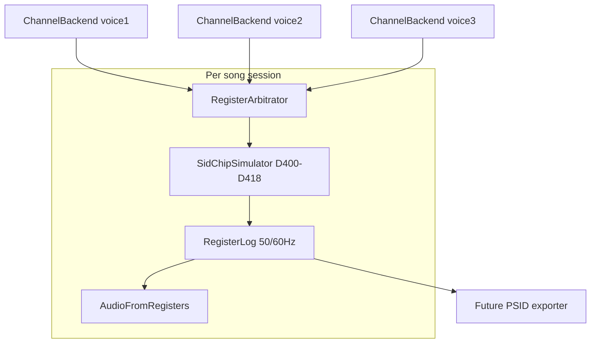

## Summary

Implement `@beatbax/plugin-chip-sid` as a Commodore 64 SID target in BeatBax.

Primary target profiles:

- MOS **6581** SID on C64 **PAL**
- MOS **8580** SID on C64 **PAL**
- **NTSC** timing variants as explicit region presets (6581 and 8580)

Primary output intent:

- Deterministic live playback in CLI and Web UI
- Deterministic **register-log** generation as the canonical artifact for regression and future exporters
- Export integration hooks for PSID/RSID, GoatTracker-oriented data, register dumps, and rendered WAV/OGG (exporter implementation is separate)

This feature document covers the **chip plugin and authoring/runtime semantics only**.

## Problem Statement

SID is materially different from PSG-style chips already in BeatBax:

- Each voice supports triangle, saw, pulse, and noise waveforms with **12-bit pulse width** and **4-bit ADSR nibbles** — composers expect SID-like timbre, not generic square waves.
- **Oscillator sync** and **ring modulation** create fixed **cross-voice dependencies** (hardwired on the chip).
- The multimode filter and **master volume** live in one global register (`$D417`); cutoff and resonance are chip-global.
- **6581** and **8580** differ audibly in filter response and especially **combined-waveform** character.

A naive per-channel backend would sound plausible in isolation but fail export and hardware fidelity. BeatBax needs a **song-scoped SID plugin** where preview, validation, and future export all derive from the same deterministic register-intent pipeline.

## Scope

### Included

**Core Plugin:**
- Package `@beatbax/plugin-chip-sid`
- Explicit profiles: **6581** / **8580** × **PAL** / **NTSC**
- One shared SID chip instance per song/session
- CLI and Web UI playback
- Deterministic register-log output
- `songWizard.ts` and `ui-contributions.ts` for SID starter songs

**Authoring Support:**
- Three SID voices mapped to BeatBax channels 1–3 (`voice1`, `voice2`, `voice3`)
- Pulse-width control for pulse instruments
- Single-waveform selection in v1 (combined waveforms deferred — see below)
- Song-level validation for shared filter state and sync/ring source requirements
- Diagnostics for filter conflicts and invalid sync/ring usage

**Sample Songs & Documentation** (`songs/c64-sid/`):
- `sid-smoke-test.bax` — minimal three-voice playback
- `pulse-width-demo.bax` — pulse width sweeps
- `filter-demo.bax` — shared filter routing and cutoff sweeps
- `sync-ring-demo.bax` — hardware-fixed sync/ring relationships
- `model-contrast-demo.bax` — same song under 6581 vs 8580

**Test Songs** (`songs/c64-sid/tests/`):
- `filter-conflict-test.bax` — overlapping incompatible filter globals (expects error)
- `sync-ring-invalid-test.bax` — impossible sync/ring assumptions (expects error)

### Excluded

- PSID/RSID and GoatTracker exporter implementation
- Multi-SID support in v1
- Combined waveforms in v1 (phase 2)
- Volume-register sample tricks (digi / `$D418` manipulation)
- Bit-exact undocumented revision quirks
- TEST-bit manipulation

## Technical Notes

- **One shared SID chip per song** — filter, master volume, sync, and ring-mod require a song-scoped simulator.
- **Profiles are explicit** — `chipModel` (**6581** | **8580**) and `chipRegion` (**pal** | **ntsc**) must be named; missing model is an error.
- **Register log is the source of truth** — PCM preview and future exporters consume the same per-tick frame stream.
- **Sync/ring sources are hardware-fixed** — not arbitrary “pick any voice” relationships.
- **Filter globals conflict hard in v1** — incompatible cutoff/resonance/mode on the same tick is an error, not silent last-writer-wins.
- **Determinism over analog mystique** — v1 uses stable, testable 6581/8580 approximations.

## Implementation Outline

1. Define plugin package, **6581/8580 + PAL/NTSC profiles**, and shared `SidChipSimulator`.
2. Add minimal engine/parser support for `chipModel` and extend `chipRegion` to `chip sid`.
3. Implement channel backends as **intent emitters** into a song-scoped session (requires engine `beginSongSession` wiring — see Architecture).
4. Implement register-intent collection, arbitration, and deterministic register log.
5. Add instrument + song-level validation for filter conflicts and sync/ring rules.
6. Render preview PCM from the register log.
7. Add chip docs, wizard presets, and sample songs teaching real SID constraints.

## Out of Scope

Exporter implementations and multi-SID workflows — separate features/issues.

## Testing Requirements

- Deterministic register logs across repeated renders.
- Deterministic PCM preview for the same song/profile input.
- Profile differentiation tests (6581 vs 8580 where models intentionally differ).
- Filter conflict and sync/ring validation tests.

## Documentation Requirements

- Chip docs under `docs/chips/c64-sid/` (prerequisites — not yet written).
- Feature references point here for plugin scope; chip docs for composition guidance.
- Align with `ROADMAP.md` SID entry and `@beatbax/plugin-chip-sid`.

---

## Proposed Solution

### Overview

Implement `@beatbax/plugin-chip-sid` as a standalone npm package that:

- Targets **MOS 6581/8580** as a C64-first plugin
- Emulates **one shared SID** per song — three coupled voices, one filter block, one master volume
- Uses explicit **chipModel** and **chipRegion** profiles
- Exposes thin `ChipChannelBackend` facades that queue **voice and chip-global intents**
- Produces a deterministic **register log** for preview and future export
- Validates hardware-coupled authoring with explicit diagnostics

Reference docs to add (authoritative for composition):

- [docs/chips/c64-sid/hardware_guide.md](../chips/c64-sid/hardware_guide.md)
- [docs/chips/c64-sid/composition_guide.md](../chips/c64-sid/composition_guide.md)

### Design principles

1. **Shared chip state is mandatory** — filter, master volume, sync, and ring-mod are chip-scoped.
2. **Profiles are part of the contract** — 6581 and 8580 are named targets with deterministic differences.
3. **Preview and export must agree** — register logs drive both; no WebAudio-only shortcuts.
4. **Fail visibly on ambiguity** — filter global conflicts are **errors** in v1; sync/ring violations are **errors**.
5. **Minimal core changes only** — add `chipModel` (+ extend region validation for `chip sid`); no SID-specific AST nodes.

### Package structure

```
packages/plugins/chip-sid/
├── package.json
├── tsconfig.json
├── src/
│   ├── index.ts                   # ChipPlugin entry; song-scoped SID factory
│   ├── sid-chip.ts                # Shared SidChipSimulator ($D400–$D418)
│   ├── sid-profiles.ts            # 6581/8580 + PAL/NTSC clocks and frame rates
│   ├── periodTables.ts            # MIDI/freq → 16-bit voice frequency register
│   ├── register-intent.ts         # Voice-local + chip-global intents per tick
│   ├── register-arbitrator.ts     # Merge intents → one register frame
│   ├── register-log.ts            # Deterministic tick log (primary test artifact)
│   ├── channel-backend.ts         # ChipChannelBackend facades
│   ├── voice-model.ts             # Oscillator + ADSR envelope helpers
│   ├── filter-model.ts            # Shared filter + master volume ($D417)
│   ├── audio-from-registers.ts    # PCM preview from register log
│   ├── validate.ts                # Per-instrument validation
│   ├── validate-song.ts           # Filter conflicts, sync/ring rules
│   ├── ui-contributions.ts
│   ├── songWizard.ts
│   └── version.ts
├── tests/
│   ├── sid-chip.test.ts
│   ├── register-arbitrator.test.ts
│   ├── register-log.test.ts
│   ├── sid-profiles.test.ts
│   ├── periodTables.test.ts
│   ├── validate-song.test.ts
│   └── plugin.test.ts
└── README.md
```

### Hardware model

| Voice | BeatBax type | SID registers | Notes |
|-------|--------------|---------------|-------|
| 1 | `voice1` | `$D400–$D403` freq, `$D405–$D406` AD/pulse, `$D404` SR, `$D417` ctrl bits | Square/pulse has 12-bit PW in `$D402–$D403` |
| 2 | `voice2` | `$D407–$D40A`, `$D40B`, `$D40C–$D40D`, `$D417` | Same layout offset +7 |
| 3 | `voice3` | `$D40E–$D411`, `$D412`, `$D413–$D414`, `$D417` | Same layout offset +14 |
| Filter | *(global)* | `$D415–$D416` cutoff/resonance, `$D417` mode + routing + master vol | One filter block for entire chip |

**Control register `$D404` / `$D40B` / `$D412` (per voice):**

| Bit | Function |
|-----|----------|
| 0 | Gate (note on/off) |
| 1 | Sync enable |
| 2 | Ring mod enable |
| 3 | Test (v1: must remain 0) |
| 4–7 | Waveform select (v1: single waveform only — one bit set) |

**Waveform bits (v1 — pick exactly one):**

| Bit | Waveform |
|-----|----------|
| 4 | Triangle |
| 5 | Sawtooth |
| 6 | Pulse |
| 7 | Noise |

Combined waveforms (multiple bits set) are **out of scope for v1**; 6581/8580 behave differently here and need profile-specific tables in phase 2.

**Fixed sync and ring-modulation chain (hardware — not configurable):**

| Target voice | Sync source (hard reset) | Ring-mod source |
|--------------|--------------------------|-----------------|
| Voice 1 | Voice 3 | Voice 3 |
| Voice 2 | Voice 1 | Voice 1 |
| Voice 3 | Voice 2 | Voice 2 |

Validation: enabling `sync` or `ring` on voice N requires the **source voice** to be active (gated) on that tick with a suitable waveform. The plugin models this in the shared chip session — do not treat sync/ring as isolated per-channel flags.

**Filter register `$D417` (global, one value per tick):**

| Bits | Function |
|------|----------|
| 0–2 | Filter route voices 1/2/3 into filter |
| 3–5 | Filter mode: LP / BP / HP (independent enables, combinable) |
| 6–9 | Master volume (4-bit) |

Cutoff `$D415` (11-bit) and resonance `$D416` (4-bit) are chip-global.

**Critical constraints (must drive validation and sample songs):**

| Resource | Scope | What composers can do | What they cannot do |
|----------|-------|----------------------|---------------------|
| Filter cutoff/resonance/mode | Global | One sweep affects all routed voices; agree on globals per tick | Two voices requesting **different** cutoff on the **same tick** |
| Master volume | Global | Set once per tick (or use consistent value) | Competing values without expecting a diagnostic |
| Sync / ring | Fixed chain | Enable on voice N when source voice is active | Ring-mod voice 2 from voice 3 (impossible on hardware) |
| Waveform | Per voice | One of triangle/saw/pulse/noise in v1 | Combined waveforms in v1 |
| Pulse width | Per voice | 0–4095 for pulse only | PW on non-pulse waveforms |
| ADSR | Per voice | 4-bit A/D/S/R nibbles (0–15) | Linear “seconds” without mapping table |

**ADSR:** SID uses 4-bit attack/decay/sustain/release nibbles with **nonlinear** A/D/R curves per datasheet. v1 maps BeatBax `ad`/`sr` fields to hardware nibbles (same pattern as NES `env=`); envelope timing is derived from chip clock and nibble value in `voice-model.ts`.

### Platform clocks and frequency

| Profile axis | Values | φ₂ clock (typical C64) | Control tick rate |
|--------------|--------|------------------------|-------------------|
| `chipRegion = pal` | PAL | **985,248 Hz** | **50 Hz** |
| `chipRegion = ntsc` | NTSC | **1,022,730 Hz** | **60 Hz** |

Voice frequency register (16-bit `$D400+$D401`, etc.):

$$
f_{voice} = \frac{N \times f_{clock}}{16777216}
$$

where \(N\) is the frequency value written to the voice. Inverse for note entry:

$$
N = \mathrm{round}\left(f_{note} \times \frac{16777216}{f_{clock}}\right)
$$

Clamp \(N\) to 0–65535; document minimum audible period in chip docs.

Macro/effect stepping (e.g. arpeggio cadence) should use the **region frame rate** (50/60 Hz), not a hardcoded PAL default. Engine `CHIP_FRAME_RATES['c64']` should become region-aware when SID lands.

### Profiles and BeatBax syntax

BeatBax uses **top-level directives**, not block assignment syntax.

**Required v1 song header:**

```bax
song name "SID Demo"
chip sid
chipModel 8580
chipRegion pal
bpm 150
```

**Profile axes:**

| Directive | Values | Required |
|-----------|--------|----------|
| `chip sid` | — | Yes |
| `chipModel` | `6581` \| `8580` | **Yes** — missing model is a parser/validation **error** |
| `chipRegion` | `pal` \| `ntsc` | Optional; default **`pal`** if omitted (document in wizard) |

**Parser/engine work (minimal):**

1. Add `chipModel?: string` to AST / SongModel (new top-level directive `chipModel 6581`).
2. Extend chip-region validation to accept `chip sid` (today only `nes` and `sms` support `chip <name> pal|ntsc`).
3. Extend `configureForSong()` to pass `{ chip, chipModel, chipRegion }` to the SID plugin.

Do **not** use `chip = sid` or `song "Name" { ... }` block syntax — that is not valid BeatBax.

### Architecture

#### Why not three independent channel backends?

- Three isolated oscillators cannot model **sync** (source voice resets target divider) or **ring mod** (source multiplies target phase).
- Three copies of filter state would allow impossible simultaneous cutoff values.
- 6581/8580 profile differences would diverge between preview and export.

The engine's `createChannel()` API is per-channel, but **SID requires shared chip state**. Use a **song-scoped session** and channel facades.



#### Tick model

- **Control tick** = 1/50 s (PAL) or 1/60 s (NTSC), aligned to `chipRegion`.
- On each tick:
  1. Collect **register intents** from all active notes on all channels
  2. **Validate** sync/ring source requirements
  3. **Arbitrate** chip-global filter + master volume
  4. **Commit** final `$D400–$D418` into `SidChipSimulator`
  5. **Step** oscillators, envelopes, filter for that tick
  6. **Append** to `RegisterLog`
- Voice frequency, ADSR, gate, and per-voice control bits may update per voice without cross-voice conflict (except sync/ring side effects handled in shared simulator).

#### Register intents and arbitration

Split **voice-local** and **chip-global** intents:

```typescript
interface SidVoiceIntent {
  tick: number;
  channel: 0 | 1 | 2;
  frequency?: number;           // 16-bit N
  pulseWidth?: number;          // 12-bit, pulse only
  waveform?: "triangle" | "saw" | "pulse" | "noise";
  gate?: boolean;
  sync?: boolean;               // uses fixed source voice
  ringMod?: boolean;            // uses fixed source voice
  attack?: number;              // 0–15 nibble
  decay?: number;
  sustain?: number;
  release?: number;
  filterRoute?: boolean;        // this voice routed into filter ($D417 bits 0–2)
  source: { pat?: string; loc?: SourceLocation };
}

interface SidChipGlobalIntent {
  tick: number;
  filterCutoff?: number;        // 11-bit $D415
  filterResonance?: number;     // 4-bit $D416
  filterLp?: boolean;           // $D417 bit 3
  filterBp?: boolean;           // bit 4
  filterHp?: boolean;           // bit 5
  masterVolume?: number;        // 4-bit $D417 bits 6–9
  source: { pat?: string; loc?: SourceLocation };
}
```

**Arbitration rules (v1):**

| Resource | Rule on conflict | Diagnostic |
|----------|------------------|------------|
| Voice freq/PW/wave/ADSR/gate | Per channel | — |
| Filter route bits (0–2) | **Merge** per voice bit | — |
| Cutoff, resonance, LP/BP/HP, master vol | **Error** if values differ same tick | Filter/global conflict with channel list |
| Master volume only | **Warn** if values differ (optional strict → error later) | Competing master volume |
| Sync/ring with inactive source | **Error** | Missing sync/ring source voice |

Optional strict mode (future): escalate master-volume warnings to errors.

#### Engine integration

`ChipPlugin.createChannel()` remains the engine API. The plugin also needs a song-scoped factory:

```typescript
interface SidChipPlugin extends ChipPlugin {
  configureForSong(song: {
    chip?: string;
    chipModel?: string;
    chipRegion?: string;
  }): void;
  beginSongSession(): SidSongSession;
}

interface SidSongSession {
  createChannel(index: number): ChipChannelBackend;
  finalizeRegisterLog(): SidRegisterFrame[];
  renderPreviewPcm(sampleRate: number): Float32Array;
}
```

**Engine dependency (not plugin-only):** Today `playback.ts` and `pcmRenderer.ts` call `configureForSong()` then `createChannel()` independently per channel — same gap as the AY Spectrum plugin. SID requires one of:

1. **Plugin-owned session (recommended)** — engine calls `beginSongSession()` once before creating backends; facades share one arbitrator.
2. **Engine extension** — optional `createChipRenderer()` on `ChipPlugin` for shared-state chips.

Either way, **never** allocate three standalone `SidChipSimulator` instances.

### Instrument fields

#### Voice types

| BeatBax `type` | SID voice | Default channel |
|----------------|-----------|-----------------|
| `voice1` | Voice 1 | Channel 1 |
| `voice2` | Voice 2 | Channel 2 |
| `voice3` | Voice 3 | Channel 3 |

#### Per-instrument fields (v1)

| Field | Type | Range | Description |
|-------|------|-------|-------------|
| `wave` | string | `triangle` \| `saw` \| `pulse` \| `noise` | Single waveform (v1) |
| `pw` | number | 0–4095 | Pulse width; pulse wave only |
| `ad` | string | `A,D` nibbles 0–15 | Attack/decay (e.g. `ad=9,9`) |
| `sr` | string | `S,R` nibbles 0–15 | Sustain/release (e.g. `sr=9,9`) |
| `sync` | boolean | — | Oscillator sync; source voice per hardware table |
| `ring` | boolean | — | Ring modulation; source voice per hardware table |
| `filterRoute` | boolean | — | Route this voice through shared filter |

#### Chip-global fields (effects or song-level — TBD in composition guide)

Filter sweeps affect `$D415–$D417` globally. Prefer explicit chip-global effect names (e.g. `filterCutoff` slide) documented in composition guide rather than per-voice `filterCutoff` on instruments (which implies false independence).

| Field | Scope | Description |
|-------|-------|-------------|
| `filterCutoff` | Global | 0–2047 (11-bit) |
| `filterResonance` | Global | 0–15 |
| `filterLp` / `filterBp` / `filterHp` | Global | Mode bits (combinable) |
| `masterVol` | Global | 0–15 |

### Song-level validation (`validate-song.ts`)

| Check | Severity | Example |
|-------|----------|---------|
| Same tick, different filter cutoff/resonance/mode | **error** | Two instruments driving incompatible `$D415–$D417` |
| `sync`/`ring` enabled, source voice not gated | **error** | Voice 1 ring-mod without active voice 3 |
| `chipModel` missing | **error** | `chip sid` with no `chipModel` |
| `pw` on non-pulse wave | **error** | `wave=triangle pw=2048` |
| Combined waveforms requested | **error** | Multiple wave bits (phase 2) |

### Combined waveforms (phase 2 — not v1)

6581 combined-wave tables differ from 8580. v1 rejects multiple waveform bits. Phase 2 adds profile-specific combined-wave emulation and composition guidance.

### Module responsibilities

| Module | Responsibility |
|--------|----------------|
| `sid-chip.ts` | Single `$D400–$D418` state; step voices + filter |
| `register-arbitrator.ts` | Merge intents; filter conflict errors |
| `register-log.ts` | Deterministic tick log (primary regression artifact) |
| `channel-backend.ts` | Facades queuing voice intents |
| `filter-model.ts` | Global filter + master volume |
| `voice-model.ts` | ADSR curves, sync/ring coupling |
| `validate-song.ts` | Filter conflicts, sync/ring rules |

### Plugin entry point (summary)

```typescript
const sidPlugin: SidChipPlugin = {
  name: 'sid',
  aliases: ['c64'],
  channels: 3,
  configureForSong(song) {
    requireChipModel(song.chipModel);
    setSidProfile(song.chipModel!, song.chipRegion ?? 'pal');
  },
  beginSongSession() { return createSidSongSession(getSidProfile()); },
  createChannel(i, ctx) { return getCurrentSession().createChannel(i); },
  validateInstrument(inst) { return validateInstrument(inst); },
};
```

See **Architecture** above for `SidSongSession`, intent split, and engine integration. UI/wizard snippets live in implementation PRs.

---

## Implementation Plan

### Phase 0: Engine + parser prerequisites

1. Add `chipModel` directive and AST field
2. Extend `chip sid pal|ntsc` region validation
3. Pass `chipModel` through resolver → SongModel → `configureForSong()`
4. Add `beginSongSession()` hook to `playback.ts` and `pcmRenderer.ts` (or equivalent session API)

**Gate:** Parser accepts sample header; `configureForSong` receives model + region.

### Phase 1: Shared chip core

1. Create package structure
2. Implement `sid-profiles.ts` — 6581/8580 × PAL/NTSC clocks and frame rates
3. Implement `periodTables.ts` — freq ↔ 16-bit N
4. Implement `sid-chip.ts` — voice stepping, ADSR, filter approximation
5. Unit tests: frequency formula, ADSR nibble bounds, profile clocks, determinism

**Gate:** `sid-chip.test.ts` passes; repeated steps produce identical state.

### Phase 2: Register intents + plugin wiring

1. Implement `register-intent.ts`, `register-arbitrator.ts`, `register-log.ts`
2. Implement `channel-backend.ts` — facades (no per-channel simulators)
3. Implement `validate.ts` and `validate-song.ts`
4. Implement `index.ts` — session lifecycle + plugin registration
5. Integration test with `sid-smoke-test.bax`

**Gate:** Register log SHA-256 identical across 3 runs.

### Phase 3: Preview audio + UI

1. Implement `audio-from-registers.ts`
2. Implement `ui-contributions.ts` — teach filter globals and sync/ring chain
3. Implement `songWizard.ts` — always emits `chipModel` + `chipRegion`
4. Wire UI contributions

**Gate:** CLI + Web UI play `sid-smoke-test.bax` with non-zero audio.

### Phase 4: Macros + filter effects

1. Map chip-global filter sweeps to `SidChipGlobalIntent`
2. Region-aware macro tick rate (50/60 Hz)
3. Profile-specific filter curves (6581 vs 8580) in `filter-model.ts`

**Gate:** `filter-demo.bax` and `filter-conflict-test.bax` behave as documented.

### Phase 5: Sample songs + chip docs

1. Demo songs listed in Scope
2. Test songs: `filter-conflict-test`, `sync-ring-invalid-test`
3. `docs/chips/c64-sid/hardware_guide.md` and `composition_guide.md`
4. `songs/c64-sid/README.md`

**Gate:** All sample songs render; regression hashes match baseline.

### Phase 6: Export integration (future)

1. PSID/RSID adapters consume `SidRegisterFrame[]`
2. GoatTracker-oriented export from register log
3. Snapshot tests for export determinism

---

## Testing Strategy

### Unit tests

| Test file | Scope |
|-----------|-------|
| `sid-chip.test.ts` | Voice stepping, ADSR, filter approx, gate |
| `register-arbitrator.test.ts` | Filter conflict errors, route-bit merge |
| `register-log.test.ts` | Deterministic serialization |
| `periodTables.test.ts` | PAL/NTSC frequency formula |
| `sid-profiles.test.ts` | 6581/8580 selection, missing model rejected |
| `validate-song.test.ts` | Filter conflicts, sync/ring source rules |
| `validate.test.ts` | Wave/pw/ad/sr bounds |

### Integration tests

| Test file | Scope |
|-----------|-------|
| `plugin.test.ts` | `beginSongSession`, three facades → one chip |
| Playback | Register log + PCM determinism |
| Profiles | Golden log diff 6581 vs 8580 on `model-contrast-demo.bax` |

### Sample song tests

| Song | Scope |
|------|-------|
| `sid-smoke-test.bax` | Minimal regression gate (register log SHA-256) |
| `pulse-width-demo.bax` | PW bounds, pulse-only |
| `filter-demo.bax` | Shared cutoff sweep, routing |
| `sync-ring-demo.bax` | Valid sync/ring chain usage |
| `model-contrast-demo.bax` | 6581 vs 8580 profile output differs where expected |
| `filter-conflict-test.bax` | **Error** on incompatible filter globals |
| `sync-ring-invalid-test.bax` | **Error** on invalid ring/sync assumption |

### Regression gate

1. **Phase 2:** `sid-smoke-test.bax` register log identical across 3 runs
2. **Phase 4:** Conflict tests emit expected diagnostics
3. **Phase 5:** All demo songs byte-identical on repeated register-log renders

---

## Sample Songs Reference

### sid-smoke-test.bax

```bax
song name "SID Smoke"
chip sid
chipModel 8580
chipRegion pal
bpm 120

inst v1 type=voice1 wave=pulse pw=2048 ad=9,9 sr=9,9
inst v2 type=voice2 wave=triangle ad=12,12 sr=12,12
inst v3 type=voice3 wave=saw ad=10,10 sr=10,10

channel 1 => inst v1 . : C4 D4 E4 F4
channel 2 => inst v2 . : G3 A3 B3 C4
channel 3 => inst v3 . : C3 . G2 . 

play
```

### pulse-width-demo.bax

```bax
chip sid
chipModel 6581
chipRegion pal

inst thin type=voice1 wave=pulse pw=512 ad=0,9 sr=8,8
inst fat  type=voice1 wave=pulse pw=3000 ad=0,9 sr=8,8

channel 1 => inst thin . : C4:4 E4:4 G4:4 C5:4
channel 2 => inst fat  . : C4:4 E4:4 G4:4 C5:4

play
```

### filter-demo.bax

```bax
chip sid
chipModel 8580
chipRegion pal

inst lead type=voice1 wave=pulse pw=2048 ad=9,9 sr=9,9 filterRoute=true
inst bass type=voice2 wave=triangle ad=12,12 sr=12,12 filterRoute=true

; Global filter sweep applied via chip-global effect (exact syntax TBD in composition guide)
; Teaches: one cutoff affects all filterRoute voices

channel 1 => inst lead . : C5 E5 G5 A5
channel 2 => inst bass . : C2 . G1 .

play
```

### sync-ring-demo.bax

```bax
chip sid
chipModel 8580
chipRegion pal

; Voice 1 ring-mod from voice 3 (hardware: source = voice 3)
inst carrier type=voice1 wave=pulse pw=2048 ring=true ad=0,9 sr=9,9
inst mod     type=voice3 wave=saw ad=0,0 sr=15,15

; Voice 2 sync from voice 1 (hardware: source = voice 1)
inst syncLead type=voice2 wave=pulse pw=1024 sync=true ad=0,9 sr=8,8
inst syncSrc  type=voice1 wave=saw ad=0,0 sr=15,15

channel 1 => inst carrier . : C4:8 . . .
channel 2 => inst mod     . : C3:8 . . .
channel 3 => inst syncLead . : G4:8 . . .

play
```

**Note:** When both ring and sync examples run together, voice 1 is shared — split into separate test patterns or sequences in the actual test song files.

### filter-conflict-test.bax

```bax
chip sid
chipModel 8580
chipRegion pal

inst a type=voice1 wave=pulse filterRoute=true
inst b type=voice2 wave=triangle filterRoute=true

; Two channels requesting incompatible global filter cutoff on same ticks — expects error
channel 1 => inst a . : C4 C4 C4 C4
channel 2 => inst b . : G3 G3 G3 G3

play
```

(Global filter values would be supplied via effects when syntax is finalized.)

---

## Compatibility & Constraints

### Shared hardware limitations

1. **One filter block** — cutoff, resonance, and mode are global; only routing bits are per-voice.
2. **Fixed sync/ring chain** — see hardware table; validation enforces source voice activity.
3. **Single waveform in v1** — combined waves deferred to phase 2 with 6581/8580 tables.
4. **6581 vs 8580** — filter and (future) combined-wave behavior differ; always set `chipModel`.
5. **Voice 3** — symmetric in plugin core; digi/export caveats documented in future exporter specs, not special-cased in v1 playback.

### Clock accuracy

Use φ₂ clocks from profile table (985,248 Hz PAL / 1,022,730 Hz NTSC). `configureForSong()` selects profile and rebuilds period tables when model or region changes.

---

## Documentation

### User-facing (prerequisites)

- [docs/chips/c64-sid/hardware_guide.md](../chips/c64-sid/hardware_guide.md) — Registers, sync/ring chain, ADSR, clocks
- [docs/chips/c64-sid/composition_guide.md](../chips/c64-sid/composition_guide.md) — Filter sweeps, sync/ring idioms
- [packages/plugins/chip-sid/README.md](../../packages/plugins/chip-sid/README.md) — When package exists

### Sample songs

- [songs/c64-sid/](../../songs/c64-sid/) — Demos and tests listed above

### Implementation-facing

- Register log snapshots as primary regression artifacts
- Inline JSDoc on public APIs in `src/*.ts`

---

## Resolved decisions

1. **`chipModel` is mandatory** for `chip sid`; wizard always emits it.
2. **Filter global conflicts are errors** in v1 — no silent last-writer-wins for cutoff/resonance/mode.
3. **Voice 3 is symmetric** in plugin core for v1.
4. **Combined waveforms** — phase 2; v1 single-wave only.
5. **BeatBax syntax** — top-level `chip sid`, `chipModel`, `chipRegion`; not block assignment.

---

## Future Enhancements

| Enhancement | Notes |
|-------------|-------|
| Combined waveforms | 6581/8580 profile tables |
| PSID/RSID exporter | Separate feature |
| GoatTracker exporter | Separate feature |
| Multi-SID | Explicit multi-chip authoring model |
| Volume-register digi | Specialist workflow; out of v1 |
| Deeper 6581 analog modeling | After deterministic baseline |
| Strict master-volume mode | Warn → error escalation |

---

## References

- [ROADMAP.md](../../ROADMAP.md) — SID target and exporter direction
- [docs/features/zx-spectrum-128-chip-plugin.md](./zx-spectrum-128-chip-plugin.md) — shared-chip / register-log pattern
- [docs/features/plugin-starter-template.md](./plugin-starter-template.md) — packaging guidance

---

## Success criteria

A contributor can author and play a simple SID song such that:

- `chip sid` + `chipModel` + `chipRegion` select the plugin and profile
- Register log is deterministic and test-covered
- Preview PCM is generated from that log
- Filter conflicts and invalid sync/ring usage surface as **errors**
- 6581 vs 8580 produce expected profile differences on `model-contrast-demo.bax`
