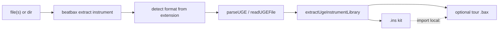

## Summary

Add a public CLI command that **extracts instruments** from tracker source files into a BeatBax `.ins` import kit (`inst` + `subpat` only).

The subcommand names the **asset** (`instrument`). The **source format** is inferred from the input path — v1 is hUGETracker `.uge`, the same way `beatbax inspect song.uge` already chooses the UGE reader.

```bash
beatbax extract instrument song.uge
beatbax extract instrument song.uge kit.ins
beatbax extract instrument songs/chiptune/uge --out gameboy.ins --demo gameboy-instruments-demo.bax
```

This is **not** full song import. Patterns, orders, and effects stay on [`hugetracker-uge-converter.md`](hugetracker-uge-converter.md) (`beatbax convert uge` → `.bax`). Extract is the reusable-kit half of that workflow: pull patches out of existing tracker songs and `import "local:….ins"` them into new BeatBax compositions.

The UGE conversion core already exists in `@beatbax/engine`. This feature is the product CLI, docs, and tests around it.

---

## Problem Statement

Authors often want **instruments** from a tracker file without converting the whole arrangement:

- Build a personal / pack kit from several hUGETracker songs.
- Audition a noise kick or wave bass in a new `.bax` without reconstructing envelopes by ear.
- Keep BeatBax songs as source of truth while still mining community `.uge` files.

What already exists:

| Capability | Status |
|---|---|
| Parse `.uge` v1–v6 | Implemented (`uge.reader.ts`, `beatbax inspect file.uge`) |
| Map duty / wave / noise + `subpat` → `.ins` source | Implemented (`ugeInstrumentsToBax.ts`) |
| Repo one-shot for the Game Boy library | `scripts/extract-gb-uge-instruments.ts` (hardcoded paths) |
| Full UGE → song `.bax` | Proposed only (`beatbax convert uge`) |
| Public `beatbax extract instrument` | **Missing** |

`inspect` is read-only (summary / JSON). The one-shot script is a development helper: it cannot be invoked as `beatbax extract …`, does not accept arbitrary files, and is not covered by CLI integration tests.

Without a CLI, users who install `@beatbax/cli` have no way to produce a `.ins` kit from a `.uge`.

---

## Proposed Solution

### Summary

Add a Commander parent command `extract` on `@beatbax/cli`, with a first subcommand `instrument` (alias `instruments`). v1 dispatches to `extractUgeInstrumentLibrary` when the input is a UGE file or a directory of them.

Keep conversion in the engine. The CLI only:

1. Resolves inputs (file, several files, or a directory).
2. Detects each file’s source format from its extension (override with `--from`).
3. Calls the matching extractor.
4. Writes `.ins` (and optionally a tour `.bax`).
5. Prints a short summary (counts, renames, parse failures).



### Why `extract instrument`, not `extract uge`

The user is extracting **instruments**. The file type is an implementation detail that the path already carries (`.uge`), as `inspect` already does:

```bash
beatbax inspect song.uge    # infers UGE
beatbax inspect song.bax    # infers BeatBax
beatbax extract instrument song.uge   # infers UGE → .ins kit
```

| Command | Job |
|---|---|
| `inspect` | Dump structure; format from extension; no files written |
| `extract instrument` | Pull **instruments** into a valid `.ins` kit; source format from extension |
| `convert uge` | (proposed) Whole **song** → `.bax` (pats, seqs, channels) |
| `convert wav2dmc` | WAV sample → NES DMC (unrelated) |

`convert uge` would emit `chip` / `pat` / `seq` / `channel`, which **must not** appear in `.ins` files. Mixing both behaviours under one subcommand would make the output type ambiguous.

Later extractors stay under the same asset verb:

```bash
beatbax extract instrument lead.uge      # v1
beatbax extract instrument song.ftm      # later Famitracker
beatbax extract instrument bank.aki      # later Arkos
```

Other assets could share the parent without colliding (`extract wavetable`, `extract sample`) — not this issue.

`extract uge` would name the **format** instead of the **thing**, and would have to be duplicated per tracker (`extract ftm`, `extract arkos`). Prefer one instrument command and a format detector.

### Format detection

v1 recognises **UGE only**.

| Input | Detection |
|---|---|
| File `*.uge` (any case) | UGE |
| Directory | Non-recursive `*.uge`, sorted |
| `--from uge` | Force UGE regardless of extension |
| Other extension, no `--from` | Usage error: unknown instrument source; hint `--from uge` |
| Mix of `.uge` and unknown files in one invocation | Skip unknown files with a warning; `--strict` fails |
| Empty directory / no `.uge` in a dir | Usage error |

Do **not** sniff binary magic in v1. Extension (or `--from`) is enough. A `.uge` that fails to parse is a parse error, not a format-detection error.

`--from` is the escape hatch for renamed files (`song.bin`, `song.UGE.bak`).

### Example usage

Single file — default output next to the source (`lead-song.ins`):

```bash
beatbax extract instrument lead-song.uge
```

Explicit output:

```bash
beatbax extract instrument lead-song.uge songs/lib/from-uge.ins
```

Directory merge (library-wide name allocator, clash → `name_2`):

```bash
beatbax extract instrument songs/instruments/gameboy/uge --out songs/instruments/gameboy/gameboy.ins
```

Optional tour song that imports the kit and plays every extracted name once:

```bash
beatbax extract instrument pack.uge kit.ins --demo pack-instruments-demo.bax
```

Stdout / dry run:

```bash
beatbax extract instrument song.uge --stdout
beatbax extract instrument song.uge --summary
```

Type filter (Game Boy channel class, not file format):

```bash
beatbax extract instrument song.uge --type noise,wave
```

Forced format:

```bash
beatbax extract instrument dumped.bin --from uge --out dumped.ins
```

A song then uses the kit:

```bax
chip gameboy
import "local:from-uge.ins"
bpm 128
channel 1 => inst Lead pat hook
```

From another folder, a relative `local:` path is required (parent `..` segments are **rejected** by import security — keep the kit beside the song, or under a child folder such as `lib/`):

```bax
import "local:lib/from-uge.ins"
```

### CLI contract (v1)

```text
beatbax extract instrument <inputs...> [output.ins]
```

Alias: `instruments`.

| Flag | Effect |
|---|---|
| `--out <path>` | Kit path (same as the optional positional output) |
| `--from <format>` | Source format (`uge` in v1). Default: infer from extension |
| `--stdout` | Print kit to stdout; do not write a file |
| `--summary` | Print counts / renames only; do not write kit |
| `--demo [path]` | Write a tour `.bax` (default: `{kitStem}-demo.bax` next to the kit) |
| `--type <list>` | Comma-separated `pulse`, `wave`, `noise` (default: all) |
| `--strict` | Non-zero exit if any input file fails to parse or is an unknown type |

**Inputs:** one or more files, and/or directories. Mix of files and dirs is allowed. Directories contribute matching instrument sources only (`*.uge` in v1).

**Default kit path** (when neither `--out` nor positional output nor `--stdout` / `--summary`):

- One file → `{dir}/{basename}.ins`
- Several files or a directory → require `--out` (do not guess a merge name)

**Exit codes:** `0` success; `1` usage / missing files / unknown format; `2` parse failure (`--strict`, or every input failed).

### Mapping (already implemented, UGE)

Reuse [`ugeInstrumentsToBax.ts`](../../packages/engine/src/import/uge/ugeInstrumentsToBax.ts). Do not fork a second mapper in the CLI.

Include a slot if it is used on that type’s order/patterns, has a non-empty subpattern/macro, or has a non-empty non-placeholder name. Skip unused empty slots, BeatBax placeholders (`DUTY_n` / `WAVE_n` / `NOISE_n`), and unused hUGETracker starter names (`Duty 50%`, `Sawtooth wave`, …).

Names: sanitize to `[A-Za-z_][A-Za-z0-9_\-]*`; reserved words and empty results → `pulse_N` / `wave_N` / `noise_N`; library-wide case-insensitive clashes → `name_2`.

Fields (inverse of UGE export):

- Duty → `type=pulse1`, `duty=`, `env=`, `sweep=` when time > 0, `length=` if enabled
- Wave → `type=wave`, `wave="` 32 hex nibbles, `volume=` 0/25/50/100
- Noise → `type=noise`, `gb:width=7|15`, `env=`, `uge_note=` from the first noise-channel note that uses that slot
- Subpatterns → native `subpat` (`ugeNoteToOffset`, `Cxy` → `vol:`, `9xx` → `timbre:`, self-jump → `halt`)

Kit files contain comments + `inst` / `subpat` only (must pass `collectDisallowedInsFileNodes`).

---

## Implementation Plan

### AST Changes

None. `.ins` grammar already allows `inst` and `subpat`.

### Parser Changes

None.

### Engine Changes

Small, if any:

- Keep `extractUgeInstrumentLibrary` as the public API (`@beatbax/engine` / `@beatbax/engine/import` already re-export it).
- Optional: honour a `kinds?: InstrumentKind[]` option so `--type` does not filter after the fact (name allocator should skip omitted types).
- Optional: `--demo` should use `formatGameBoyInstrumentsDemo` but take the **actual kit filename** in the `import "local:…"` line (today the helper hardcodes `gameboy.ins`).

No new convert-to-song code here.

### CLI Changes

- `packages/cli/src/cli.ts`: parent `extract` (reusable assets from external files) + subcommand `instrument` (alias `instruments`).
- Small `detectInstrumentSource(path, from?)` helper: extension map `{ '.uge': 'uge' }`, then `--from`.
- Mirror `inspect` / `convert wav2dmc` style: `ensureFileExists`, path resolve, mkdir for output dir, concise `[OK]` / summary lines.
- Do not import the repo script. Call engine functions.

Replace the hardcoded one-shot **or** keep it as a thin wrapper that execs:

```bash
npx @beatbax/cli extract instrument songs/instruments/gameboy/uge \
  --out songs/instruments/gameboy/gameboy.ins \
  --demo songs/instruments/gameboy/gameboy-instruments-demo.bax
```

Prefer documenting that invocation and deleting path-specific logic from `scripts/extract-gb-uge-instruments.ts` once the CLI lands.

### Web UI / Desktop Changes

Out of scope for v1. A later “Extract instruments…” file picker can call the same engine helper (same as the converter feature’s UI phase).

### Export Changes

None.

### Documentation Updates

- `packages/cli/README.md` — new Extract section next to Inspect / Convert.
- This feature doc → `docs/features/complete/` when shipped.
- Cross-link from [`hugetracker-uge-converter.md`](hugetracker-uge-converter.md) so `extract instrument` vs `convert uge` stays obvious.
- Short note in [`docs/api/uge-reader.md`](../api/uge-reader.md).

---

## Testing Strategy

### Unit Tests

Already in `packages/engine/tests/ugeInstrumentsToBax.test.ts` and `uge.reader.versions.test.ts`. Extend only if CLI needs new engine options (`kinds`, demo import filename).

CLI unit tests for format detection: `.uge` → uge; `.bax` / `.mid` → unknown; `--from uge` on a non-`.uge` name; directory collects `*.uge` only.

### Integration Tests

Add `packages/cli/tests/extract-instrument.integration.test.ts` (same pattern as `convert-wav2dmc.integration.test.ts`):

- Build a tiny v6 fixture via `buildUgeFixture` (do **not** depend on gitignored `songs/**/*.uge`).
- `beatbax extract instrument fixture.uge out.ins` writes a file that `parse`s and passes `collectDisallowedInsFileNodes`.
- `--demo` resolves `import "local:….ins"` with `baseFilePath` set to the demo path; every kit name appears in a `:inst(name)` tour.
- Directory with two fixtures: clash `Lead` → `Lead_2`.
- `--stdout` prints kit source and does not write `--out`.
- `song.bin` without `--from` → exit 1; `song.bin --from uge` with valid UGE bytes succeeds.
- Missing file → exit 1; corrupt `.uge` → exit 2.

---

## Migration Path

- Existing `.ins` kits and the in-repo `gameboy.ins` stay valid.
- No language change; songs keep `import "local:…"`.
- The one-shot script can be removed after the CLI reproduces its output (or kept as a repo npm script that calls the CLI).

---

## Implementation Checklist

- [ ] `extract` parent + `instrument` subcommand (alias `instruments`) in `packages/cli/src/cli.ts`
- [ ] Format detection from extension; `--from uge` override
- [ ] Default / `--out` / `--stdout` / `--summary` / `--demo` / `--type` / `--strict`
- [ ] Directory and multi-file merge using `extractUgeInstrumentLibrary`
- [ ] Demo `import` line uses the real kit basename
- [ ] CLI integration tests with committed UGE fixtures
- [ ] `packages/cli/README.md` examples
- [ ] Cross-link from the full UGE→`.bax` converter spec
- [ ] Decide: delete or slim `scripts/extract-gb-uge-instruments.ts`

---

## Future Enhancements

- Additional `--from` values / extensions under the same `extract instrument` command (Famitracker, Arkos `.aki`) — not this issue.
- Desktop / web “Extract instruments…” (file picker → insert `import` + paste kit, or write `.ins` beside the song).
- `--merge` into an existing `.ins` (append + clash rename) instead of overwrite.
- Filter by name glob (`--name Kick*`).
- `beatbax extract instrument song.uge --emit-inst` printing pasteable `inst` lines to stdout (same idea as `convert wav2dmc --emit-inst`).
- Other `extract` assets (`wavetable`, `sample`) — not this issue.

---

## Open Questions

1. **Default include policy** — keep today’s “named or used or subpat” (yes). `--used-only` can be a later flag if kits are still noisy.
2. **Overwrite vs refuse** — v1 overwrite of `--out` is fine; print the path. `--merge` later.
3. **Recursive directories** — v1 non-recursive. `--recursive` later if needed.
4. **Singular vs plural** — ship `instrument` as the canonical verb; accept `instruments` as an alias.

---

## References

- Engine: `packages/engine/src/import/uge/uge.reader.ts`, `ugeInstrumentsToBax.ts`
- Prototype: `scripts/extract-gb-uge-instruments.ts`
- CLI patterns: `packages/cli/src/cli.ts` (`inspect`, `convert wav2dmc`)
- `.ins` rules: `packages/engine/src/song/ins-file.ts`, [`complete/instrument-imports.md`](complete/instrument-imports.md)
- Import paths: [`docs/grammar/import-security.md`](../grammar/import-security.md)
- Sibling: [`hugetracker-uge-converter.md`](hugetracker-uge-converter.md) (issue #151)
- Issue draft: [`.github/ISSUES/cli-extract-uge-instruments.md`](../../.github/ISSUES/cli-extract-uge-instruments.md)

---

## Additional Notes

`inspect file.uge --json` remains the way to dump the raw parsed UGE model. Extract is the authoring path: stable BeatBax source, not a JSON dump of tracker internals.

UGE export of a song that imports a large kit still cannot fit more than 15 slots per type in hUGETracker. The optional demo header should keep stating that, as the in-repo tour already does.
