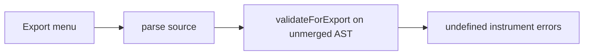

## Summary

Desktop (and any host using `ExportManager`) failed to export songs whose instruments, named `effect` presets, or `subpat` tables come from `import`. CLI export already merged kits. Play, parse/diagnostics, and CodeLens ▶ Preview already merged kits too.

**Shipped.** `ExportManager` now merges imports the same way Play, parse, and CodeLens do, then validates and resolves the **merged** AST. Each export re-parses the editor buffer so unsaved edits are included.

## Current state (2026-08-16)

Import merge now works in these Desktop/web paths:

| Path | Merges `import`? | Landed |
|------|:---:|--------|
| Parse / Problems diagnostics (`createAppContext.emitParse`) | yes | [#170](https://github.com/kadraman/beatbax/issues/170) |
| Whole-song Play (`PlaybackManager`) | yes | with parse |
| CodeLens / Alt+P preview | yes | [#176](https://github.com/kadraman/beatbax/pull/176) |
| CLI `verify` / `play` / `export` | yes | original import work |
| **Desktop Export menu** (`ExportManager`) | **yes** | **this spec / [#171](https://github.com/kadraman/beatbax/issues/171)** |

`.ins` kits may also contain native `subpat` tables ([#174](https://github.com/kadraman/beatbax/pull/174)) and named `effect` presets ([#176](https://github.com/kadraman/beatbax/pull/176)). Those merge with instruments during `resolveImports`. Skipping that step on export drops the whole kit, not only `inst` names.

Web-lite does **not** expose an Export menu (`capabilities.export === false`). `ExportManager` is still the shared UI export path; Desktop is the user-facing host. If web-lite later re-enables export, remote `github:` / `https:` imports that Play can load must export too. Web-lite still cannot load `local:`.

## Problem Statement

[`songs/features/local_import_example.bax`](../../../songs/features/local_import_example.bax) and adventure-pack songs such as `packs/gb-adventure-pack/src/_loop_template.bax` have no inline `inst` lines. Channels reference kit names from `.ins` files:

```bax
import "local:lib/adventure.ins"

channel 1 => inst adv_lead seq mel
channel 2 => inst adv_harm seq harm
channel 3 => inst adv_bass seq bass
channel 4 => inst kick seq perc
```

CLI `beatbax export uge …` succeeds because [`validateSource`](../../../packages/cli/src/cli.ts) calls `resolveImports` before validation and export.

Desktop **Export → hUGETracker** (and every other format that goes through `ExportManager`) fails. Problems window:

```text
Export failed: Validation failed: Channel 1 references undefined instrument 'adv_lead'. — Define 'inst adv_lead' before using it.; …
```

Play and ▶ Preview on the same saved file succeed after [#170](https://github.com/kadraman/beatbax/issues/170) / [#176](https://github.com/kadraman/beatbax/pull/176).

### Root cause

[`ExportManager.export()`](../../../packages/app-core/src/export/export-manager.ts) still does:

1. `parse(source)` — parser AST only; `import` is not merged.
2. `validateForExport(ast, format)` — generic check: `ast.insts[ch.inst]` must exist. Kit names are missing → hard error. This check is **not** UGE-specific.
3. `resolveSong(ast)` — Desktop/web use the **browser** `@beatbax/engine/song` bundle. That `resolveSong` calls [`resolveImportsSync`](../../../packages/engine/src/song/importResolver.browser.ts), which **always throws** (`resolveImportsSync is not available in browser context`). Remote `https:` / `github:` lines throw earlier (`Use resolveSongAsync()`).
4. Then `plugin.export(resolved, …)`.

So even `validate: false` cannot export a kit song: step 3 throws in the browser bundle. The GitHub issue originally described step 3 as “export without the kit”; that is the Node resolver behaviour, not Desktop/web.

Format-specific extras (UGE duty/wave/noise counts, MIDI noise → channel 10) would also be wrong if they ran, because `ast.insts` is still empty. They never get that far.



## Proposed Solution

### Summary

Reuse the Play/parse/CodeLens import path inside `ExportManager`. Do **not** snapshot `latestResolvedAst` from `parse:success` as the export source — re-parse the buffer so unsaved edits are exported.

1. After `parse(source)`, if `ast.imports?.length`, `await resolveImports(ast, buildImportResolverOptions())` (same helper as [`create-app-context.ts`](../../../packages/app-core/src/app/create-app-context.ts), playback, and [`parseAndResolveForPreview`](../../../packages/app-core/src/editor/codelens-preview.ts)).
2. On import failure, fail the export with that message (`export:error` / Problems), not a generic “undefined instrument” list.
3. Run `validateForExport` on the **merged** AST (`insts` / `effects` / `subpatterns` populated, `imports` cleared).
4. Call `resolveSong` on that merged AST so the browser bundle does not enter `resolveImportsSync`.
5. Pass the resolved song to `exportViaPlugin` unchanged.

Desktop `local:` continues to use Electron FS injection via `buildImportResolverOptions()` (`LAST_DOCUMENT_PATH` + `window.electronAPI.readFileSync` / `existsSync`). Untitled buffers still cannot resolve `local:` (no folder) — same as Play.

### Example Usage

After the fix, with `songs/features/local_import_example.bax` saved on disk:

1. File → Open the song.
2. Export → hUGETracker (UGE), MIDI, WAV, or JSON.
3. The file contains `gb_lead`, `gb_bass`, `kick` from the local `.ins` kits.

CLI behaviour is unchanged and remains the reference.

## Implementation Plan

### AST Changes

None.

### Parser Changes

None.

### CLI Changes

None. CLI export already resolves imports in `validateSource`.

### Web UI / Desktop Changes

- [`packages/app-core/src/export/export-manager.ts`](../../../packages/app-core/src/export/export-manager.ts) — merge imports with `buildImportResolverOptions()` before `validateForExport` and `resolveSong`.
- [`packages/app-core/tests/export-manager.test.ts`](../../../packages/app-core/tests/export-manager.test.ts) — cover kit songs (see Testing).

No Desktop-only UI chrome. [`handleDesktopExport`](../../../apps/desktop/src/renderer/src/lib/export-handler.ts) already passes `filename` (document stem) and the editor source; it does not need to pass a filesystem path because `buildImportResolverOptions()` reads `LAST_DOCUMENT_PATH`.

### Export Changes

This **is** the export-host change. Exporter plugins (`uge`, `midi`, `wav`, `json`, FamiTracker, VGM, Arkos, …) stay payload-first and keep consuming validated ISM. They must not grow their own `resolveImports` calls.

### Documentation Updates

This spec. After implementation:

- Move to `docs/features/complete/`.
- Note the UI export path in [`instrument-imports.md`](instrument-imports.md).
- [`export-architecture.md`](../../exports/export-architecture.md) UI flow: parse → **merge imports** → validate → resolve → plugin.

## Testing Strategy

### Unit Tests

[`packages/app-core/tests/export-manager.test.ts`](../../../packages/app-core/tests/export-manager.test.ts):

- Mock `resolveImports` + parser (same pattern as [`codelens-preview.test.ts`](../../../packages/app-core/tests/codelens-preview.test.ts)).
- Source with `import "local:lib/kit.ins"` and `channel 1 => inst gb_lead …` (no inline `inst`):
  - `validate: true` (default) succeeds after merge.
  - `plugin.export` receives a resolved song whose `insts` include kit names.
  - `resolveImports` is called with options from `buildImportResolverOptions` (desktop path when `LAST_DOCUMENT_PATH` is set).
- Song with no `import` lines: `resolveImports` is not called.
- Import merge failure: `success: false`, `export:error`, message includes the import error (not “undefined instrument”).
- Existing filename / save-dialog tests stay green.

### Integration Tests

Manual: open a **saved** `songs/features/local_import_example.bax` (or `packs/gb-adventure-pack/src/_loop_template.bax`) in Desktop. Export UGE, MIDI, WAV, JSON. Confirm kit instruments are in the artifact. Confirm a truly missing `inst` (not supplied by song or import) still fails validation.

## Migration Path

No song-format change. Songs that already import kits start exporting from Desktop without author edits.

## Implementation Checklist

- [x] `ExportManager.export()` merges imports with `buildImportResolverOptions()` before validate/resolve.
- [x] `validateForExport` and `resolveSong` run on the merged AST (`imports` cleared).
- [x] Import failure surfaces as `export:error` with the import message.
- [x] Default `validate: true` still errors on instruments that are missing after merge.
- [x] Desktop `local:` export uses the saved document path; web-lite still blocks `local:`.
- [x] Unit tests + `@beatbax/app-core` patch changeset.
- [x] Move this spec to `docs/features/complete/` and note UI export in `instrument-imports.md`.

## Future Enhancements

None required for v1. Optional later: share a single `parseAndResolveForPreview`-style helper between CodeLens and ExportManager so the merge policy cannot drift.

## Open Questions

None for v1. Export stays click-to-reparse; do not snapshot `latestResolvedAst` for the payload.

## References

- Tracking issue: https://github.com/kadraman/beatbax/issues/171
- [`docs/features/complete/instrument-imports.md`](instrument-imports.md)
- [`docs/features/codelens-preview-imported-instruments.md`](../codelens-preview-imported-instruments.md) (preview path; shipped in #176)
- [`docs/exports/export-architecture.md`](../../exports/export-architecture.md)
- Parse / diagnostics: [#170](https://github.com/kadraman/beatbax/issues/170)
- `.ins` `subpat`: [#174](https://github.com/kadraman/beatbax/pull/174)
- Named `effect` in `.ins` + CodeLens preview: [#176](https://github.com/kadraman/beatbax/pull/176)

## Additional Notes

Patch `@beatbax/app-core` so that `ExportManager` merges `import` kits (instruments, effects, subpatterns) before validation and plugin export.
