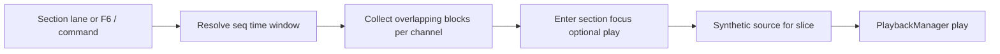

## Summary

Let BeatBax Desktop play one **time-aligned arrangement slice** across all channels — for example all four `theme_*` parts together — without commenting out other `channel` references or editing the buffer.

v1 builds a synthetic `.bax` of only the overlapping section and plays it through the existing transport (`PlaybackManager`). There is **no new grammar**.

**Shipped UX (Desktop):** arrangement-slice playback is wrapped in **section focus mode** — a persistent session state with Pattern Grid highlighting, editor decorations, transport-scoped F5/F8, and keyboard navigation (F6, Esc, Alt+←/→).

## Problem Statement

`pat` defines a phrase on one channel. Hearing how parts **combine** means playing the same time window on every channel at once.

Today that is painful:

| Capability                                        | What it actually plays                                                                                                                                                                     |
| ------------------------------------------------- | ------------------------------------------------------------------------------------------------------------------------------------------------------------------------------------------ |
| CodeLens `▶ Preview` / `↺ Loop` on `pat` or `seq` | **One** item, one channel. Starting another preview stops the current one.                                                                                                                 |
| Channel mute / solo                               | Hides whole channels for the **full** song. Does not isolate a section in time.                                                                                                            |
| Grammar `:mute` / `:rest` on a seq/pat ref        | Silences that item but **keeps its duration**, so the wanted section still starts after silent bars. Every other token on every channel still needs editing.                               |
| Play Selection (`beatbax.playSelection`, demoted) | Multiple **seq definition** lines can layer on separate channels. Multiple **pats are chained on one channel**. Instrument lookup only sees the **first** `seq` token on a `channel` line. Surfaces removed; prefer CodeLens / Pattern Grid. |
| Transport Play                                    | Plays every `channel` line as written.                                                                                                                                                     |

The practical workaround is commenting out other pattern/sequence references on each `channel` line. Songs such as [`songs/gameboy/heroes_call.bax`](../../../songs/gameboy/heroes_call.bax) make that cost obvious:

```bax
channel 1 => inst hero_bright  seq fanfare_mel  theme_mel  bridge_mel  …
channel 2 => inst chord_bright seq fanfare_harm theme_harm bridge_harm …
channel 3 => inst deep_bass    seq fanfare_bass theme_bass bridge_bass …
channel 4 => inst kick         seq fanfare_perc theme_perc bridge_perc …
```

Hearing only the theme means four coordinated edits, then restoring the lines. Preview combinations are a **session** concern, not song structure, so a `mix` / `preview` directive would be the wrong layer.

## Proposed Solution

### Summary

Treat an arrangement slice as a **temporary channel map** derived from the Pattern Grid timeline. Keep definitions (`chip`, `bpm`, `import`, `inst`, `pat`, `seq`, `effect`). Replace `channel` and `play` with only the overlapping section, then play through transport.



**Desktop:** the primary affordance is the Pattern Grid **section lane** (seq row), not Shift+click on individual pat blocks. **Web-lite** still uses Shift+click on pat blocks (see Platform differences below).

### Example Syntax

No new `.bax` syntax. The synthetic buffer uses existing `channel` lines:

```bax
# original inst / pat / seq / import lines kept
channel 1 => inst hero_bright  seq theme_mel
channel 2 => inst chord_bright seq theme_harm
channel 3 => inst deep_bass    seq theme_bass
channel 4 => inst kick         seq theme_perc
play auto repeat
```

That is the same shape as commenting out the other seq tokens, without touching the editor.

### Example Usage (Desktop)

1. Open a multi-section song with the Pattern Grid visible.
2. In the **section lane** (top seq row): click a section **name** to **focus** (highlight grid + editor, no play), or click **▶** to **focus and play**.
3. Right-click a section for **Focus section** / **Play section**.
4. While focused: **F5** plays the section; **F8** stops but keeps focus; transport loop toggle loops the slice when playing.
5. In the editor: **F6** focuses the section at the cursor (uses enclosing `seq` line, not first global pat match); **Esc** exits focus; **Alt+←/→** moves to prev/next section.
6. **Pat blocks** in channel rows: click navigates to the `pat` definition (unchanged). Click does not enter section focus — use the section lane or F6.
7. Command palette **Play Arrangement Slice** plays the slice at the cursor (cursor-aware anchor resolution).
8. Mixer mute/solo still apply. The editor buffer is never modified.

### Section focus mode (Desktop)

Section focus is the persistent UI shell around arrangement-slice playback:

| Element | Behaviour |
| --- | --- |
| Pattern Grid section lane | Collapsed seq-level blocks; focus highlight on active column |
| Pattern Grid channel rows | Column highlight on overlapping pats; mute/solo per channel |
| Editor | Highlights section comment + `seq … =` lines for the focused section |
| Editor overlay | **Exit focus** button (top-right); Esc also exits |
| Status bar | Read-only **Section focus** pill |
| Transport F5 | Plays focused section when focus is active; full song otherwise |
| Transport F8 | Stops playback; **keeps** section focus |
| Playhead | Jumps to section start when entering focus or stopping in focus mode |

Implementation: `section-focus-controller.ts`, `section-focus-editor.ts`, `section-focus-overlay.ts`, `resolveSectionFocus` / `findArrangementSliceAnchorAtCursor` in `arrangement-slice.ts`.

### Platform differences

| Gesture | Desktop | Web-lite |
| --- | --- | --- |
| Section lane (seq row) | Primary focus/play affordance | N/A |
| Shift+click pat block | Not used (navigate only) | Plays slice at that block |
| Section focus mode | Full (keyboard, editor, overlay) | Not shipped |
| F6 / Esc / Alt+←/→ | Yes | No |

## Scope

### Included (v1 + section focus)

| Area | Detail |
| --- | --- |
| Slice definition | Time window of the **containing sequence item** when `seqName` is present (`theme_mel` = all of its pats). Otherwise the single pattern block. |
| Other channels | Include blocks whose step range **overlaps** that window. Prefer the original `seq` name when the window matches that seq's span. |
| Playback path | `PlaybackManager.play` on synthetic source. **Not** the CodeLens isolated `Player`. |
| Desktop Pattern Grid | Section lane (focus / ▶ play); column highlight; context menu; pat blocks = navigate only; channel mute/solo. |
| Section focus mode | Persistent focus state, editor decorations, transport-scoped F5/F8, F6 at cursor, Esc, Alt+←/→. |
| Command | `beatbax.playArrangementSlice` — cursor-aware slice at editor position. |
| Loop | When transport **loop** is on, focused playback uses `play auto repeat` on the synthetic source. No separate context-menu loop item. |
| Misaligned overlap | Whole overlapping pats included; toast when misaligned. |
| Play Selection hardening | Full channel-token inst map; multi-pat layering by channel. |
| Web-lite | Shift+click pat block → slice play (no section focus shell). |

### Out of scope (v1)

- New grammar (`section`, `form`, `mix`, `preview`, `cat`).
- Scratch mix of pats not on the timeline.
- Engine `startStep` / `endStep` seeking (see [pattern-grid-seek-and-loop.md](../pattern-grid-seek-and-loop.md)).
- Additive CodeLens (several pats at once on the isolated player).
- Desktop Shift+click on pat blocks (superseded by section lane + F6).
- Dedicated **Loop this section** context-menu item (transport loop toggle is sufficient).

### Deferred / not planned

- **Desktop e2e** for slice play — manual QA in [`docs/qa/desktop-release-qa.md`](../../qa/desktop-release-qa.md) covers this; unit tests cover the builder. Low ROI unless CI regressions appear.

## Supported arrangements

Section focus and the Pattern Grid section lane work best when a song's **top-level channel seq items** align across channels. Three common layouts:

| Layout | Example | Section focus |
| --- | --- | --- |
| **Structured** | [`a_trainers_journey.bax`](../../../songs/gameboy/a_trainers_journey.bax) | Full: section lane, cross-channel column highlight, `# --- Section N: … ---` comment + all role `seq` lines in the editor |
| **Phased** | [`shadow_temple.bax`](../../../songs/nes/shadow_temple.bax) | Slice play and column highlight work per phase (`intro` / `main` / `bridge` on each `channel` line). Editor grouping is weaker when seq defs are channel-grouped instead of under section headers |
| **Monolithic** | [`battle_fanfare.bax`](../../../songs/nes/battle_fanfare.bax) | One seq per channel spanning the whole song — section focus selects the **entire** timeline. Pat-block navigation and cursor-aware F6 on individual pats still work |

**Slice window rule:** focus expands to the **containing top-level channel seq item** (`channelItemIndex`), not arbitrary pat runs inside a long `seq`. Repeated pattern names on the timeline (e.g. `mel_a1` in Theme A and Reprise) are distinct positions; F6 uses cursor context to pick the right occurrence.

**Editor hints:** after parse, info diagnostics on the first `channel` line suggest improvements for phased or monolithic layouts (see `detectArrangementLayout` in app-core). **Arrange: Restructure Phased Sections into Headers** (command palette) can rewrite channel-grouped phased seq defs into `# --- Section N ---` blocks — opt-in, edits the open buffer only.

First-class freeform support (`section`, `form`, `cat`) is planned in [song-composition-abstractions.md](../song-composition-abstractions.md).

## Implementation Plan

### AST / Parser / CLI / Export

No changes. Slice playback is session-only.

### App-core (shared)

- [`arrangement-slice.ts`](../../../packages/app-core/src/editor/arrangement-slice.ts): `buildArrangementSliceSource`, `resolveSectionFocus`, `listArrangementSections`, `findAdjacentSectionAnchor`, `findArrangementSliceAnchorAtCursor`.
- [`command-palette.ts`](../../../packages/app-core/src/editor/command-palette.ts): `beatbax.playArrangementSlice`, hardened `buildMultiPlaySource`.
- [`cursor-ident.ts`](../../../packages/app-core/src/editor/cursor-ident.ts): identifier at cursor for F6.

### Desktop

- [`DesktopPatternGrid.tsx`](../../../apps/desktop/src/renderer/src/components/panels/DesktopPatternGrid.tsx): section lane, slice highlight, mute/solo, context menu.
- [`section-focus-controller.ts`](../../../apps/desktop/src/renderer/src/lib/section-focus-controller.ts): enter/exit/play/refresh/navigate.
- [`section-focus-editor.ts`](../../../apps/desktop/src/renderer/src/lib/section-focus-editor.ts): Monaco decorations.
- [`section-focus-overlay.ts`](../../../apps/desktop/src/renderer/src/lib/section-focus-overlay.ts): Exit focus control.
- [`pattern-grid-shortcuts.ts`](../../../apps/desktop/src/renderer/src/lib/pattern-grid-shortcuts.ts): F6, Esc, Alt+arrows in editor.
- [`desktop-workspace.ts`](../../../apps/desktop/src/renderer/src/lib/desktop-workspace.ts): wires controller, transport, shortcuts, command palette.

### Web-lite

- [`pattern-grid.ts`](../../../apps/web-ui/src/ui/pattern-grid.ts): Shift+click → `buildArrangementSliceSource` → play.

### Keyboard shortcuts (Desktop, section focus)

| Key | Action |
| --- | --- |
| F5 | Play (focused section when section focus is on) |
| F6 | Focus section at cursor (no play) |
| F8 | Stop (keeps section focus) |
| Esc | Exit section focus |
| Alt+← | Previous section (while focused) |
| Alt+→ | Next section (while focused) |

## Testing Strategy

### Unit Tests (automated)

- `buildArrangementSliceSource` — heroes_call-shaped fixture, pat-only channel, length mismatch, loop option.
- `buildMultiPlaySource` — inst map, multi-pat layering.
- `findArrangementSliceAnchorAtCursor` — reused pat names resolve to enclosing seq (not first timeline match).
- `listArrangementSections` / `findAdjacentSectionAnchor` / `resolveSectionFocus`.

### Manual QA

- [`docs/qa/desktop-release-qa.md`](../../qa/desktop-release-qa.md) — Pattern Grid section focus shortcuts row.

## Migration Path

Fully additive. Existing `.bax` files, CodeLens, mute/solo, and transport Play are unchanged. Pat-block click remains navigate-only on Desktop.

## Implementation Checklist

- [x] Spec + issue draft.
- [x] `buildArrangementSliceSource` + unit tests.
- [x] Harden `buildMultiPlaySource` + tests.
- [x] Desktop Pattern Grid: section lane, column highlight, context menu; pat click = navigate.
- [x] Section focus mode: controller, editor decorations, overlay, status bar, transport integration.
- [x] Keyboard shortcuts: F5/F6/F8, Esc, Alt+←/→.
- [x] Cursor-aware F6 (`findArrangementSliceAnchorAtCursor`).
- [x] Wire slice play → `PlaybackManager.play`.
- [x] Command `beatbax.playArrangementSlice`.
- [x] Web-lite Pattern Grid Shift+click.
- [x] Help panel + QA checklist updated.
- [x] Spec updated for shipped section-lane / section-focus UX (this revision).
- [x] Supported arrangements docs + layout info diagnostics.
- [x] Phased cross-channel `resolveSectionFocus` seq highlighting fix.
- [x] Command `beatbax.restructurePhasedSections` (opt-in buffer rewrite).
- [ ] Desktop e2e — **deferred** (see Out of scope).

## Resolved decisions

1. **Primary Desktop gesture:** section lane (seq row) — click name to focus, ▶ to play. Not Shift+click on pat blocks.
2. **Loop:** transport loop toggle + `play auto repeat` on synthetic source when loop is enabled. No dedicated context-menu loop entry.
3. **Window clipping:** clip to clicked seq window; whole overlapping pats included with misaligned toast when needed.
4. **F6 anchor:** cursor context (seq definition line, channel seq ref, nearest seq block) — not first global pat/seq name match.

## Future Enhancements

- Engine `startStep` / `endStep` from [pattern-grid-seek-and-loop.md](../pattern-grid-seek-and-loop.md).
- Named `section` / `form` from [song-composition-abstractions.md](../song-composition-abstractions.md).
- Scratch-mix picker for pats not yet on `channel` lines.
- CLI `beatbax play --slice theme_mel`.
- Granular CodeLens toggles — see [granular-codelens-settings.md](../granular-codelens-settings.md).

## References

- Issue: https://github.com/kadraman/beatbax/issues/189
- [`docs/features/pattern-grid-seek-and-loop.md`](../pattern-grid-seek-and-loop.md)
- [`docs/features/complete/editor-interactive-features.md`](editor-interactive-features.md)
- [`docs/features/complete/sequence-arrangements.md`](sequence-arrangements.md)
- [`packages/app-core/src/editor/codelens-preview.ts`](../../../packages/app-core/src/editor/codelens-preview.ts)
- [`songs/gameboy/heroes_call.bax`](../../../songs/gameboy/heroes_call.bax)

## Additional Notes

CodeLens stays single-item/single-channel. Pattern Grid section focus is multi-channel and uses transport — complementary, not redundant. See [granular-codelens-settings.md](../granular-codelens-settings.md) for optional seq CodeLens toggle.

This feature is **Phase 0** relative to Pattern Grid seek/loop: synthetic AST “play this column”. Engine seek/loop remains the long-term model for loop regions on the **full** song timeline.
