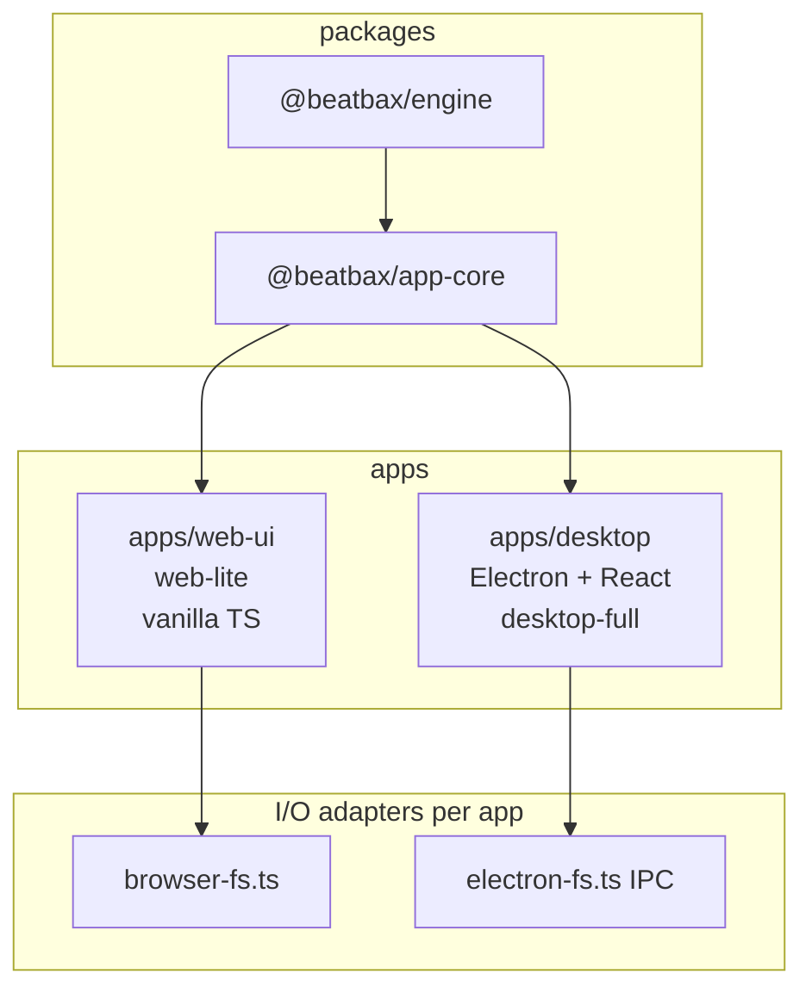

## Summary

Restructure BeatBax's client applications so the **Electron desktop app is the primary, full-featured IDE**, while the **browser web UI becomes a simplified "web-lite" experience** for trying BeatBax without installation. Shared application logic moves into a new `@beatbax/app-core` workspace package; the desktop renderer is built with **React** (not a symlink of the vanilla web-ui DOM).

This feature supersedes the original "additive Electron wrapper around web-ui" approach documented in [electron-desktop-client.md](./electron-desktop-client.md). Electron-specific plumbing (IPC, native menus, packaging) remains as specified there; the renderer architecture and web-ui scope change significantly.

---

## Implementation Progress

**Last updated:** 2026-06-11  
**Overall status:** Phases 1–3 **complete**; Phase 4 **in progress** (CI/scripts/docs done; manual QA and first GitHub Release pending).

| Phase | Status | Notes |
|-------|--------|-------|
| **1 — `@beatbax/app-core`** | ✅ Complete | Package builds and tests independently (26 suites, 392 tests). Web-ui consumes app-core. |
| **2 — web-lite** | ✅ Complete | `apps/web-ui` ships as web-lite profile. See [Phase 2 deviations](#phase-2-deviations-from-original-spec) below. |
| **3 — Electron desktop (React)** | ✅ Complete | Full IDE via web-ui panel bridges; native file I/O, session restore, Open Recent, custom title bar, sandboxed preload. 21 unit tests + Playwright e2e. |
| **4 — Distribution** | 🟨 In progress | Root README/scripts, `apps/desktop/README.md`, desktop CI workflow, and `@beatbax/engine` changeset added; manual QA and first GitHub Release still pending. |

**Key artifacts (Phases 1–2):**

- `packages/app-core/` — shared stores, playback, editor, export, import, plugins, utils, `client-profile.ts`, `createAppContext()`, `FileIOAdapter`
- `apps/web-ui/vite.config.ts` — `__CLIENT_PROFILE__: "web-lite"`
- `apps/web-ui/src/app/web-lite-header.ts` — favicon + text logo + social icon links
- `apps/web-ui/tests/web-lite.test.ts`, `web-lite-download.test.ts`, `status-bar-panels.test.ts`, `panels-menu.test.ts`, `bottom-expand-strip.test.ts`

**Key artifacts (Phase 3):**

- `apps/desktop/` — electron-vite + React renderer with `desktop-full` profile
- `apps/desktop/src/main/` — window lifecycle, IPC handlers, native menu (Open Recent), file associations, Windows/Linux icon
- `apps/desktop/src/preload/` — `contextBridge` → `window.electronAPI` (CJS bundle for `sandbox: true`)
- `apps/desktop/src/renderer/` — `App.tsx`, `DesktopWorkspaceShell`, `DesktopTitleBar`, `electron-fs.ts` (read/write/exists via IPC)
- `packages/app-core/src/utils/local-storage.ts` — `LAST_DOCUMENT_PATH` for desktop session restore
- `packages/app-core/src/import/import-resolver-options.ts` — passes on-disk song path to engine import resolver
- `packages/engine/src/song/importResolver.ts` — allows local `.ins`/import resolution when `window.electronAPI` or explicit fs hooks are present
- `.changeset/desktop-local-imports-engine.md` — patch bump for engine import-resolver desktop support

**Key artifacts (Phase 4, partial):**

- `.github/workflows/desktop-build.yaml` — build engine → app-core → desktop; Playwright smoke tests; upload installers
- Root `package.json` — `desktop:dev`, `desktop:build`, `desktop:test`, `desktop:dist`
- Root `README.md` and `ROADMAP.md` — desktop-first positioning

**Not yet done (deferred / Phase 4 remainder):**

- Manual QA on Windows (primary platform), then macOS/Linux
- First desktop GitHub Release with installers
- `packages/app-core/README.md`
- `apps/web-ui/README.md` web-lite scope note

`@beatbax/app-core` is **`private: true`** — internal workspace package only, not published to npm (same as `@beatbax/web-ui`).

---

## Problem Statement

### Browser limitations

The current web UI at `apps/web-ui` is the only client. It runs in a browser sandbox:

- File exports trigger downloads rather than saving to a user-chosen path.
- No native Open/Save dialogs, file-type associations, or recent-files menu.
- Long audio render tasks cannot access the local file system directly.
- Distribution requires a hosted web server; there is no standalone installable app.

### Full IDE in the browser is the wrong default

The web UI has grown into a full IDE (~2,060-line `main.ts`, Monaco with code lens / glyph margin / command palette, channel mixer, pattern grid, export pipeline, BeatBax CoPilot, settings, and more). Many of these features are awkward or impossible to deliver well in a browser, and maintaining a single monolithic client for both browser and desktop creates friction:

- Browser users get complexity they do not need for a "try it" experience.
- A desktop build that simply reuses the entire vanilla web-ui DOM defers a maintainable UI architecture and makes React adoption harder later.
- Business logic, state, and UI chrome are tightly coupled in `apps/web-ui`, blocking independent evolution of each client.

### Goal

| Client | Role | Profile |
|--------|------|---------|
| **Desktop** (`apps/desktop`) | Default download; full IDE | `desktop-full` |
| **Web** (`apps/web-ui`) | Try in browser; limited editing/playback | `web-lite` |

---

## Architecture Decision

**Decision (2026-06-06):** Extract shared logic into `packages/app-core`, simplify web-ui to web-lite, and build the desktop renderer with **React + electron-vite** consuming app-core. Do **not** symlink `apps/web-ui/src` into the Electron renderer.

| Factor | Original plan ([electron-desktop-client.md](./electron-desktop-client.md)) | Revised plan (this document) |
|--------|-----------------------------------------------------------------------------|------------------------------|
| Code sharing | Symlink or alias web-ui source into desktop renderer | `@beatbax/app-core` package |
| Desktop UI framework | Vanilla TS + DOM (same as web-ui) | React |
| Web UI scope | Unchanged full IDE | Simplified web-lite |
| Desktop positioning | Opt-in additive distribution | **Primary client** |
| Estimated effort | 3–3.5 days | ~12–18 days |

Rationale:

1. **app-core-first** avoids maintaining two full UIs long-term; business logic lives in one place.
2. **React on desktop** enables a modern component model for the full IDE without rewriting web-lite.
3. **web-lite** gives browser users a focused edit/play/visualizer experience and drives desktop downloads.

---

## Proposed Solution

### Target architecture

```
packages/
  engine/          @beatbax/engine        (unchanged; published)
  app-core/        @beatbax/app-core      (NEW — shared logic; **private**, not on npm)

apps/
  web-ui/          @beatbax/web-ui        web-lite profile, vanilla TS shell (**private**)
  desktop/         @beatbax/desktop       desktop-full profile, Electron + React (Phase 3)
```



### Client profiles and capabilities

Each app sets its profile at build time via Vite `define`:

```typescript
// apps/web-ui/vite.config.ts
define: { __CLIENT_PROFILE__: '"web-lite"' }

// apps/desktop electron.vite.config.ts (renderer)
define: { __CLIENT_PROFILE__: '"desktop-full"' }
```

`packages/app-core/src/client-profile.ts`:

```typescript
export type ClientProfile = 'web-lite' | 'desktop-full';

export interface ClientCapabilities {
  export: boolean;
  copilot: boolean;
  channelMixer: boolean;
  patternGrid: boolean;
  advancedEditor: boolean;   // code lens, glyph margin, command palette
  midiStepEntry: boolean;
  helpPanel: boolean;
  problemsPanel: boolean;
  outputPanel: boolean;
  settingsPanel: boolean;
  nativeMenu: boolean;
}
```

### Feature matrix

| Capability | web-lite | desktop-full |
|------------|----------|--------------|
| Editing | Basic Monaco (syntax, diagnostics, completions, folding) | Full IDE (code lens, glyph margin, command palette, MIDI step entry) |
| Playback | Play/pause/stop, BPM, volume, loop | Full transport + pattern grid sync |
| Panels | Visualizer, Help, Problems, Output | Visualizer, Mixer, Help, Copilot, Problems, Output |
| Export | **None** | All formats via native save dialog |
| CoPilot | **No** | Yes |
| File open | Hidden input + `?song=` URL | Native Open dialog + drag-drop + associations |
| File save | localStorage auto-save + **Save downloads `.bax`** | Native Save/Save As |
| Menu | Web-lite header (text logo + social links); no DOM MenuBar | Native OS menu (no DOM MenuBar) |

---

## Implementation Plan

### Phase 1: Create `@beatbax/app-core`

**New package:** `packages/app-core/`

1. Scaffold workspace package with `package.json`, `tsconfig.json`, Jest config.
2. Add `client-profile.ts` and `getCapabilities()` API.
3. Move framework-agnostic modules from `apps/web-ui/src/`:

   | Module | Source path |
   |--------|-------------|
   | Stores | `stores/` |
   | Playback | `playback/` |
   | Editor | `editor/` (core + advanced, gated by profile) |
   | Export | `export/` |
   | Import | `import/` |
   | Plugins | `plugins/` |
   | Utils | `event-bus`, `feature-flags`, `local-storage` |
   | Types | `types/` |

4. Add I/O abstraction at `src/io/fs-adapter.ts`:

   ```typescript
   export interface FileIOAdapter {
     openFile(): Promise<{ name: string; content: string } | null>;
     saveFile(name: string, data: Uint8Array): Promise<string | null>;
   }
   ```

5. Extract bootstrap orchestration from `main.ts` into `src/app/create-app-context.ts` — returns typed `AppContext` (event bus, stores, playback, export manager, parse pipeline).
6. Refactor `apps/web-ui` to import from `@beatbax/app-core` with **no user-visible behavior change** (refactor-only milestone).

**Deliverable:** `@beatbax/app-core` builds and tests independently; web-ui behavior unchanged.

**Status (2026-06-07):** ✅ Delivered. All checklist items complete. Phase 2 subsequently changed deployed web-ui behaviour (see below).

---

### Phase 2: Simplify Web UI (web-lite)

1. Set `__CLIENT_PROFILE__ = "web-lite"` in `apps/web-ui/vite.config.ts`.
2. Slim layout in `app/layout.ts` and `app/tabs.ts`:
   - Remove / hide: DOM MenuBar, CoPilot right tab, pattern grid host, channel mixer hosts.
   - Keep: toolbar (Open, New, Save, Verify, theme, examples), transport bar, editor, Visualizer (right pane), Help (right pane), Problems + Output (bottom pane), status bar with Window menu.
   - Add: web-lite header — text **BeatBax** logo (left) and social icon links (right; GitHub today; X / itch.io when URLs are configured in `web-lite-header.ts`).
3. Gate features via `getCapabilities()` — no export UI, no CoPilot bootstrap, no advanced editor bootstrap, no MIDI step entry, no pattern grid / channel mixer.
4. File I/O: open via hidden input + URL loading; localStorage auto-save; **Save** toolbar action downloads `.bax` (no export menu).

**Deliverable:** Deployed web app is a lightweight try/edit/play experience.

**Status (2026-06-07):** ✅ Delivered. See [Phase 2 deviations](#phase-2-deviations-from-original-spec).

#### Phase 2 deviations from original spec

During implementation the web-lite scope was refined:

| Original spec | As shipped |
|---------------|------------|
| Remove Help and Output bottom tabs | **Help** and **Output** retained — useful for docs and playback logs in browser |
| "Get the Desktop App" header CTA | **Text logo + social icons** (GitHub; X / itch.io optional) |
| Save = localStorage only | **Save** also triggers `.bax` download via `download-helper` |
| Minimal settings (theme + word wrap) | **Settings modal disabled** (`settingsPanel: false`); theme via toolbar / **Alt+Shift+L**, word wrap via toolbar |

These are reflected in `packages/app-core/src/client-profile.ts` and `apps/web-ui/src/app/web-lite-header.ts`.

### Phase 3: Build Electron Desktop (React)

Follow [electron-desktop-client.md](./electron-desktop-client.md) for main process, preload, IPC, and packaging. **Renderer differs:** React instead of web-ui symlink.

```
apps/desktop/
  electron.vite.config.ts
  electron-builder.yml
  package.json
  src/
    main/           index.ts, ipc-handlers.ts, menu.ts
    preload/        index.ts (contextBridge → window.electronAPI)
    renderer/
      main.tsx
      App.tsx
      electron-fs.ts
      components/     AppLayout, Toolbar, TransportBar, EditorPane, panels
      hooks/          useAppContext, usePlayback, useEditor
      styles/
```

**React component map** (initial):

| Current vanilla module | Desktop React component |
|------------------------|-------------------------|
| `app/layout.ts` + `ui/layout.ts` | `AppLayout.tsx` |
| `ui/menu-bar.ts` | Hidden; native menu in main process |
| `ui/toolbar.ts` | `Toolbar.tsx` |
| `ui/transport-bar.ts` | `TransportBar.tsx` |
| `ui/pattern-grid.ts` | `PatternGrid.tsx` |
| Monaco setup | `EditorPane.tsx` via `@monaco-editor/react` |
| `panels/song-visualizer.ts` | `VisualizerPanel.tsx` (bridge mount first, React rewrite later) |
| `panels/channel-mixer.ts` | `ChannelMixerPanel.tsx` (bridge first) |
| `panels/chat-panel.ts` | `CopilotPanel.tsx` |
| `panels/help-panel.ts` | `HelpPanel.tsx` |
| `panels/output-panel.ts` | `ProblemsPanel.tsx`, `OutputPanel.tsx` |
| `panels/settings-panel.ts` | `SettingsModal.tsx` |

**Bridge pattern:** Complex canvas panels (Visualizer, Mixer) mount existing app-core panel classes via `useEffect` + ref in Phase 3; native React rewrites scheduled as post-MVP follow-up.

**Preload API** (extends original doc):

```typescript
interface ElectronAPI {
  openFile(options): Promise<{ path: string; data: Uint8Array } | null>;
  saveFile(options, data: Uint8Array): Promise<string | null>;
  getRecentFiles(): Promise<string[]>;
  addRecentFile(path: string): void;
  getVersion(): string;
  onMenuAction(callback: (action: string) => void): void;
}
```

**Deliverable:** Installable desktop app with full feature parity to today's web-ui.

**Status (2026-06-11):** ✅ Delivered. See [Phase 3 implementation notes](#phase-3-implementation-notes) below.

#### Phase 3 implementation notes

The desktop renderer bridges existing web-ui panel implementations via `@web-ui` Vite aliases rather than native React rewrites (Phase 5 follow-up). Shipped capabilities include:

| Area | As shipped |
|------|------------|
| Layout | Three-pane resizable layout (`DesktopWorkspaceShell`); custom frameless title bar on Windows/Linux; hidden inset title bar on macOS |
| File I/O | Native Open/Save/Save As; write-in-place on Ctrl+S; drag-drop and argv `.bax`/`.uge` startup; `.ins` import resolution via IPC-backed `readFileSync`/`existsSync` |
| Session | Last on-disk document path persisted (`LAST_DOCUMENT_PATH`); restores real filename on restart |
| Recent files | Native OS recent-documents list + File → Open Recent submenu (basename labels, full path tooltips) |
| Panels / IDE | Toolbar, transport (loop/live/rewind/vol/BPM), pattern grid, channel mixer, visualizer, help, problems/output, settings, CoPilot, new-song wizard, advanced Monaco (code lens, glyph margin, command palette), MIDI step entry, debug overlay |
| Security | `contextIsolation: true`, `nodeIntegration: false`, `sandbox: true`; preload bundled as CommonJS (`index.js`) with `externalizeDeps: false` |
| Branding | Game Boy favicon/icon on window (Windows/Linux) and web-lite header |
| Tests | 21 Jest unit tests (IPC, menu, fs adapter, document save, preload path); Playwright e2e smoke + integration specs |

---

### Phase 4: Distribution and positioning

1. Update root `README.md` — desktop download first; web as "Try in browser (limited)".
2. Add `apps/desktop/README.md` (dev, build, dist).
3. Add `.github/workflows/desktop-build.yaml` — build engine → app-core → desktop; Playwright Electron smoke tests; upload installers.
4. Root `package.json` scripts: `desktop:dev`, `desktop:build`, `desktop:dist`.
5. GitHub Releases: desktop installers as primary artifact.
6. Existing `beatbax-build.yaml` continues deploying web-lite to app.beatbax.com.

**Status (2026-06-11):** 🟨 Partially delivered — CI workflow, root scripts, README/ROADMAP, and `apps/desktop/README.md` are in place. Manual QA on Windows and the first GitHub Release remain.

---

### Phase 5: Post-MVP polish

- Rewrite Visualizer and Channel Mixer as native React components.
- Shared Tailwind design tokens (`packages/ui-tokens/` optional).
- `electron-updater` auto-update (see electron-desktop-client future enhancements).

---

## CLI Changes

None — `@beatbax/cli` is unaffected.

---

## Export Changes

No engine export logic changes. `ExportManager` in app-core continues calling `fs.writeFileSync`; each app provides the appropriate Vite alias shim (`browser-fs.ts` or `electron-fs.ts`). Export UI is desktop-only.

---

## Documentation Updates

- This document (master plan).
- [electron-desktop-client.md](./electron-desktop-client.md) — revised to reference this doc; Electron-specific sections retained.
- Root `README.md` — desktop-first positioning.
- `apps/desktop/README.md` — new.
- `apps/web-ui/README.md` — note web-lite scope.
- `packages/app-core/README.md` — new.
- `ROADMAP.md` — update client distribution targets.

---

## Testing Strategy

### Unit tests (`packages/app-core`)

- Client profile / capability gating.
- Stores, parse pipeline, export manager.
- File I/O adapter mocks.

### Unit tests (`apps/desktop`)

- IPC handlers (path traversal validation).
- `electron-fs.ts` adapter.
- Native menu template structure.

### Integration tests

- **web-ui:** web-lite layout renders without export/copilot; capabilities gate correctly.
- **desktop:** Playwright for Electron — open `.bax`, play, export JSON, native menu actions.

### Manual QA

- Desktop: full IDE on Windows (primary), then macOS/Linux.
- Web-lite: Chrome, Firefox, Safari smoke test.
- Verify `.bax` double-click opens desktop on Windows/macOS.

---

## Migration Path

This is a **breaking change in product positioning**, not in engine or CLI APIs:

1. **Phase 1** is internal refactor only — deployed web-ui unchanged until Phase 2.
2. **Phase 2** deploys web-lite — existing web users lose export, CoPilot, mixer, pattern grid, and advanced editor features in browser. Messaging should direct users to desktop download.
3. **Phase 3** ships desktop as the recommended client with full feature set.
4. No `@beatbax/engine` public API changes.

---

## Implementation Checklist

### Phase 1 — app-core

- [x] Scaffold `packages/app-core/` workspace package (`private: true`, not published to npm)
- [x] Implement `client-profile.ts` and `getCapabilities()`
- [x] Implement `FileIOAdapter` interface (`src/io/fs-adapter.ts`)
- [x] Move stores, playback, editor, export, import, plugins, utils, types from web-ui
- [x] Extract `createAppContext()` from `main.ts`
- [x] Refactor web-ui to consume app-core (Phase 1 refactor-only milestone)
- [x] Move applicable unit tests to app-core (26 suites)

### Phase 2 — web-lite

- [x] Set `__CLIENT_PROFILE__ = "web-lite"` in web-ui Vite config
- [x] Slim layout — Visualizer + Help (right); Problems + Output (bottom); no MenuBar / mixer / grid / copilot
- [x] Remove export UI and CoPilot entirely
- [x] Disable advanced editor features (code lens, glyph margin, command palette)
- [x] Web-lite header (text logo + social links; was originally "Get Desktop App" CTA)
- [x] Update web-ui tests for web-lite gating (`web-lite.test.ts`, related panel/status tests)
- [x] Save downloads `.bax` in web-lite (toolbar Save; no export formats)

### Phase 3 — desktop

- [x] Scaffold `apps/desktop/` with electron-vite + React
- [x] Implement main process (`index.ts`, `ipc-handlers.ts`, `menu.ts`)
- [x] Implement preload `contextBridge`
- [x] Implement `electron-fs.ts` IPC adapter (read/write/exists)
- [x] Build React shell (AppLayout, Toolbar, TransportBar, EditorPane)
- [x] Wire panel bridges / React components to app-core (Visualizer, Help, Output, Mixer, Pattern Grid, Settings, export)
- [x] Register `.bax` and `.uge` file associations
- [x] Configure `electron-builder.yml`
- [x] Add desktop unit and Playwright integration tests
- [x] Native Save in place + session restore (`LAST_DOCUMENT_PATH`)
- [x] File → Open Recent (native recent documents + renderer submenu)
- [x] Custom title bar (Windows/Linux) with window controls
- [x] Sandboxed renderer + CJS preload bundle
- [x] Engine import resolver desktop support (local `.ins` imports)
- [x] Windows/Linux taskbar icon

### Phase 4 — distribution

- [x] Add desktop CI workflow
- [x] Add root `desktop:*` npm scripts
- [x] Update README, ROADMAP, `apps/desktop/README.md`
- [x] Add `@beatbax/engine` changeset for desktop import-resolver fix
- [ ] Manual QA on Windows (primary platform)
- [ ] Publish first desktop release on GitHub Releases

---

## Future Enhancements

See [electron-desktop-client.md — Future Enhancements](./electron-desktop-client.md#future-enhancements):

- Auto-update via `electron-updater`
- System tray with play/stop
- Global keyboard shortcut
- Crash reporting
- Offline AI chat (Ollama routing)
- Multi-window support
- External file watcher

Additional (from this feature):

- Native React Visualizer and Channel Mixer (remove bridge mounts)
- Shared `packages/ui-tokens/` for Tailwind consistency

---

## Open Questions

1. **Code signing:** Required for macOS notarisation and Windows SmartScreen. Are certificates available for CI/CD?
2. **Target platform priority:** Windows first for initial release, or all three simultaneously?
3. **WAV export in Electron:** Reimplement without `standardized-audio-context` polyfill using native `OfflineAudioContext`?
4. **Web-lite save UX:** Partially resolved — Save downloads `.bax`; localStorage auto-save also active. Full export menu remains desktop-only (Phase 3).

---

## References

- [electron-desktop-client.md](./electron-desktop-client.md) — Electron IPC, main process, packaging (renderer approach revised by this doc)
- [web-ui-refactoring.md](./complete/web-ui-refactoring.md) — prior decision to stay vanilla TS in web-ui
- [monorepo-refactoring.md](./complete/monorepo-refactoring.md) — workspace structure
- [ai-chatbot-assistant.md](./complete/ai-chatbot-assistant.md) — CoPilot (desktop-only after this change)
- [apps/web-ui/vite.config.ts](../../apps/web-ui/vite.config.ts)
- [apps/web-ui/src/app/web-lite-header.ts](../../apps/web-ui/src/app/web-lite-header.ts)
- [apps/web-ui/src/main.ts](../../apps/web-ui/src/main.ts)
- [packages/app-core/src/client-profile.ts](../../packages/app-core/src/client-profile.ts)
- [electron-vite documentation](https://electron-vite.org/)
- [electron-builder documentation](https://www.electron.build/)
- [Playwright for Electron](https://playwright.dev/docs/api/class-electronapplication)

---

## Additional Notes

Estimated effort: **~12–18 developer days** (Phase 1: 4–6d, Phase 2: 2–3d, Phase 3: 5–7d, Phase 4: 1–2d). The original electron-desktop-client estimate of 3–3.5 days assumed reusing the vanilla web-ui renderer unchanged; app-core extraction, React desktop shell, and web-lite split add significant but necessary scope.

Tracking issue draft: [.github/ISSUES/desktop-first-client-split.md](../../.github/ISSUES/desktop-first-client-split.md)
