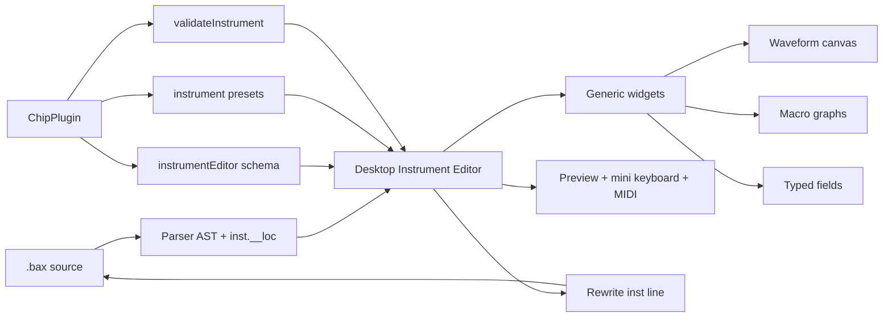

## Summary

Add an **Instrument Editor** panel to BeatBax Desktop so users can graphically create and edit instruments that are written back into the open `.bax` file.

The panel is a new right-pane tab (alongside Visualizer, Help, and Copilot). It supports:

- Chip-aware field editors (duty, envelope, sweep, noise, samples, …)
- **Visual waveforms** in the hUGETracker style (draw a 32×4-bit wavetable)
- **Instrument macros** as editable graphs (`vol_env`, `arp_env`, `duty_env`, `pitch_env`, chip extras)
- **Templates** from the active sound-chip plugin, plus copy-from an existing song instrument
- **Preview** via a mini piano keyboard, mapped computer keys, and a connected MIDI keyboard

Chip plugins do **not** ship React UI. They declare an `instrumentEditor` schema (types, fields, macros, waveform config, presets). The Desktop host renders generic widgets from that schema and reuses `validateInstrument()` for errors.

v1 is **Desktop-only**. Web UI is a later follow-up.

---


## Problem Statement

BeatBax already has a complete **text** instrument pipeline:

- `inst` lines with chip-specific fields (`[docs/grammar/instruments.md](../grammar/instruments.md)`, `[InstrumentNode](../../packages/engine/src/parser/ast.ts)`)
- Macros as `[v0,v1,…|loopPoint]`
- Game Boy wavetables as 32×4-bit nibbles (array or hUGE hex string)
- Plugin validation (`validateInstrument`) and New Song Wizard instrument **blocks**
- CodeLens preview notes (`C3`–`C7`) and MIDI audition on `inst` lines

What is missing is a graphical authoring surface. Users who think in waveforms and envelopes must type arrays by hand. That is slow, error-prone, and unlike hUGETracker, FamiTracker, or Furnace.

Host-side instrument metadata is also **hardcoded** in `[CHIP_INSTRUMENT_META](../../packages/app-core/src/editor/instrument-meta.ts)` rather than owned by the chip plugin. New chips (SID, SNES) would otherwise require Desktop special-cases for every field.

A panel that is both visual **and** chip-plugin-driven keeps `.bax` as the source of truth while matching how musicians already edit instruments in trackers.

---


## Proposed Solution


### Summary

1. Add optional `instrumentEditor?: ChipInstrumentEditor` on `ChipPlugin`.
2. Add a Desktop right-pane **Instruments** tab, feature-flagged Experimental (default off).
3. Render generic widgets from the active chip’s schema: typed fields, waveform canvas, macro graphs.
4. Round-trip edits to the matching `inst` line using parser `inst.__loc`.
5. Preview through the existing `startInstNotePreview` path, driven by a mini keyboard and MIDI.


### Architecture: host UI + plugin schema

Plugins are npm audio backends. They already contribute docs (`uiContributions`) and New Song templates (`newSongWizard`). They must not ship React components in v1 — that would break sandboxing, theming, and versioning.

**Host owns** panel chrome, generic editors, keyboard, MIDI routing, and source writeback. **Plugins declare** what the host may show, then **validate** the result.




| Concern                                                                   | Owner                                     |
| ------------------------------------------------------------------------- | ----------------------------------------- |
| Valid types, fields, ranges, macros, waveform config                      | Plugin `instrumentEditor` schema          |
| Validation errors                                                         | Plugin `validateInstrument`               |
| Starter / copy templates                                                  | Plugin presets + current song instruments |
| Drawing canvas, macro graphs, keyboard, MIDI, source writeback            | Desktop host                              |
| Playback of the edited instrument                                         | Existing engine preview path              |
| Custom React (SID combined-wave, SNES BRR picker, GB `subpat` row editor) | Phase 2 optional slots — not v1           |


Reuse existing `validateInstrument`, `instrumentVolumeRange`, and `newSongWizard`. Do not duplicate validation in the UI.

**Host fallback:** if a plugin omits `instrumentEditor`, derive a degraded editor from `CHIP_INSTRUMENT_META` + `validateInstrument` so SMS / Spectrum / NES still work before each plugin is updated.

### Plugin contract

Add optional `instrumentEditor?: ChipInstrumentEditor` on `[ChipPlugin](../../packages/engine/src/chips/types.ts)`:

```ts
export interface ChipInstrumentEditor {
  types: ChipInstrumentTypeDef[];
  fields: ChipInstrumentFieldDef[];
  macros: ChipInstrumentMacroDef[];
  waveform?: ChipInstrumentWaveformDef;
  presets: ChipInstrumentPreset[];
  constraints?: ChipInstrumentConstraintNote[];
}

export interface ChipInstrumentTypeDef {
  id: string;                 // 'pulse1' | 'wave' | 'tone1' | 'dmc' | …
  label: string;
  /** 1-based hardware channel used for preview (replaces hardcoded instChannelId). */
  previewChannel: number;
}

export type ChipInstrumentWidget = 'enum' | 'int' | 'bool' | 'text' | 'sample';

export interface ChipInstrumentFieldDef {
  name: string;               // 'duty' | 'env' | 'sweep' | 'volume' | …
  label: string;
  widget: ChipInstrumentWidget;
  values?: string[];          // enum literals
  min?: number;
  max?: number;
  /** Show only when the instrument type matches (e.g. type=wave). */
  whenType?: string | string[];
  hint?: string;
}

export interface ChipInstrumentMacroDef {
  name: string;               // 'vol_env' | 'arp_env' | 'duty_env' | 'pitch_env' | 'noise_rate_env'
  label: string;
  min: number;
  max: number;
  signed?: boolean;
  loop?: boolean;             // support |loopPoint
  whenType?: string | string[];
  /** Hardware vs software; shown as a panel hint (e.g. AY vol_env is global). */
  kind?: 'hardware' | 'software';
  hint?: string;
}

export interface ChipInstrumentWaveformDef {
  field: string;              // usually 'wave'
  length: number;             // 32 for Game Boy
  min: number;                // 0
  max: number;                // 15 for 4-bit nibbles
  hexImport?: boolean;        // 32-char hUGE hex string
  draw?: boolean;
  playWhileDrawing?: boolean;
  whenType?: string | string[];
  presets?: Array<{ id: string; label: string; samples: number[] | 'sine' | 'square' | 'saw' | 'triangle' }>;
}

export interface ChipInstrumentPreset {
  id: string;
  label: string;
  type: string;
  /** Single `inst` line body (no `inst <name>` prefix), e.g. `type=pulse1 duty=50 env=12,down`. */
  content: string;
}

export interface ChipInstrumentConstraintNote {
  id: string;
  when?: string;              // optional field/type predicate
  message: string;            // AY one-envelope, SMS attenuation, GB wave volume steps
}
```

Channel mapping on `types[].previewChannel` replaces the hardcoded switch in `[instChannelId](../../packages/app-core/src/editor/codelens-preview.ts)` (`pulse2→2`, `wave`/`triangle→3`, `noise→4`, `dmc→5`, else `1`, clamped to `plugin.channels`).

Presets are **per-instrument snippets**, not the New Song Wizard’s multi-`inst` blocks in `songWizard.ts`.

### Example syntax (unchanged language)

The panel does not add new `.bax` syntax. It authors the existing instrument grammar:

```bax
chip gameboy

inst lead type=pulse1 duty=50 env=12,down
inst wah  type=pulse1 duty=50 env=12,flat duty_env=[2,2,2,2,2,2,2,2,0,0,0,0,0,0,0,0|0]
inst bass type=wave wave=[0,5,11,15,15,15,15,15,11,5,0,0,0,0,0,0] volume=100
inst kick type=noise gb:width=7 uge_note=C-6 pitch_env=[0,-2,-4,-6] vol_env=[15,12,8,4]
```

Waveform drawing writes `wave=` as a 32-entry array (preferred) or a 32-nibble hex string when the user pastes hUGE hex. Macros write `[v0,v1,…|loopPoint]` with the loop suffix omitted when there is no loop.

### Example usage

1. User opens a Game Boy song and enables **Instruments** (View menu or Panels dropdown).
2. Clicking `inst bass type=wave …` in the editor focuses that instrument in the panel.
3. User draws a triangle-like wavetable, sets volume to 100%, and holds C2 on the mini keyboard to preview.
4. User adds a `vol_env` decay graph. The `inst` line is rewritten at `__loc`.
5. User clicks **New**, picks the plugin preset “Pluck lead”, renames it, and copies macros from `wah`.

---


## Panel UX (Desktop)

New right-pane tab **Instruments**, same chrome as Help / Visualizer / Copilot (`[tabs.ts](../../apps/desktop/src/renderer/src/components/shell/tabs.ts)` `RightTabId` today is `'channels' | 'help' | 'ai'`).

- View menu + Panels dropdown toggle (`group: 'side'`)
- Feature flag `INSTRUMENT_EDITOR` (Experimental, default **off**), matching Pattern Grid
- Clicking an `inst` definition line, or a new CodeLens **Edit**, opens the tab and selects that instrument

Layout (top → bottom):

```
┌─────────────────────────────────────────────┐
│ Instruments          [New] [Duplicate]      │
├─────────────────────────────────────────────┤
│ lead   pulse1                               │
│ bass   wave          ← selected             │
│ kick   noise                                │
├─────────────────────────────────────────────┤
│ Template: [Plugin presets ▾] [Copy from ▾]  │
├─────────────────────────────────────────────┤
│ Name  [bass]     Type [wave ▾]              │
│ volume [100 ▾]   gm [39]                    │
├─────────────────────────────────────────────┤
│ Waveform                                    │
│  15 ▆▆▆▆                                    │
│     ▆    ▆                                  │
│   0──────────── 32   hex: 05BFF…            │
│ [Sine] [Square] [Saw] [Triangle]            │
├─────────────────────────────────────────────┤
│ vol_env   ▂▄▆█▆▄▂________   loop |          │
│ pitch_env (empty)                           │
├─────────────────────────────────────────────┤
│ ▂▃▄▅▆▇█ mini keyboard █▇▆▅▄▃▂   MIDI: on   │
└─────────────────────────────────────────────┘
```

1. **Instrument list** — names from the current AST; New / Duplicate / Rename / Delete.
2. **Template picker** — plugin presets + copy from another song instrument.
3. **Type + chip fields** — schema-driven controls (duty, env, sweep, noise width, volume, sample ref, …). Hidden fields follow `whenType`.
4. **Visual waveform** — only if the schema defines `waveform` and the current type matches. hUGE-style draw canvas: nibble bars, live hex / `wave=[…]` readout, shape presets, optional play-while-drawing.
5. **Macro graphs** — one row per supported macro for the current type; click-drag to set values; loop marker (`|n`); empty row omits the field.
6. **Preview bar** — mini piano (ships the virtual-keyboard idea in this panel), hold-to-play, existing MIDI input when enabled.

Constraint notes from the plugin (AY global envelope, SMS attenuation direction, GB wave volume steps) appear as inline hints, not as a second validation engine.

### Selection and list actions


| Action                      | Behaviour                                                                                                                                       |
| --------------------------- | ----------------------------------------------------------------------------------------------------------------------------------------------- |
| Click list row              | Load that instrument; reveal its `inst` line in Monaco                                                                                          |
| Click `inst` line in editor | Select that instrument in the panel                                                                                                             |
| New                         | Insert a new `inst` line from the default plugin preset for the current type                                                                    |
| Duplicate                   | Copy fields to a unique name (`lead2`, …) and insert after the original                                                                         |
| Rename                      | Rewrite the definition name and offer to update `channel … inst` / inline `inst` references (v1: definition only + warning if still referenced) |
| Delete                      | Remove the `inst` line; warn if still referenced                                                                                                |


Imported instruments (`import "local:…"` / remote) are listed read-only in v1, with a “copy into song” action. Editing an imported definition would not persist in the `.ins` file.

---


## Visual waveforms

Reference: [hUGETracker Waves tab](https://superdisk.github.io/hUGETracker/hUGETracker/tabs/waves.html) — draw a 32-sample 4-bit waveform with the mouse, with a live hex string and optional play-while-drawing.

BeatBax stores `wave=` **per instrument**, not as hUGETracker’s 16-slot global wave bank. v1 does **not** invent a shared wave table. Copy-from-instrument and shape presets cover reuse.

Canvas behaviour:

- One column per sample; height maps `min`–`max` (GB: 0–15)
- Click/drag sets sample values; Shift-drag draws a line between points
- Live readout: 32-nibble hex **and** decimal array
- Pasting a valid 32-char hex string (`parseWaveTable`) updates the canvas
- Shape presets fill the table (sine, square, saw, triangle, plus plugin-supplied tables)
- Play-while-drawing retriggers a short preview on the last drawn sample change (throttled)
- Peak hint if `max(samples) < schema.max` (quiet wavetable), matching the grammar guide

Game Boy `volume=` (0 / 25 / 50 / 100) stays a field widget beside the canvas — it is an output-level selector, not part of the wavetable.

Chips without `waveform` in the schema hide this section entirely (NES, SMS, Spectrum).

---


## Instrument macros

Macros already use `[v0,v1,…|loopPoint]` with `loopPoint = -1` meaning one-shot / hold last value (`[parseMacro](../../packages/engine/src/audio)` / chip backends). The graph editor is a visual view of that same string.

Per macro row:

- Horizontal sequence of steps; vertical axis is `min`–`max` (signed macros centre on 0)
- Click/drag to paint values; length control to grow/shrink the sequence
- Loop marker at index `n` writes `|n`; no marker omits the pipe
- Empty sequence removes the field from the `inst` line
- Hardware macros show the plugin `hint` (AY `vol_env` is global R11–R13; SMS `vol_env` is attenuation)

Supported in v1 via schema (not a host hardcode):


| Field            | Typical use                   |
| ---------------- | ----------------------------- |
| `vol_env`        | Volume / attenuation sequence |
| `arp_env`        | Semitone offsets              |
| `duty_env`       | Duty index 0–3                |
| `pitch_env`      | Pitch offsets in semitones    |
| `noise_rate_env` | SMS noise clock (chip extra)  |


Game Boy `subpat` is **read-only in v1**: if `subpat=` is set, show the name and a link to the `subpat` block, and disable overlapping macro graphs with a note that native subpattern wins (`[gameboy-uge-instrument-subpatterns.md](complete/gameboy-uge-instrument-subpatterns.md)`). A tracker-style subpattern row editor is Phase 2.

---


## Templates and copy-from

Two sources:

1. **Plugin presets** — `instrumentEditor.presets` (single-instrument snippets).
2. **Song instruments** — copy fields from another `inst` in the current AST (optionally excluding `note` / `gm` / name).

Applying a template overwrites editable fields of the **selected** instrument (or fills a New instrument). It does not replace the whole song’s wizard instrument block.

New Song Wizard templates remain a separate onboarding path (`[new-song-wizard.md](complete/new-song-wizard.md)`).

---


## Preview, mini keyboard, and MIDI

Preview must use the same engine path as CodeLens (`[startInstNotePreview](../../packages/app-core/src/editor/codelens-preview.ts)`): a one-note AST on the plugin-declared preview channel, current `insts` table, hold/decay timeout.


| Input                    | Behaviour                                                                                                                                          |
| ------------------------ | -------------------------------------------------------------------------------------------------------------------------------------------------- |
| Mini-keyboard click/hold | Note-on for that pitch; note-off on release (or timeout if the chip has no sustain)                                                                |
| Computer-key mapping     | Same notes as the virtual-keyboard proposal                                                                                                        |
| MIDI note-on / note-off  | Same preview when MIDI input is enabled (`[midi-step-entry-controller.ts](../../apps/desktop/src/renderer/src/lib/midi-step-entry-controller.ts)`) |
| Play-while-drawing       | Retrigger last preview pitch (default C4)                                                                                                          |


Active key highlighting is shared across mouse, computer keys, and MIDI. MIDI step-entry (inserting tokens into `pat` lines) is unchanged; when the Instruments tab is focused, MIDI prefers **audition** over step entry unless Record is armed.

This panel is the first ship vehicle for the mini keyboard described in `[virtual-piano-keyboard.md](virtual-piano-keyboard.md)`. Scale-aware key styling may reuse scale-awareness data but is optional for v1.

---


## Source round-trip

`.bax` text remains the source of truth. The panel is a structured editor over one `inst` statement.

- Parser already stores `props.__loc` on each instrument (`[parseInstRhs](../../packages/engine/src/parser/peggy/index.ts)`).
- Writeback replaces that line (or the statement range) in Monaco.
- Preserve trailing comments on the same line.
- Pretty-print: human `env=12,down` rather than JSON objects when equivalent; arrays as `[0,1,2,…]`; macros as `[15,12,8,4]` or `[0,4,7|0]`.
- **Write-valid-only (v1):** run `validateInstrument` before writeback. Invalid edits stay in panel state, show plugin messages, and do not touch source until valid.
- After a successful write, the existing parse pipeline refreshes AST, diagnostics, and CodeLens.
- Do not rewrite unrelated whitespace or other statements.

Imported instruments: copy-into-song inserts a new local `inst` line; the import is left as-is.

---


## Chip capability matrix


| Chip            | Waveform                            | Macros                                               | Notable fields                                                                       | Plugin notes                                                           |
| --------------- | ----------------------------------- | ---------------------------------------------------- | ------------------------------------------------------------------------------------ | ---------------------------------------------------------------------- |
| Game Boy        | Yes — 32×4-bit `wave=`              | `vol_env`, `pitch_env`, `duty_env`, `arp_env`        | duty, env, sweep (pulse1), volume (wave), width, `uge_note`, `subpat` (read-only v1) | Wave volume is 0/25/50/100 selector                                    |
| NES             | No                                  | `vol_env`, `duty_env`, `arp_env`, `pitch_env`        | duty, env, sweep_*, DMC `sample`                                                     | Triangle: warn that volume macros do not apply; DMC uses sample picker |
| SMS             | No                                  | `vol_env`, `arp_env`, `pitch_env`, `noise_rate_env`  | vol (attenuation), noise_mode, noise_rate, gg_pan                                    | `instrumentVolumeRange.isAttenuation`                                  |
| Spectrum / AY   | No                                  | `vol_env` (hardware, global), `arp_env`, `pitch_env` | vol, tone, tone_mix, noise_rate, env_bass                                            | Constraint: one `vol_env` / `env_bass` at a time                       |
| SID (proposed)  | Optional pulse-width visual later   | Schema-ready                                         | waveform, pw, ADSR                                                                   | Plugin fills schema when the chip lands                                |
| SNES (proposed) | No wavetable draw; BRR sample field | `vol_env`, `pitch_env` if declared                   | adsr, vol_l/r, brr_sample                                                            | Sample widget + ADSR fields; no host special-case                      |


SID and SNES must not require Desktop code changes beyond generic widgets once they provide a schema.

---


## Implementation Plan


### AST / engine changes

- Extend `[packages/engine/src/chips/types.ts](../../packages/engine/src/chips/types.ts)` with `ChipInstrumentEditor` and `instrumentEditor?` on `ChipPlugin`.
- Export the types from `@beatbax/engine`.
- No new `InstrumentNode` fields for v1.
- Optional: public `serializeInstrument(name, node, options)` used by writeback and tests (today serialization is only covered indirectly).


### Parser changes

None required for v1. Keep `__loc`. If statement-range writeback needs end location, add it then — do not expand `inst` to multi-line syntax.

### Chip plugins

- Game Boy first: full schema (types, fields, macros, waveform, presets).
- Then NES, SMS, Spectrum-128.
- Update `[docs/contributing/creating-plugins.md](../contributing/creating-plugins.md)` and the plugin starter template.


### Desktop UI


| Area            | Files / notes                                                                                                                                                                             |
| --------------- | ----------------------------------------------------------------------------------------------------------------------------------------------------------------------------------------- |
| Right tab       | `[tabs.ts](../../apps/desktop/src/renderer/src/components/shell/tabs.ts)` — add `'instruments'` to `RightTabId` / `RIGHT_TAB_ORDER`                                                       |
| Panels menu     | `[panels-menu.ts](../../apps/desktop/src/renderer/src/components/shell/panels-menu.ts)` — side-group entry                                                                                |
| View menu       | `[menu-bar.ts](../../apps/desktop/src/renderer/src/components/shell/menu-bar.ts)` — `PANEL_CHECK_IDS` + feature flag                                                                      |
| Feature flag    | `[feature-flags.ts](../../packages/app-core/src/utils/feature-flags.ts)`, `[settings/features.tsx](../../apps/desktop/src/renderer/src/components/settings/features.tsx)`, settings store |
| Panel component | New `apps/desktop/src/renderer/src/components/panels/DesktopInstrumentEditor.tsx` (native React, same mount pattern as Help / Pattern Grid)                                               |
| Preview         | Reuse `startInstNotePreview`; teach `instChannelId` to read `instrumentEditor.types`                                                                                                      |
| MIDI            | When Instruments tab focused, route note-on/off to preview; Record-armed still does step entry                                                                                            |
| CodeLens        | Optional **Edit** command that shows the tab and selects the instrument                                                                                                                   |


### CLI / Web UI / Export

No CLI or export changes. Web UI is out of scope for v1 (document as follow-up).

### Documentation updates

- This spec.
- Plugin author guide: how to declare `instrumentEditor`.
- Grammar instruments page: link “edit graphically in Desktop”.
- Help panel: short Instruments section (host-owned, not chip-replaced).

---


## Testing Strategy


### Unit tests

- Schema types: Game Boy waveform length/bit depth; NES has no waveform; SMS attenuation range.
- Fallback editor derived from `CHIP_INSTRUMENT_META` when schema is absent.
- `serializeInstrument` round-trip: parse → serialize → parse equals fields (env CSV vs object normalised).
- Macro graph model: loop marker, empty-omits-field, signed pitch.
- Waveform: hex paste, 16-value tile to 32, clamp 0–15.
- `previewChannel` mapping vs current `instChannelId` behaviour for GB/NES/AY/SMS.


### Integration / e2e

- Desktop: enable flag → Instruments tab visible; select `inst` line → panel loads fields.
- Edit duty / wave / vol_env → source line updates; parse succeeds.
- Invalid env rejected (no write) and plugin message shown.
- Preview from mini keyboard plays; MIDI audition when enabled.
- Template apply inserts/overwrites expected fields.
- e2e in `apps/desktop/tests/e2e/` following Help / Visualizer tab tests.

---


## Migration Path

- Feature flag off by default: no change for existing users.
- Existing songs need no source migration.
- Plugins without a schema keep working via the degraded host fallback.
- Once GB/NES/SMS/Spectrum ship schemas, `CHIP_INSTRUMENT_META` can later be generated from the same schema (follow-up) so autocomplete and the panel cannot drift.

---


## Implementation Checklist

1. `ChipInstrumentEditor` types + `instrumentEditor?` on `ChipPlugin`; Game Boy schema + presets.
2. Desktop panel shell: right tab, feature flag, instrument list, selection from editor.
3. Schema-driven field widgets + write-valid-only source writeback.
4. Waveform canvas (Game Boy first): draw, hex, presets, play-while-drawing.
5. Macro graphs with loop markers.
6. Plugin presets + copy-from song instrument.
7. Mini keyboard + MIDI audition + live preview.
8. NES / SMS / Spectrum schemas (and constraint copy).
9. Tests: schema, serialize round-trip, panel units, desktop e2e.
10. Plugin author docs + Help blurb.

---


## Future Enhancements

- Web UI port of the same host widgets.
- Game Boy `subpat` tracker-row editor (empty rows, jumps, `fx:`).
- Shared wavetable bank (only if language support is added; not implied by hUGE).
- Optional plugin widget slots for SID combined-wave, SNES BRR encode picker.
- Rename that rewrites all `inst` references.
- In-place editing of `.ins` libraries.
- Generate `CHIP_INSTRUMENT_META` from `instrumentEditor` so hover/complete stay in sync.
- Scale-aware mini-keyboard styling (`[virtual-piano-keyboard.md](virtual-piano-keyboard.md)`).

---


## Non-goals (v1)

- New `.bax` instrument syntax.
- Plugin-shipped React / HTML UI.
- hUGETracker 16-wave global bank.
- Real-time MIDI recording of instrument automation.
- Multi-instrument layered editor (SMS percussion templates stay as separate `inst` lines).
- Web UI implementation.
- Bit-exact hUGETracker skin — match **interaction** (draw waveform, macros), not pixel layout.

---


## Open Questions

1. Rename v1: definition-only + warning, or also rewrite `channel` / inline references?

>  definition-only + warning
>
> 1. Should play-while-drawing be on by default (hUGE does) or behind a toggle?
>  on by default with a toggle
> 2. After all first-party chips ship schemas, should `CHIP_INSTRUMENT_META` be deleted in the same milestone or a follow-up?
>   > follow-up
> 3. Hold-to-play vs fixed 2 s CodeLens timeout for the mini keyboard — prefer hold-to-play when the chip can sustain.
>   > hold-to-play with the existing 2 s safety timeout.

---


## References

- [hUGETracker Waves](https://superdisk.github.io/hUGETracker/hUGETracker/tabs/waves.html)
- [hUGETracker Subpatterns](https://superdisk.github.io/hUGETracker/hUGETracker/subpatterns.html)
- `[docs/grammar/instruments.md](../grammar/instruments.md)`
- `[docs/features/complete/gameboy-instrument-macros-policy.md](complete/gameboy-instrument-macros-policy.md)`
- `[docs/features/complete/gameboy-uge-instrument-subpatterns.md](complete/gameboy-uge-instrument-subpatterns.md)`
- `[docs/features/complete/plugin-system.md](complete/plugin-system.md)`
- `[docs/features/complete/web-midi-step-entry.md](complete/web-midi-step-entry.md)`
- `[docs/features/virtual-piano-keyboard.md](virtual-piano-keyboard.md)`
- `[docs/features/complete/new-song-wizard.md](complete/new-song-wizard.md)`
- `[docs/contributing/creating-plugins.md](../contributing/creating-plugins.md)`
- Tracking issue draft: `[.github/ISSUES/instrument-editor-panel.md](../../.github/ISSUES/instrument-editor-panel.md)`

---


## Additional Notes

Estimated implementation effort after this spec: **~10–14 developer days** (schema + GB panel 4–5d, waveform + macros 3–4d, preview/MIDI/templates 2d, NES/SMS/AY schemas + tests 2–3d).

The NES APU plugin doc already listed a future “instrument editor panel” as Web UI integration; this spec supersedes that as a **Desktop** feature with a plugin schema that NES fills in rather than NES-specific widgets.
