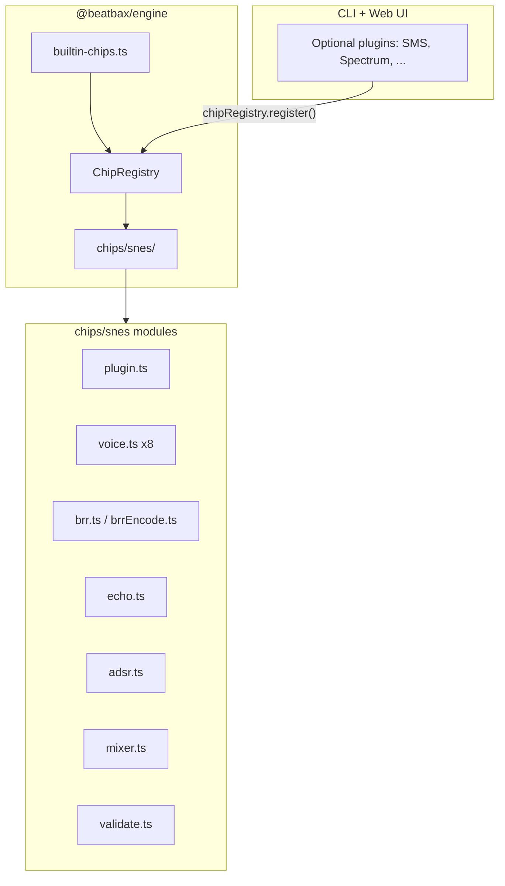

## Summary

Implement the Nintendo Super Entertainment System (SNES) audio subsystem as a **built-in chip** in `@beatbax/engine`, registered automatically alongside Game Boy and NES via `BUILTIN_CHIP_PLUGINS`. Users select the backend with `chip snes` at the top of their `.bax` file.

The SNES sound hardware consists of an **SPC700** 8-bit CPU and a Sony **S-DSP** (8-voice BRR sample playback engine with hardware ADSR, per-voice stereo volume, and a global echo buffer). BeatBax v1 drives the S-DSP directly through a deterministic voice-state pipeline — composers do not author SPC700 programs. The chip exposes 8 channels mapped to S-DSP voices, BRR sample instruments, hardware ADSR envelopes, per-voice L/R volume, and a song-level echo directive.

This follows the built-in conventions established by [`builtin-nes-chip-plugin.md`](builtin-nes-chip-plugin.md): source under `packages/engine/src/chips/snes/`, auto-registration, subpath export `@beatbax/engine/chips/snes`, and tests under `packages/engine/tests/snes/`.

---

## Problem Statement

BeatBax's Nintendo-first direction has mature Game Boy and NES coverage as built-in chips, but no SNES path. Composers who want to write in the SNES style — one of the richest and most recognisable 16-bit game sound palettes — have no supported backend.

SNES audio is often dismissed as "purely sample-based" and excluded from chiptune roadmaps (see [`ROADMAP.md`](../../ROADMAP.md)). That classification conflates the S-DSP with Amiga MOD-style streaming samplers. The S-DSP is a **constrained 8-voice BRR playback engine** with fixed hardware ADSR, Gaussian interpolation, per-voice stereo volume, and a shared echo buffer — a legitimate composition target with well-defined limits, not an open-ended PCM streamer.

Without a spec and built-in registration path, SNES would repeat the pre-migration NES friction: optional plugin package, host-specific registration, songs failing in environments that only depend on `@beatbax/engine`, and new-song wizard gaps.

Related prior work:

- [`docs/features/builtin-nes-chip-plugin.md`](builtin-nes-chip-plugin.md) — built-in chip conventions (SNES is the next built-in Nintendo chip)
- [`docs/features/complete/plugin-system.md`](complete/plugin-system.md) — `ChipPlugin` / `ChipRegistry` contract
- [`docs/features/complete/nes-apu-chip-plugin.md`](complete/nes-apu-chip-plugin.md) — structural template for a large chip spec

---

## Scope

### Included (v1)

| Area | Detail |
|------|--------|
| Built-in `snesPlugin` | `packages/engine/src/chips/snes/`, entry in `BUILTIN_CHIP_PLUGINS` |
| 8 S-DSP voices | BeatBax channels 1–8 → S-DSP voices 0–7 |
| BRR sample instruments | `brr_sample` field; bundled `@snes/*` library; URL and `local:` loading |
| Hardware ADSR | `adsr=a,d,s,r` nibbles (0–15 per stage) |
| Per-voice stereo volume | `vol_l` / `vol_r` (0–127) |
| Global echo | Song-level `echo` directive (FB, EDL, EVOL L/R, ESA) |
| Per-voice echo disable | `echo_off=true` (DIR bit) |
| Software macros | `vol_env`, `pitch_env` where hardware ADSR is insufficient |
| CLI encoder | `beatbax convert wav2brr` |
| UI integration | `songWizard.ts`, `ui-contributions.ts`, channel meta labels |
| Sample songs | `songs/snes/` demos and smoke tests |
| Chip documentation | `docs/chips/snes/` (hardware, composition, interesting facts) |

### Excluded (v1)

| Area | Detail |
|------|--------|
| `.spc` export | SPC700 program / SPC file generation deferred |
| SPC700 program authoring | No IPL ROM upload, no driver bytecode |
| Pitch modulation via noise | Noise clock as pitch mod source deferred |
| Multi-chip / MSU-1 | Out of scope |
| SPC700 debugger / disassembler | Out of scope |
| Bit-exact Gaussian interpolation QA | Use stable, testable approximation |
| OpenMPT / tracker import | Out of scope |
| Optional `@beatbax/plugin-chip-snes` shim | Deferred until external consumers need it |

---

## Proposed Solution

### Summary

1. **Implement** `snesPlugin` under `packages/engine/src/chips/snes/` implementing the standard `ChipPlugin` interface.
2. **Register** via `BUILTIN_CHIP_PLUGINS` in `builtin-chips.ts` (no host install/toggle required).
3. **Export** chip-specific utilities from `@beatbax/engine/chips/snes` (BRR encode/decode, echo presets, ADSR tables).
4. **Drive** the S-DSP through a song-scoped voice-state simulator: BRR decode → Gaussian interpolation → ADSR → per-voice mix → global echo → 32 kHz stereo output.
5. **Validate** SNES-specific instrument fields and song-level echo directives at parse/compile time.

### Architecture



### Package Structure

```
packages/engine/src/chips/snes/
├── plugin.ts           # snesPlugin — ChipPlugin entry
├── index.ts            # @beatbax/engine/chips/snes public exports
├── voice.ts            # S-DSP voice backend (×8 instances)
├── brr.ts              # BRR decode + sample cache
├── brrEncode.ts        # wav2brr encoder (CLI)
├── brrSamples.ts       # bundled @snes/* library
├── adsr.ts             # hardware envelope generator
├── echo.ts             # global echo buffer + FIR
├── mixer.ts            # 32 kHz stereo mix
├── validate.ts         # instrument + echo validation
├── ui-contributions.ts # CoPilot prompt, hover docs, help sections
└── songWizard.ts       # New Song Wizard metadata + templates

packages/engine/tests/snes/
├── snes-plugin.test.ts
├── brrEncode.test.ts
├── adsr.test.ts
└── echo.test.ts
```

### Example Syntax

#### Song setup and echo

```bax
chip snes
bpm 120

; Song-level echo (global S-DSP echo buffer)
echo on  fb=50  edl=4  evol_l=80  evol_r=80
```

#### Instrument definitions

```bax
; Sustained orchestral layer
inst strings  type=voice  brr_sample="@snes/strings_c4"
              adsr=8,4,10,6  vol_l=100  vol_r=100

; Brass with stereo spread
inst brass    type=voice  brr_sample="@snes/brass_g3"
              adsr=2,3,12,8  vol_l=90  vol_r=70

; Percussive one-shot (fast attack, short release)
inst kick     type=voice  brr_sample="@snes/kick"
              adsr=0,0,15,2  vol_l=127  vol_r=127

; Dry voice (echo disabled via DIR bit)
inst lead     type=voice  brr_sample="@snes/flute_c5"
              adsr=1,2,14,4  vol_l=110  vol_r=110  echo_off=true

; URL-based loading (CLI and browser)
inst choir    type=voice  brr_sample="https://example.com/samples/choir.brr"
              adsr=6,5,12,7  vol_l=80  vol_r=80

; Local file import (CLI only)
inst sfx      type=voice  brr_sample="local:samples/hit.brr"
              adsr=0,0,15,1  vol_l=127  vol_r=127
```

#### Channel routing

```bax
channel 1 => inst strings  seq melody
channel 2 => inst brass    seq harmony
channel 3 => inst kick     seq drums
channel 4 => inst lead     seq counter
channel 5 => inst choir    seq pad
```

> **Note:** BeatBax maps `channel 1–8` to S-DSP voices in hardware order: 1 → Voice 0, 2 → Voice 1, … 8 → Voice 7.

### Example Usage

- `chip snes` selects the SNES S-DSP backend.
- Channel count is fixed at 8.
- `type=voice` is the only instrument type in v1 (channel assignment determines which S-DSP voice plays).
- `brr_sample` references bundled `@snes/*` samples, URLs, or `local:` paths (CLI).
- `adsr=a,d,s,r` sets hardware envelope nibbles (0–15 each).
- `vol_l` / `vol_r` set per-voice stereo volume (0–127).
- `echo on` / `echo off` at song level controls the global echo buffer.
- `echo_off=true` on an instrument disables echo for that voice (S-DSP DIR bit).

Programmatic access:

```typescript
import { chipRegistry } from '@beatbax/engine/chips';

chipRegistry.has('snes'); // true immediately after engine load
```

BRR utilities:

```typescript
import { decodeBRR, encodeBRRFromPCM } from '@beatbax/engine/chips/snes';
```

### Effects Support

The S-DSP has **hardware ADSR envelopes** and **per-voice stereo volume** but no hardware LFO, sweep, or per-note echo. Global echo is a song-level directive, not a per-note effect. Software macros supplement hardware where needed.

| Effect | SNES Support | Mechanism | Notes |
|--------|-------------|-----------|-------|
| `pan` | ✅ Supported | Maps to `vol_l` / `vol_r` adjustment | S-DSP has no pan pot; stereo is per-voice L/R volume |
| `cut` | ✅ Supported | Key off + volume mute after N ticks | Reliable |
| `port` / `bend` | ⚠️ Approximate | Per-tick pitch register writes | Pitch is 14-bit; resolution is good at mid range |
| `vib` | ⚠️ Approximate | Per-tick pitch writes simulating LFO | Same mechanism as `port` |
| `arp` | ⚠️ Approximate | Rapid pitch cycling or `arp_env` macro | Classic SNES technique for chord simulation |
| `volSlide` | ⚠️ Approximate | Per-tick `vol_l`/`vol_r` writes | 7-bit resolution (128 steps) |
| `trem` | ⚠️ Approximate | Periodic volume writes | Same 7-bit quantisation as `volSlide` |
| `vol_env` | ✅ Supported | Software volume macro | Supplements hardware ADSR |
| `pitch_env` | ✅ Supported | Software pitch macro | Slides, vibrato, pitch fall |
| `echo` (per-note) | ❌ Not supported | N/A — echo is song-level only | Use `echo on` directive; per-note `echo` effect is a validation error |
| `sweep` | ❌ Not supported | N/A — no hardware sweep | Validation error under `chip snes` |
| `retrig` | ⚠️ Approximate | Re-trigger key on for same voice | Phase continuity depends on sample loop point |
| `duty_env` | ❌ Not supported | N/A — BRR samples, not square waves | Validation error |

**Song-level echo (not in effects table):**

| Directive | Range | Description |
|-----------|-------|-------------|
| `echo on` / `echo off` | — | Master echo enable |
| `fb` | 0–127 | Echo feedback (EFB register) |
| `edl` | 0–15 | Echo delay length — buffer size in 2048-byte units |
| `evol_l` / `evol_r` | 0–127 | Echo volume left / right |
| `esa` | 0–65535 | Echo buffer start address in ARAM (advanced; auto by default) |

---

## Implementation Plan

Implement in ordered phases; each phase should leave tests green.

### Phase 1 — Core plugin scaffold

1. Create `packages/engine/src/chips/snes/` directory structure.
2. Implement `plugin.ts` exporting `snesPlugin` with `name: 'snes'`, `channels: 8`, and channel factory dispatch.
3. Add `snesPlugin` to `BUILTIN_CHIP_PLUGINS` in [`packages/engine/src/chips/builtin-chips.ts`](../../packages/engine/src/chips/builtin-chips.ts).
4. Add `./chips/snes` export to [`packages/engine/package.json`](../../packages/engine/package.json).
5. Add parser support for `chip snes` directive and 8-channel validation.

### Phase 2 — BRR sample pipeline

1. Implement `brr.ts` — BRR block decoder (9-bit samples, filter modes 0–3, loop/end flags).
2. Implement `brrEncode.ts` — PCM → BRR encoder for CLI.
3. Implement `brrSamples.ts` — bundled `@snes/*` sample library.
4. Add `resolveSampleAsset()` and `preloadForPCM()` to `snesPlugin`.
5. Add CLI command `beatbax convert wav2brr`.

### Phase 3 — Voice backends and ADSR

1. Implement `adsr.ts` — hardware envelope rate tables (attack/decay/sustain/release).
2. Implement `voice.ts` — S-DSP voice backend with pitch (14-bit), Gaussian interpolation, key on/off.
3. Wire `createChannel()` to instantiate 8 voice backends.
4. Implement `validate.ts` — instrument field validation.

### Phase 4 — Echo and mixing

1. Implement `echo.ts` — global echo buffer, FIR filter, feedback, EDL/ESA management.
2. Implement `mixer.ts` — 32 kHz stereo output from voice sum + echo return.
3. Add song-level `echo` directive parsing and validation.
4. Support `echo_off` per-instrument (DIR bit).

### Phase 5 — AST, parser, and macros

New instrument fields:

| Field | Type | Description |
|-------|------|-------------|
| `brr_sample` | `string` | BRR sample reference (`@snes/*`, URL, `local:`) |
| `adsr` | `a,d,s,r` | Hardware ADSR nibbles (0–15 each) |
| `vol_l` | `0`–`127` | Per-voice left volume |
| `vol_r` | `0`–`127` | Per-voice right volume |
| `echo_off` | `boolean` | Disable echo for this voice (DIR bit) |
| `vol_env` | `[v0,v1,…\|N]` | Software volume macro (0–127 levels) |
| `pitch_env` | `[s0,s1,…\|N]` | Software pitch macro (semitone offsets) |

Parser changes:

- Accept `chip snes` directive.
- Validate exactly 8 channels for SNES songs.
- Allow `type=voice` instrument type.
- Parse `brr_sample`, `adsr`, `vol_l`, `vol_r`, `echo_off`, `vol_env`, `pitch_env`.
- Parse song-level `echo` directive with `fb`, `edl`, `evol_l`, `evol_r`, `esa`.
- Reject NES/GB/SMS-only fields when `chip snes` is active.
- Reject per-note `echo` effect with diagnostic: "use song-level `echo on` directive".
- Reject `sweep` and `duty_env` with clear diagnostics.

### Phase 6 — Web UI and CLI integration

**Web UI:**

- SNES appears in data-driven built-in chips list in Settings → Plugins (locked "Built-in" badge).
- Update [`apps/web-ui/src/utils/chip-meta.ts`](../../apps/web-ui/src/utils/chip-meta.ts) labels from `Ch N` to `Voice N`.
- Add syntax highlighting for `brr_sample`, `adsr`, `vol_l`, `vol_r`, `echo_off`, `echo` directive.
- Add `ui-contributions.ts` and `songWizard.ts` for SNES starter songs.

**CLI:**

- No plugin discovery needed (built-in).
- `beatbax verify` emits SNES-specific validation errors.
- `beatbax convert wav2brr` for sample preparation.
- Include SNES in chip selection/help listings.

### Phase 7 — Sample songs and documentation

Add under `songs/snes/`:

- `snes-smoke-test.bax` — minimal 3-voice playback
- `echo-demo.bax` — global echo with wet/dry comparison
- `adsr-demo.bax` — envelope sculpting showcase
- `stereo-demo.bax` — vol_l/vol_r panning patterns
- `orchestral-demo.bax` — layered BRR ensemble

Maintain chip docs (prerequisites for this feature):

- [`docs/chips/snes/hardware_guide.md`](../chips/snes/hardware_guide.md)
- [`docs/chips/snes/composition_guide.md`](../chips/snes/composition_guide.md)
- [`docs/chips/snes/interesting_facts.md`](../chips/snes/interesting_facts.md)

Update [`ROADMAP.md`](../../ROADMAP.md): add SNES as a planned built-in chip; qualify the "exclude sample-based" principle to exclude Amiga-style streaming, not S-DSP BRR playback.

### Export Changes

v1 export behavior:

- JSON/ISM export: full SNES semantics preserved.
- MIDI export: map pitch events normally; map `vol_l`/`vol_r` to CC#10/CC#11 approximations.
- WAV preview/export: 32 kHz stereo render.

Post-v1 native export candidates:

- **`.spc` export:** SPC700 program generation from register-intent stream (separate feature).
- **Register dump export:** Per-tick S-DSP register log for emulator/homebrew drivers.

---

## Testing Strategy

### Unit Tests

- BRR block decode: all filter modes, loop/end flags, 9-bit sample reconstruction.
- BRR encode round-trip: PCM → BRR → decode → PCM within tolerance.
- ADSR envelope: rate tables, attack/decay/sustain/release stage transitions.
- Echo buffer: feedback, delay length, FIR filter output.
- Pitch calculation: 14-bit pitch register from MIDI note + sample base rate.
- Gaussian interpolation: sample output at fractional positions.
- `vol_l` / `vol_r` clamping and stereo mix.

### Integration Tests

- Parse → resolve → schedule → render determinism snapshots for representative SNES songs.
- 8-channel validation: reject 9th channel assignment.
- Echo on/off: wet/dry output difference measurable in PCM hash.
- `echo_off` per-instrument: voice excluded from echo buffer.
- Bundled `@snes/*` sample resolution in CLI and test environment.
- Unsupported field diagnostics under `chip snes`.

### Regression Tests

- Ensure no behavioral changes to Game Boy/NES/SMS backends.
- Ensure built-in registration order does not affect other chips.
- Ensure ISM stability: same input yields same scheduled events/output hashes.

---

## Migration Path

No migration required for existing songs.

Adoption path:

1. Add `chip snes` at top of new songs.
2. Define instruments with `type=voice` and `brr_sample` references.
3. Set `adsr` and `vol_l`/`vol_r` for articulation and stereo placement.
4. Optionally add `echo on` with `fb`, `edl`, `evol_l`, `evol_r` for spatial depth.
5. Use `beatbax convert wav2brr` to prepare custom samples.

---

## Implementation Checklist

- [ ] Create `packages/engine/src/chips/snes/` module scaffold
- [ ] Implement `plugin.ts` with 8 channel factories
- [ ] Implement `voice.ts` S-DSP voice backend
- [ ] Implement `brr.ts` BRR decoder
- [ ] Implement `brrEncode.ts` and CLI `beatbax convert wav2brr`
- [ ] Implement `brrSamples.ts` bundled `@snes/*` library
- [ ] Implement `adsr.ts` hardware envelope generator
- [ ] Implement `echo.ts` global echo buffer
- [ ] Implement `mixer.ts` 32 kHz stereo output
- [ ] Add `snesPlugin` to `BUILTIN_CHIP_PLUGINS`
- [ ] Add `@beatbax/engine/chips/snes` package export
- [ ] Add parser support for `chip snes` and SNES instrument fields
- [ ] Add parser support for song-level `echo` directive
- [ ] Add SNES instrument + echo validator
- [ ] Reject unsupported effects/fields under `chip snes`
- [ ] Register in web-ui built-in chips list (data-driven)
- [ ] Update `chip-meta.ts` labels to `Voice N`
- [ ] Add `ui-contributions.ts` and `songWizard.ts`
- [ ] Add unit + integration + regression tests under `tests/snes/`
- [ ] Add sample songs under `songs/snes/`
- [ ] Add chip docs under `docs/chips/snes/`
- [ ] Update `ROADMAP.md` to include SNES

---

## Future Enhancements

- **`.spc` export** — SPC700 program generation from deterministic register-intent stream.
- **Noise pitch modulation** — S-DSP noise clock as mod source for voice 3 (hardware feature).
- **`@beatbax/plugin-chip-snes` shim** — thin npm re-export for backward compatibility if external consumers appear.
- **Echo FIR coefficient authoring** — expose FIR table editing for advanced users.
- **ARAM budget visualiser** — show sample memory usage in web UI.
- **Satellaview / BS-X variants** — same S-DSP core, different upload protocols.

---

## Open Questions

1. Should v1 expose `type=voice` only, or also `type=voice1`…`voice8` explicit types?
2. Should `esa` (echo buffer address) be auto-computed from sample allocation, or require manual authoring?
3. Should bundled `@snes/*` samples ship as base64 in-engine (like NES DMC) or as separate asset files?
4. Should Gaussian interpolation use the full 512-entry hardware table or a simplified linear approximation for v1?
5. Should `chip snes` support a region qualifier (NTSC is the only hardware variant, but Satellaview timing differs)?

---

## Risks and Mitigations

| Risk | Mitigation |
|------|------------|
| Engine bundle grows (BRR samples in `brrSamples.ts`) | Acceptable for Nintendo-first; lazy-load if size becomes an issue |
| Gaussian interpolation fidelity | Use stable 512-entry table; document approximation in chip docs |
| Echo buffer ARAM allocation conflicts | Auto-compute `esa` from sample layout; validate total ARAM budget |
| 8-voice limit frustrates orchestral composers | Document channel budgeting in composition guide; echo fills space |
| SNES dismissed as "not chiptune" | Feature spec and ROADMAP update clarify S-DSP vs Amiga distinction |

---

## References

- [`docs/features/builtin-nes-chip-plugin.md`](builtin-nes-chip-plugin.md) — built-in chip conventions
- [`docs/features/complete/plugin-system.md`](complete/plugin-system.md) — `ChipPlugin`, `ChipRegistry`
- [`docs/features/complete/nes-apu-chip-plugin.md`](complete/nes-apu-chip-plugin.md) — large chip spec template
- [`docs/features/complete/sms-psg-chip-plugin.md`](complete/sms-psg-chip-plugin.md) — effects support table pattern
- [`docs/features/complete/effects-system.md`](complete/effects-system.md) — cross-chip effect semantics
- [`docs/chips/snes/hardware_guide.md`](../chips/snes/hardware_guide.md) — S-DSP hardware reference
- [`docs/chips/snes/composition_guide.md`](../chips/snes/composition_guide.md) — composition techniques
- [`docs/chips/snes/interesting_facts.md`](../chips/snes/interesting_facts.md) — cultural context
- [`packages/engine/src/chips/builtin-chips.ts`](../../packages/engine/src/chips/builtin-chips.ts)
- [`packages/engine/src/chips/registry.ts`](../../packages/engine/src/chips/registry.ts)
- [`apps/web-ui/src/utils/chip-meta.ts`](../../apps/web-ui/src/utils/chip-meta.ts)
- [`.github/issues/snes-sdsp-chip-plugin.md`](../../.github/issues/snes-sdsp-chip-plugin.md) — GitHub issue draft

---

## Additional Notes

- [`apps/web-ui/src/utils/chip-meta.ts`](../../apps/web-ui/src/utils/chip-meta.ts) already has SNES channel colours (8 voices); labels will be updated from `Ch N` to `Voice N` during implementation.
- BeatBax drives the S-DSP directly without SPC700 program upload in v1. This matches how other chips work (register-intent pipeline) and avoids requiring composers to write 6502-family assembly.
- The S-DSP outputs at a fixed 32 kHz sample rate. All timing, ADSR rates, and echo delay calculations derive from this clock.
- Preserve BeatBax core contracts: deterministic parse → AST → ISM → schedule pipeline; no chip-specific AST mutations; plugin-isolated backend behavior; loud, explicit validation for unsupported fields.
