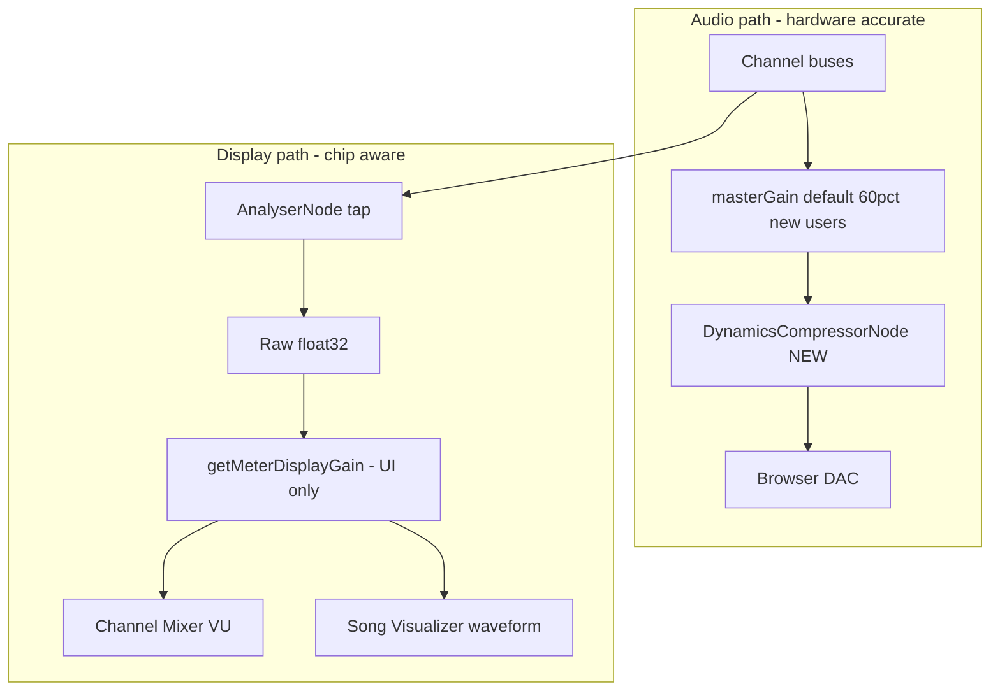

## Summary

Fix web-ui playback that is uncomfortably loud and distorted compared to CLI headless playback. The root cause is **digital clipping** in the real-time Web Audio graph (parallel channel summing with no peak protection) combined with a **default master volume of 100%** while CLI applies **0.6 output gain**.

For NES specifically, the previous **normalized WebAudio mix mode** inflated per-channel audio gain (~8.9×) to make VU meters readable — the wrong layer. This feature removes that mode entirely and instead adds **chip-aware display compensation** so Channel Mixer VU meters and Song Visualizer waveforms remain useful while audio stays hardware-accurate.

---

## Problem Statement

### Loudness and distortion

Web-ui live playback routes all channel buses in parallel to `masterGain` (default **1.0**) and then directly to `ctx.destination`. There is no limiter or peak-down normalization. Dense multi-channel passages (4 Game Boy channels or 5 NES channels at full envelope) can sum well above ±1.0 float, causing harsh digital clipping at the browser DAC.

CLI headless playback is quieter and cleaner because it:

1. Renders via `renderSongToPCM()` with optional peak-down normalization (`normalizeBuffer` when peak > 0.95)
2. Applies default **`--play-gain 0.6`** before int16 conversion (`nodeAudioPlayer.floatTo16BitPCM`)

### NES mix mode was a UI workaround on the audio path

NES hardware mixer weights (`NES_MIX_GAIN`) produce per-channel Web Audio levels around **0.11** at maximum when channels route independently. Game Boy backends output **0–1** per channel. To avoid NES songs sounding ~9× quieter and VU meters barely lighting, **normalized mode** applied `NES_WEB_AUDIO_NORM ≈ 8.865` per channel — but a full 5-channel NES arrangement can sum to **3–5× full scale**, causing severe clipping. The PCM/CLI path correctly uses combined `nesMix()` weights (max ~0.855).

### Meter and visualizer assume Game Boy levels

Both UI components map raw analyser float32 samples as if every chip outputs 0–1:

| Component | Current mapping | NES hardware-mode result |
|-----------|----------------|--------------------------|
| `channel-mixer.ts` | `level = round(rms * 12)` | ~1 VU segment at max volume |
| `song-visualizer.ts` | `y = (h/2) * (1 - sample)` | Waveform ~11% of canvas height |

Inflating audio gain to fix meters corrupts playback. Display compensation in the UI is the correct fix.

---

## Proposed Solution

Four coordinated changes across engine and web-ui:



### Part 1 — Master soft limiter (engine)

Insert a `DynamicsCompressorNode` in `packages/engine/src/audio/playback.ts`:

```
channelBuses → masterGain → limiter → destination
```

Suggested settings (transparent limiting):

| Parameter | Value |
|-----------|-------|
| threshold | -6 dB (0.5 linear) |
| knee | 6 dB |
| ratio | 12 |
| attack | 0.003 s |
| release | 0.1 s |

Benefits web-ui live playback, codelens preview, and WAV export (OfflineAudioContext uses the same `Player`).

### Part 2 — Default master volume 60% (web-ui)

In `apps/web-ui/src/main.ts`, change transport master default from **100% → 60%** for new users (no stored `transport.masterVolume` preference). Matches CLI `--play-gain 0.6`.

### Part 3 — Remove NES normalized WebAudio mix mode (engine + web-ui)

Delete entirely:

- `setNesWebAudioMixMode`, `getNesWebAudioMixMode`, `getNesWebAudioNorm`
- `NesWebAudioMixMode`, `NES_WEB_AUDIO_NORM`, `globalThis` mode key
- Settings UI block in `plugins.ts`
- `NES_WEB_AUDIO_MIX_MODE` localStorage key
- Startup call in `main.ts`

NES channel backends (`pulse`, `triangle`, `noise`, `dmc`) use raw `NES_MIX_GAIN` weights only — matching CLI PCM output.

**Breaking API change:** `@beatbax/engine/chips/nes` drops mode-related exports. No external in-repo consumers. Note in engine CHANGELOG.

### Part 4 — Chip-aware meter display compensation (engine API + web-ui)

**Engine:** extend `ChipPlugin` in `packages/engine/src/chips/types.ts`:

```typescript
/**
 * Display-only gain for per-channel VU meters and waveform visualizations.
 * Does NOT affect audio output. Maps a channel at maximum hardware output
 * to ~1.0 on the meter scale. Default when absent: 1.0.
 */
getMeterDisplayGain?(channelIndex: number): number;
```

**NES implementation** (`packages/engine/src/chips/nes/plugin.ts`):

| Channel | Max level | Display gain formula | Approx. |
|---------|-----------|---------------------|---------|
| Pulse 1/2 | 15 | `1 / (NES_MIX_GAIN.pulse * 15)` | ~8.87 |
| Triangle | 15 | `1 / (NES_MIX_GAIN.triangle * 15)` | ~7.84 |
| Noise | 15 | `1 / (NES_MIX_GAIN.noise * 15)` | ~13.5 |
| DMC | 127 | `1 / (NES_MIX_GAIN.dmc * 127)` | ~2.34 |

Game Boy: omit hook (defaults to 1.0).

**Web-ui utility** — new `apps/web-ui/src/utils/meter-display.ts`:

- `getMeterDisplayGain(chipName, channelId)` — via `chipRegistry`
- `scaleRmsForMeter(rms, gain)` — `Math.min(1, rms * gain)`
- `scaleSamplesForWaveform(samples, gain)` — multiply and clamp to ±1

**Wire into:**

- `apps/web-ui/src/panels/channel-mixer.ts` — VU RMS mapping
- `apps/web-ui/src/panels/song-visualizer.ts` — waveform canvas Y coordinates

**Out of scope:** Master oscilloscope (`oscilloscope.ts`) — taps post-mix signal; NES full mix ~0.855 is already readable.

---

## Implementation Plan

### Engine changes

| File | Change |
|------|--------|
| `packages/engine/src/audio/playback.ts` | Add `DynamicsCompressorNode` after `masterGain` |
| `packages/engine/src/chips/types.ts` | Add `getMeterDisplayGain?()` to `ChipPlugin` |
| `packages/engine/src/chips/nes/mixer.ts` | Remove normalized mode machinery |
| `packages/engine/src/chips/nes/pulse.ts` | Remove `getNesWebAudioNorm()` usage |
| `packages/engine/src/chips/nes/triangle.ts` | Remove `getNesWebAudioNorm()` usage |
| `packages/engine/src/chips/nes/noise.ts` | Remove `getNesWebAudioNorm()` usage |
| `packages/engine/src/chips/nes/dmc.ts` | Remove `getNesWebAudioNorm()` usage |
| `packages/engine/src/chips/nes/index.ts` | Remove mode exports; implement `getMeterDisplayGain` on plugin |
| `packages/engine/src/chips/nes/plugin.ts` | Implement `getMeterDisplayGain` per channel |
| `packages/engine/CHANGELOG.md` | Note breaking removal of NES mix mode API |

### Web UI changes

| File | Change |
|------|--------|
| `apps/web-ui/src/main.ts` | Default master 60%; remove `setNesWebAudioMixMode` |
| `apps/web-ui/src/utils/meter-display.ts` | **New** shared display scaling utility |
| `apps/web-ui/src/panels/channel-mixer.ts` | Apply display gain to VU RMS |
| `apps/web-ui/src/panels/song-visualizer.ts` | Apply display gain to waveform drawing |
| `apps/web-ui/src/panels/settings-sections/plugins.ts` | Remove NES mix mode setting |
| `apps/web-ui/src/utils/local-storage.ts` | Remove `NES_WEB_AUDIO_MIX_MODE` key |

### Documentation updates

| File | Change |
|------|--------|
| `docs/features/complete/builtin-nes-chip-plugin.md` | Remove `setNesWebAudioMixMode` references |
| This document | Move to `docs/features/complete/` when shipped |

---

## Testing Strategy

### Unit tests

- NES `getMeterDisplayGain` values match `NES_MIX_GAIN` table
- `scaleRmsForMeter` / `scaleSamplesForWaveform` clamping
- Update `nes-plugin.test.ts` DMC WebAudio test: expected `NES_MIX_GAIN.dmc * 127` (no norm factor)
- Limiter node created and wired in `Player` (extend `playback.analyser.test.ts` or new test)

### Manual QA

1. Dense 4-channel Game Boy song — no harsh clipping at default 60% master with limiter
2. Dense NES song — audio matches CLI; VU meters and visualizer waveforms readable
3. A/B web-ui 60% vs `beatbax play song.bax` — perceived loudness within ~1 dB
4. Transport at 100% on dense mix — limiter prevents brick-wall distortion
5. Web-ui WAV export — benefits from limiter in OfflineAudioContext path

---

## What NOT to Change

- Do not remove `disableNormalization` on pulse `PeriodicWave` without listening tests
- Do not change AST `volume` default from 1.0 (hUGETracker parity)
- Do not change CLI `--play-gain 0.6` unless deliberately unifying both paths

---

## Migration Path

- **Existing web-ui users** with saved `transport.masterVolume` keep their preference; only new users get 60% default
- **NES mix mode localStorage** (`plugins.nes.webAudioMixMode`) becomes orphaned — safe to ignore; key removed from codebase
- **Engine API consumers** of `setNesWebAudioMixMode` (none in-repo) must migrate to hardware-only playback

---

## Implementation Checklist

- [ ] Add master limiter in `Player`
- [ ] Change web-ui default master volume to 60%
- [ ] Remove NES normalized mix mode (API, UI, storage, channel backends)
- [ ] Add `ChipPlugin.getMeterDisplayGain()` and NES implementation
- [ ] Add `meter-display.ts` utility
- [ ] Wire display gain into Channel Mixer and Song Visualizer
- [ ] Update tests and CHANGELOG
- [ ] Manual A/B verification vs CLI

---

## Future Enhancements

- Chip-aware VU reference for additional quiet plugins (SMS, etc.)
- Shared `PLAYBACK_OUTPUT_GAIN = 0.6` constant across CLI and web-ui
- Optional user-facing "limiter bypass" for advanced users (unlikely needed)

---

## References

- [`packages/engine/src/audio/playback.ts`](../../packages/engine/src/audio/playback.ts) — Web Audio `Player`
- [`packages/engine/src/audio/pcmRenderer.ts`](../../packages/engine/src/audio/pcmRenderer.ts) — CLI PCM path + normalization
- [`packages/engine/src/node/nodeAudioPlayer.ts`](../../packages/engine/src/node/nodeAudioPlayer.ts) — CLI 0.6 output gain
- [`packages/engine/src/chips/nes/mixer.ts`](../../packages/engine/src/chips/nes/mixer.ts) — NES mix weights (to be simplified)
- [`apps/web-ui/src/panels/channel-mixer.ts`](../../apps/web-ui/src/panels/channel-mixer.ts) — VU meter
- [`apps/web-ui/src/panels/song-visualizer.ts`](../../apps/web-ui/src/panels/song-visualizer.ts) — Waveform display
- [`docs/language/volume-directive.md`](../language/volume-directive.md) — Song-level `volume` directive
- [`docs/features/complete/per-channel-analyser.md`](complete/per-channel-analyser.md) — Analyser infrastructure
