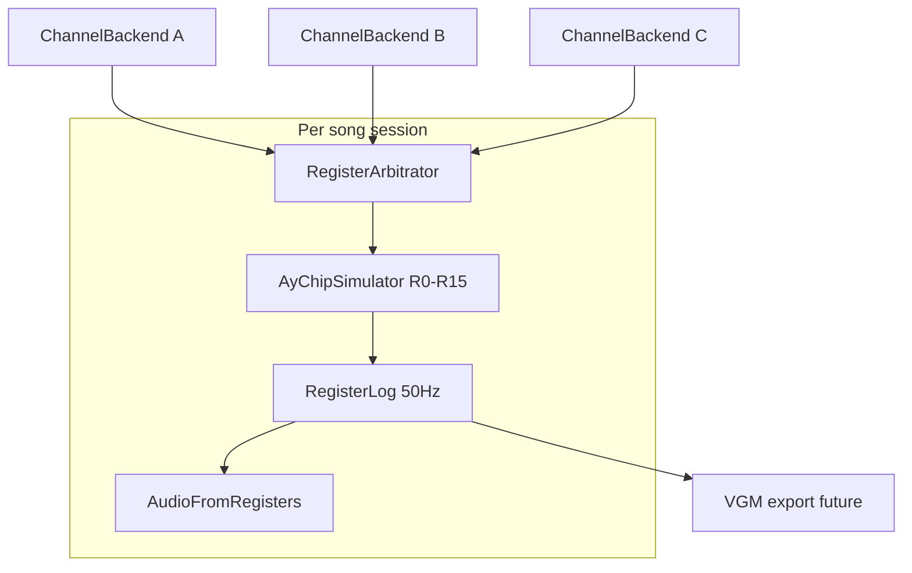

## Summary

Implement `@beatbax/plugin-chip-spectrum-128` as an AY-compatible PSG target in BeatBax. The plugin is Spectrum-first but will also cover Amstrad CPC due to close hardware similarity.

Primary export intent:

- Tracker-based formats: PT3 (ProTracker), Arkos Tracker (where supported)
- Register-stream formats: VGM and raw register dumps
- Homebrew-focused output path: prioritize the most common format per target workflow (typically PT3/Arkos or register stream)

## Problem Statement

A generic AY-wide plugin creates ambiguity across platforms with different clocking, tooling, and homebrew expectations. BeatBax needs explicit platform-scoped plugins so behavior, defaults, and export choices are clear and deterministic.

For this scope, Spectrum 128 is the prioritized AY-compatible target, with Amstrad CPC included as a close sibling profile.

## Scope

### Included

**Core Plugin:**
- Spectrum 128 default timing and channel behavior
- Amstrad CPC compatibility profile
- Shared AY-compatible PSG semantics (3 channels, shared noise, shared envelope)
- Export integration placeholder/wiring for PT3/Arkos/VGM/register stream outputs
- Support for playback from both CLI and Web-UI
- Implementation of `songWizard.js` with support for both Spectrum-128 and Amstrad-CPC computers
- Implementation of `ui-contributions.js` including copilot prompts, hover providers and help

**Sample Songs & Documentation** (`songs/spectrum-128/`):
- **Synth Demo** (`synth-demo.bax`) — Demonstrates:
  - Lead/bass instrument definitions with constant volume
  - Arpeggio macros (`arp_env`)
  - Pitch bend macros (`pitch_env`)
  - Multi-channel polyphony
  - Melodic patterns and sequences

- **Percussion Demo** (`percussion-demo.bax`) — Demonstrates:
  - **Time-multiplexed drums** under one shared `noise_rate` (hardware-accurate)
  - Per-channel mixer routing (`tone_mix`) — not independent noise timbres
  - Software volume shaping (`vol` + BeatBax slides) instead of conflicting hardware `vol_env`
  - Classic Spectrum layout: melody on A, harmony on B, bass/drums borrowing C

- **Effects Showcase** (`effects-showcase.bax`) — Demonstrates:
  - All macro types combined: `vol_env`, `arp_env`, `pitch_env`, `noise_rate`
  - Hardware limitation handling (one envelope per song)
  - Channel mixer blending strategies
  - Complex polyphonic arrangements

- **Amstrad CPC Version** (`amstrad-cpc-demo.bax`) — Demonstrates:
  - Same song compiled with `chipRegion=cpc`
  - Platform-agnostic note structure, region-aware AY clock scaling
  - Deterministic output across platforms

**Test Songs** (`songs/spectrum-128/tests/`):
- `smoke-test.bax` — Minimal 4-note song per channel (regression gate)
- `shared-envelope-test.bax` — Multiple channels with vol_env conflict detection
- `noise-mixing-test.bax` — Independent **mixer** routing per channel (same global noise source)
- `noise-conflict-test.bax` — Overlapping hits with different `noise_rate` values (expects diagnostic)
- `buzz-bass-demo.bax` — Envelope-as-oscillator bass on channel C
- `all-macros.bax` — All instrument macro types in one song

### Excluded

- Atari ST specifics (covered by a separate plugin scope)
- Broad multi-platform AY abstraction as a first-class user target
- Export implementation (PT3/VGM export; separate feature/issue)

## Technical Notes

- **One shared AY chip per song** — not three independent emulators. Preview, PCM, and future VGM export must share the same register stream.
- **50 Hz tick alignment** — Spectrum/CPC tracker workflows are PAL-frame based; register commits happen once per chip tick.
- **Register arbitration** — R6 (noise period), R7 (mixer), and R11–R13 (envelope) are global and last-writer-wins each tick. Conflicts emit diagnostics, not silent wrong audio.
- **Authoring-first percussion** — a full GM-style drum kit with simultaneous different noise timbres is **not** a hardware target; sample songs must teach multiplexed drums instead.

## Implementation Outline

1. Define plugin package, platform profiles, and **shared `AyChipSimulator`** (see Architecture below).
2. Implement **register-intent collection + arbitration** per 50 Hz tick; wire thin `ChipChannelBackend` facades that queue intents.
3. Add **song-level validation** for shared-register conflicts (noise period, envelope program).
4. Add Spectrum-focused song templates that match real tracker constraints (see `docs/chips/zx-spectrum-128/composition_guide.md`).
5. Expose deterministic **register logs** as the primary regression artifact; playback preview is derived from that log.
6. Wire export adapter contracts for PT3/Arkos/VGM/register streams (export implementation is a separate feature).

## Out of Scope

Implementation and updates of exporter plugins, this will be implemented in a separate feature document/issue.

## Testing Requirements

- Deterministic playback across repeated renders.
- Shared-resource conflict tests (noise/envelope writes) across channels.
- Export snapshot tests for Spectrum default profile.
- Compatibility tests for Amstrad CPC profile.

## Documentation Requirements

- Chip docs live under `docs/chips/zx-spectrum-128/`.
- Feature references should point to this spec rather than AY-named docs.
- Roadmap must remain aligned with Spectrum 128 + Atari ST split.

---

## Proposed Solution

### Overview

Implement `@beatbax/plugin-chip-spectrum-128` as a standalone npm package that:

- Targets the **AY-3-8912** PSG family (Spectrum 128 primary; Amstrad CPC as a clock preset)
- Emulates **one shared chip** per song — three tone outputs (A/B/C), one noise source, one envelope generator
- Advances simulation on **50 Hz PAL chip ticks** with deterministic register write ordering
- Exposes thin `ChipChannelBackend` facades that **queue register intents**, not isolated emulators
- Validates **song-level shared-resource conflicts** (especially noise period and envelope program)
- Renders preview audio from the **same register stream** used by future VGM/PT3 export (export itself is out of scope here)
- Provides UI contributions and New Song Wizard templates aligned with real Spectrum tracker practice

Reference docs (authoritative for composition constraints):

- [docs/chips/zx-spectrum-128/hardware_guide.md](../chips/zx-spectrum-128/hardware_guide.md)
- [docs/chips/zx-spectrum-128/composition_guide.md](../chips/zx-spectrum-128/composition_guide.md)

### Design principles

1. **Register stream is the source of truth** — PCM preview and export both consume the same per-tick register log.
2. **Do not fake independent noise channels** — unlike NES/Game Boy, AY has no fourth noise voice; drums are time-multiplexed.
3. **Fail visibly on conflicts** — when two active notes require different R6 or R11–R13 values on the same tick, emit a diagnostic with channel + loc context.
4. **Spectrum-first defaults** — CPC is a region/clock preset, not a parallel feature matrix in v1.

### Package structure

```
packages/plugins/chip-spectrum-128/
├── package.json
├── tsconfig.json
├── src/
│   ├── index.ts                 # ChipPlugin entry; song-scoped chip factory
│   ├── ay-chip.ts               # Shared AyChipSimulator (single R0–R15 state)
│   ├── register-intent.ts       # Per-note/channel intended writes per tick
│   ├── register-arbitrator.ts   # Merge intents → one register frame; conflict detection
│   ├── register-log.ts          # Deterministic tick log (primary test artifact)
│   ├── channel-backend.ts       # ChipChannelBackend facades → queue intents
│   ├── audio-from-registers.ts  # PCM / WebAudio preview from register log
│   ├── envelope-generator.ts    # AY envelope state machine (16 shapes)
│   ├── periodTables.ts          # MIDI/freq → tone period; buzz-bass env period helper
│   ├── validate.ts              # Per-instrument field validation
│   ├── validate-song.ts         # Song-level shared-resource conflict validation
│   ├── platform-profiles.ts     # Clock + frame rate per region
│   ├── ui-contributions.ts
│   ├── songWizard.ts
│   └── version.ts
├── tests/
│   ├── ay-chip.test.ts
│   ├── register-arbitrator.test.ts
│   ├── register-log.test.ts
│   ├── validate-song.test.ts
│   ├── platform-profiles.test.ts
│   └── plugin.test.ts
└── README.md
```

### Hardware model

| Voice | BeatBax type | AY register | Notes |
|-------|--------------|-------------|-------|
| A | `tone1` | R0–R1 tone period, R8 attenuation | Square wave, 12-bit period |
| B | `tone2` | R2–R3, R9 | Square wave |
| C | `tone3` | R4–R5, R10 | Square wave; commonly bass or drum borrow |
| — | *(mixer)* | R7 | Per-channel tone/noise enable bits (active-low on hardware) |
| — | *(shared)* | R6 | **One** noise period (5-bit) for entire chip |
| — | *(shared)* | R11–R13 | **One** envelope period + shape; all envelope-mode channels read the same level |

**Critical constraints (must drive validation and sample songs):**

| Resource | Scope | What composers can do | What they cannot do |
|----------|-------|----------------------|---------------------|
| Noise period R6 | Global | One palette per phrase; stagger hits; same `noise_rate` when overlapping | Kick/snare/hat with **different** `noise_rate` at the **same tick** |
| Envelope R11–R13 | Global | One envelope program active; buzz bass on C; software volume elsewhere | Independent per-channel hardware `vol_env` curves simultaneously |
| Mixer R7 | Per channel | Route tone-only, noise-only, or tone+noise per A/B/C | — |
| Tone period | Per channel | Independent pitch on A/B/C | — |

Noise generator internals: **5-bit period register**, **17-bit LFSR** with fixed feedback (not three independent LFSRs).

### Architecture

#### Why not three independent channel backends?

The previous approach gave each `ChipChannelBackend` its own `AYState`. That breaks hardware semantics:

- Three noise LFSRs → drum timbres that cannot exist on real hardware
- Three envelope generators → misleading `vol_env` previews
- Per-channel `noise_rate` appearing to work in WebAudio but failing on export

The engine's `createChannel()` API is per-channel, but **AY requires shared chip state**. The plugin resolves this with a **song-scoped chip instance** and backends that are facades.



#### Tick model

- **Chip tick** = 1/50 s (PAL). All register commits align to chip ticks, not the engine's 60 Hz PCM envelope cadence.
- On each tick:
  1. Collect **register intents** from all active notes on all channels
  2. **Arbitrate** global registers (R6, R7, R11–R13)
  3. **Commit** final R0–R15 into `AyChipSimulator`
  4. **Step** tone/noise/envelope generators for that tick
  5. **Append** to `RegisterLog`
- Between ticks, tone periods (R0–R5) and per-channel attenuation (R8–R10) may update freely — they are not shared.

#### Register intents and arbitration

Each active note produces **intended writes** for the ticks it spans:

```typescript
interface RegisterIntent {
  tick: number;
  channel: 0 | 1 | 2;
  tonePeriod?: number;       // R0+R1 / R2+R3 / R4+R5
  attenuation?: number;      // R8 / R9 / R10 (0=loudest … 15=silent)
  useEnvelope?: boolean;     // route amplitude through shared envelope
  toneEnable?: boolean;      // R7 tone bit
  noiseEnable?: boolean;     // R7 noise bit
  noisePeriod?: number;      // R6 (global)
  envelopePeriod?: number;   // R11+R12 (global)
  envelopeShape?: number;    // R13 (global)
  source: { pat?: string; loc?: SourceLocation }; // for diagnostics
}
```

**Arbitration rules (v1):**

| Register | Rule on conflict | Diagnostic |
|----------|------------------|------------|
| R6 noise period | Last-writer-wins; **warn** if values differ same tick | `scale-lock`-style message listing channels |
| R11–R13 envelope | Last-writer-wins; **warn** if shape/period differ | Envelope program conflict |
| R7 mixer bits | **Merge per channel** — each channel owns its own tone/noise enable bits | — |
| R0–R5, R8–R10 | Per-channel — no conflict | — |

Optional strict mode (future): **error** instead of warn on R6/R11–R13 conflicts.

#### Engine integration

`ChipPlugin.createChannel()` remains the engine API. The plugin also implements a song-scoped factory:

```typescript
interface SpectrumChipPlugin extends ChipPlugin {
  /** Called once per song before channels are created (matches NES configureForSong pattern). */
  configureForSong(song: { chip?: string; chipRegion?: string }): void;

  /** Creates shared chip state for this render/playback session. */
  beginSongSession(): AySongSession;
}

interface AySongSession {
  createChannel(index: number): ChipChannelBackend; // facades bound to shared arbitrator
  finalizeRegisterLog(): RegisterFrame[];           // for tests + export
  renderPreviewPcm(sampleRate: number): Float32Array;
}
```

`pcmRenderer` / `Player` integration options (pick one during implementation):

1. **Plugin-owned session (recommended)** — engine calls `beginSongSession()` once; backends share arbitrator.
2. **Engine extension** — add optional `createChipRenderer()` to `ChipPlugin` for chips that need shared state (AY, future YM2149).

Either way, **never** allocate three standalone `AyChipSimulator` instances.

#### Platform clocks

Align with [hardware_guide.md](../chips/zx-spectrum-128/hardware_guide.md):

| Region key | Machine | AY clock | Frame rate |
|------------|---------|----------|------------|
| `spectrum-128` | ZX Spectrum 128 | **1,773,400 Hz** | 50 Hz |
| `cpc` | Amstrad CPC (464/6128) | **1,000,000 Hz** | 50 Hz |

Note: 3.5469 MHz is the Spectrum 128 **CPU** clock, not the AY clock. Do not use it in period tables.

Tone period: `N = floor(f_clock / (16 × f_tone))` (12-bit, clamp 1–4095).

Buzz bass envelope period: `N_env = floor(f_clock / (256 × f_note))` — see composition guide.

### Instrument fields

#### Common (all types)

| Field | Type | Range | Description |
|-------|------|-------|-------------|
| `vol` | number | 0–15 | Fixed attenuation (15 = loudest in BeatBax; mapped to AY inverted scale) |
| `vol_env` | array \| string | `[0-15,...\|loopIdx]` | **Hardware envelope program** (global R11–R13). All envelope-mode channels share the same level each tick. Prefer software volume slides for independent drum decay. |
| `env_bass` | boolean | — | *(optional)* Buzz-bass mode: envelope period from note pitch (`N_env` formula) |

#### Tone channels (`tone1`, `tone2`, `tone3`)

| Field | Type | Description |
|-------|------|-------------|
| `arp_env` | array \| string | Arpeggio as semitone offsets (50 Hz step) |
| `pitch_env` | array \| string | Pitch bend as semitone offsets |

#### Noise mixing (any tone channel)

| Field | Type | Description |
|-------|------|-------------|
| `tone_mix` | boolean | Enable noise in R7 mixer for this channel (default: false) |
| `noise_rate` | 0–31 | Intended R6 when note is active — **global**; song validator diagnoses conflicts |

#### Platform (optional)

| Field | Type | Description |
|-------|------|-------------|
| `chipRegion` | string | `spectrum-128` (default) or `cpc` |

### Song-level validation (`validate-song.ts`)

| Check | Severity | Example |
|-------|----------|---------|
| Same tick, different `noise_rate` from two active notes | warn | Kick on A + snare on B with different R6 |
| Same tick, different envelope shape/period | warn | Two `vol_env` programs on R11–R13 |
| Overlapping buzz bass + envelope program on C | warn | `env_bass` + `vol_env` same phrase |

### Percussion composition model

Do **not** target a GM drum kit with simultaneous independent noise timbres.

| Role | Channel | Technique |
|------|---------|-----------|
| Lead | A | Pure tone + `arp_env` |
| Harmony | B | Pure tone |
| Bass / drums | C | Buzz bass or **time-multiplexed** noise hits |

**Working patterns:** (1) multiplexed kit — drums share one `noise_rate` or never overlap; (2) tone kick on A + noise snare/hat on B/C; (3) borrow channel C between bass and percussion; (4) software volume decay via BeatBax effects, not hardware `vol_env`.

**Anti-pattern (wizard/Copilot must not suggest):**

```bax
inst kick  type=tone1 tone_mix=true noise_rate=2
inst snare type=tone2 tone_mix=true noise_rate=8   ; conflicts when overlapping
inst hihat type=tone3 tone_mix=true noise_rate=15
```

### Module responsibilities

| Module | Responsibility |
|--------|----------------|
| `ay-chip.ts` | Single R0–R15 state; step generators |
| `register-arbitrator.ts` | Merge per-tick intents; conflict diagnostics |
| `register-log.ts` | Deterministic tick log (primary regression artifact) |
| `channel-backend.ts` | Facades queuing intents into arbitrator |
| `audio-from-registers.ts` | PCM preview from register log |
| `validate-song.ts` | Shared R6 / R11–R13 conflict detection |

### Plugin entry point (summary)

```typescript
const spectrumPlugin: SpectrumChipPlugin = {
  name: 'spectrum-128',
  channels: 3,
  configureForSong(song) { setPlatformRegion(song.chipRegion ?? 'spectrum-128'); },
  beginSongSession() { return createAySongSession(getPlatformProfile()); },
  createChannel(i, ctx) { return getCurrentSession().createChannel(i); },
  validateInstrument(inst) { return validateInstrument(inst); },
  // validateSong(ast) — song-level shared-resource pass
};
```

See **Architecture** above for `AySongSession`, register intents, and engine integration. Detailed UI/wizard snippets live in implementation PRs — not duplicated here.

---

## Implementation Plan

### Phase 1: Shared chip core

1. Create package structure (`package.json`, `tsconfig.json`, `src/`, `tests/`)
2. Implement `platform-profiles.ts` — `spectrum-128` (1.7734 MHz AY) and `cpc` (1.0 MHz AY), 50 Hz frame rate
3. Implement `ay-chip.ts` — single R0–R15 state; tone/noise/envelope stepping aligned to chip ticks
4. Implement `periodTables.ts` — MIDI/freq → tone period; buzz-bass `N_env` helper
5. Unit tests: LFSR seed/feedback, tone period formula, clock presets, determinism

**Gate:** `ay-chip.test.ts` passes; repeated register steps produce identical state.

### Phase 2: Register intents + plugin wiring

1. Implement `register-intent.ts`, `register-arbitrator.ts`, `register-log.ts`
2. Implement `channel-backend.ts` — facades that queue intents (no per-channel `AYState`)
3. Implement `validate.ts` (instrument fields) and `validate-song.ts` (R6 / R11–R13 conflicts)
4. Implement `index.ts` — `configureForSong`, `beginSongSession`, `createChannel`
5. Wire plugin registration in engine; integration test with minimal 3-channel song

**Gate:** `smoke-test.bax` produces identical register log hash across 3 runs.

### Phase 3: Preview audio + UI

1. Implement `audio-from-registers.ts` — PCM from register log (same stream export will use)
2. Implement `ui-contributions.ts` — Copilot/hover docs that teach multiplexed drums and shared R6/R11–R13
3. Implement `songWizard.ts` — templates from composition guide (lead A, harmony B, bass/drums C)
4. Wire UI contributions into web editor

**Gate:** Web + CLI playback of `synth-demo.bax` renders non-zero audio; wizard loads.

### Phase 4: Macros + effects

1. Map `arp_env`, `pitch_env` to per-tick tone period offsets (50 Hz)
2. Map `vol_env` / `env_bass` to global R11–R13 intents with conflict diagnostics
3. Map `tone_mix` / `noise_rate` to R7 + R6 intents with conflict diagnostics
4. Prefer BeatBax software volume slides for independent drum decay where hardware envelope is unavailable

**Gate:** `effects-showcase.bax` and `shared-envelope-test.bax` behave as documented; determinism preserved.

### Phase 5: Sample songs + docs

1. `synth-demo.bax` — polyphonic melody with `arp_env` / `pitch_env`
2. `percussion-demo.bax` — **multiplexed** drums (one `noise_rate`, staggered hits)
3. `effects-showcase.bax` — all macro types; documents envelope + noise constraints
4. `amstrad-cpc-demo.bax` — same song with `chipRegion=cpc`
5. Test songs: `smoke-test`, `shared-envelope-test`, `noise-mixing-test`, `noise-conflict-test`, `buzz-bass-demo`, `all-macros`
6. `songs/spectrum-128/README.md` — index, play instructions, troubleshooting

**Gate:** All sample songs render; regression hashes match baseline.

### Phase 6: Export integration (future)

When VGM/PT3 exporters land:

1. Register export adapters against the **register log**, not per-channel PCM
2. Wire existing VGM AY backend stub to consume `RegisterFrame[]`
3. Snapshot tests for export determinism

---

## Testing Strategy

### Unit tests

| Test file | Scope |
|-----------|-------|
| `ay-chip.test.ts` | R0–R15 stepping, 17-bit LFSR, envelope shapes, attenuation |
| `register-arbitrator.test.ts` | Intent merge, R6/R11–R13 conflict detection, R7 per-channel merge |
| `register-log.test.ts` | Deterministic tick serialization |
| `periodTables.test.ts` | 1.7734 MHz / 1.0 MHz period tables, buzz-bass formula |
| `validate.test.ts` | Instrument field ranges |
| `validate-song.test.ts` | Overlapping noise_rate, dual vol_env, buzz bass conflicts |
| `platform-profiles.test.ts` | Region switching, wrong CPU clock rejected |

### Integration tests

| Test file | Scope |
|-----------|-------|
| `plugin.test.ts` | `beginSongSession`, three facades → one arbitrator, `configureForSong` |
| Playback | Register log + PCM preview determinism on repeated renders |
| Macros | `arp_env`, `pitch_env`, `vol_env`, `env_bass`, `noise_rate` intent mapping |

### Sample song tests

| Song | Scope |
|------|-------|
| `synth-demo.bax` | Polyphony, arp/pitch macros |
| `percussion-demo.bax` | Multiplexed drums, single R6 palette |
| `effects-showcase.bax` | Macro interaction + documented HW limits |
| `amstrad-cpc-demo.bax` | `chipRegion=cpc` clock scaling |
| `smoke-test.bax` | Minimal regression gate (register log SHA-256) |
| `shared-envelope-test.bax` | Diagnostic when two `vol_env` programs overlap |
| `noise-mixing-test.bax` | Independent R7 mixer bits, **same** R6 noise source |
| `noise-conflict-test.bax` | Diagnostic when overlapping hits need different R6 |
| `buzz-bass-demo.bax` | Envelope-as-oscillator on channel C |
| `all-macros.bax` | All macro types without illegal overlaps |

### Regression gate

Before merging each phase:

1. **Phase 2:** `smoke-test.bax` register log identical across 3 runs
2. **Phase 4:** Conflict test songs emit expected diagnostics; non-conflict songs render cleanly
3. **Phase 5:** All sample songs byte-identical on repeated register-log renders

---

## Sample Songs Reference

### synth-demo.bax

**Purpose:** Melodic polyphony with software macros on independent tone periods.

```bax
chip spectrum-128
bpm 150

inst lead type=tone1 vol=12 arp_env=[0,2,4,7,4,2,0]
inst bass type=tone2 vol=14 pitch_env=[0,-2,-4,-2,0]
inst pad  type=tone3 vol=10

pat lead_riff = C4 E4 G4 C5 B4 G4 E4 .
pat bass_line = C2 . . . G1 . . .
pat pad_sust  = E3 . . . E3 . . .

seq main = lead_riff lead_riff lead_riff lead_riff
seq bass = bass_line bass_line bass_line bass_line
seq pad  = pad_sust pad_sust pad_sust pad_sust

channel 1 => inst lead seq main
channel 2 => inst bass seq bass
channel 3 => inst pad  seq pad

play
```

---

### percussion-demo.bax

**Purpose:** Hardware-realistic drums — one noise palette, staggered hits, channel C borrowed for bass + percussion.

```bax
chip spectrum-128
bpm 120

; Shared noise palette for all percussion (R6 = 10)
inst kick  type=tone3 vol=15 tone_mix=true noise_rate=10
inst snare type=tone2 vol=14 tone_mix=true noise_rate=10
inst hat   type=tone1 vol=10 tone_mix=true noise_rate=10

; Multiplexed: only one drum voice active per tick on channel C
pat kick  = C2 . . . . . . .
pat snare = . . . D3 . . . .
pat hat   = . F4 . . F4 . . F4 .

seq drums = kick snare hat kick snare hat kick snare

channel 1 => inst kick  seq drums   ; melody lane free — use for lead in full arr
channel 2 => inst snare seq drums
channel 3 => inst hat   seq drums

play
```

Use BeatBax volume slides (not competing `vol_env` programs) for per-hit decay when hits do not overlap on the same channel.

---

### effects-showcase.bax

**Purpose:** All macro types with explicit hardware trade-offs documented in comments.

```bax
chip spectrum-128
bpm 140

; arp + pitch on A — no hardware vol_env here
inst lead type=tone1 vol=13 arp_env=[0,2,4,5] pitch_env=[0,1,0,-1]

; Single hardware envelope program for the phrase (R11–R13)
inst bass type=tone2 vol=14 vol_env=[14,14,10,6]

; Noise on C shares global R6 with any other active noise hits
inst perc type=tone3 vol=15 tone_mix=true noise_rate=12

pat melody = C4 E4 G4 C5 B4 A4 G4 .
pat bass   = C2 . . . G1 . . .
pat drums  = . . D2 . . . D2 .

seq main = melody melody melody melody
seq bass = bass bass bass bass
seq perc = drums drums drums drums

channel 1 => inst lead seq main
channel 2 => inst bass seq bass
channel 3 => inst perc seq perc

play
```

---

### amstrad-cpc-demo.bax

**Purpose:** Platform-agnostic note content; region selects AY clock only.

```bax
chip spectrum-128
chipRegion cpc

inst lead type=tone1 vol=12 arp_env=[0,2,4,7]
inst bass type=tone2 vol=14
inst pad  type=tone3 vol=10

pat melody = C4 E4 G4 C5 B4 A4 G4 .
pat bass   = C2 . . . G1 . . .

seq main = melody melody melody melody
seq bass = bass bass bass bass

channel 1 => inst lead seq main
channel 2 => inst bass seq bass
channel 3 => inst pad  seq main:oct(-1)

play
```

---

### Test songs

**smoke-test.bax** — register-log regression gate:

```bax
chip spectrum-128
inst tone1 type=tone1 vol=10
inst tone2 type=tone2 vol=10
inst tone3 type=tone3 vol=10

channel 1 => inst tone1 . : C4 D4 E4 F4
channel 2 => inst tone2 . : C3 D3 E3 F3
channel 3 => inst tone3 . : C2 D2 E2 F2

play
```

**shared-envelope-test.bax** — expects diagnostic (two `vol_env` programs):

```bax
chip spectrum-128
inst lead type=tone1 vol=12 vol_env=[15,10,5,0]
inst bass type=tone2 vol=14 vol_env=[14,10,6,0]

channel 1 => inst lead .
channel 2 => inst bass .
```

**noise-mixing-test.bax** — independent mixer routing, shared noise source:

```bax
chip spectrum-128
inst tone  type=tone1 vol=12
inst blend type=tone2 vol=12 tone_mix=true noise_rate=8
inst noise type=tone3 vol=12 tone_mix=true noise_rate=8

channel 1 => inst tone  . : C4 C4 C4 C4
channel 2 => inst blend . : C3 C3 C3 C3
channel 3 => inst noise . : C2 C2 C2 C2
```

**noise-conflict-test.bax** — expects diagnostic (different R6 same tick):

```bax
chip spectrum-128
inst a type=tone1 vol=12 tone_mix=true noise_rate=4
inst b type=tone2 vol=12 tone_mix=true noise_rate=20

channel 1 => inst a . : C4 C4 C4 C4
channel 2 => inst b . : C3 C3 C3 C3
```

**all-macros.bax** — valid combination (no overlapping envelope/noise conflicts):

```bax
chip spectrum-128
inst lead type=tone1 vol=12 arp_env=[0,2,4,5] pitch_env=[0,1,0,-1]
inst bass type=tone2 vol=14
inst perc type=tone3 vol=14 tone_mix=true noise_rate=12 vol_env=[15,8,0]

channel 1 => inst lead .
channel 2 => inst bass .
channel 3 => inst perc .
```

---

## Compatibility & Constraints

### Shared hardware limitations

1. **One envelope program (R11–R13):** All envelope-mode channels read the **same** level each tick. Only one `vol_env` / buzz-bass program should be active per phrase; validation warns on overlap.
2. **One noise period (R6):** All channels with noise enabled share one timbre. Stagger hits or use the same `noise_rate` when overlapping.
3. **Mixer (R7):** Per-channel tone/noise routing is independent — this is how channels differ in noise **mix**, not noise **pitch**.
4. **Tone periods (R0–R5) and fixed attenuation (R8–R10):** Independent per channel.

### Clock accuracy

Period tables use equal temperament (A4 = 440 Hz) with the **AY clock** from `platform-profiles.ts`:

- Spectrum 128: **1,773,400 Hz** (not the 3.5469 MHz CPU clock)
- Amstrad CPC: **1,000,000 Hz**

`configureForSong()` selects the profile; recomputes period tables when `chipRegion` changes.

---

## Documentation

### User-facing

- [docs/chips/zx-spectrum-128/hardware_guide.md](../chips/zx-spectrum-128/hardware_guide.md) — Registers, LFSR, envelope, clocks
- [docs/chips/zx-spectrum-128/composition_guide.md](../chips/zx-spectrum-128/composition_guide.md) — Tracker-realistic arranging
- [packages/plugins/chip-spectrum-128/README.md](../../packages/plugins/chip-spectrum-128/README.md) — Installation and usage (when package exists)

### Sample songs

- [songs/spectrum-128/](../../songs/spectrum-128/) — Demos and test songs listed above
- [songs/spectrum-128/README.md](../../songs/spectrum-128/README.md) — Index and play instructions

### Implementation-facing

- Inline JSDoc on public APIs in `src/*.ts`
- Register log snapshots as primary regression artifacts (preferred over PCM-only hashes)

---

## Future Enhancements

### Short-term

- All 16 AY envelope shapes per datasheet
- BeatBax effect integration (cut, retrig, volslide) mapped to register intents
- Strict mode: error (not warn) on R6/R11–R13 conflicts

### Mid-term

- VGM export from register log
- PT3 / Arkos export adapters
- Optional engine `createChipRenderer()` hook for shared-state chips

### Long-term

- Register-state debugger in web editor
- Cycle-accurate write timing (beyond 50 Hz tracker model)
- Linked multi-song modules (menu + gameplay)
