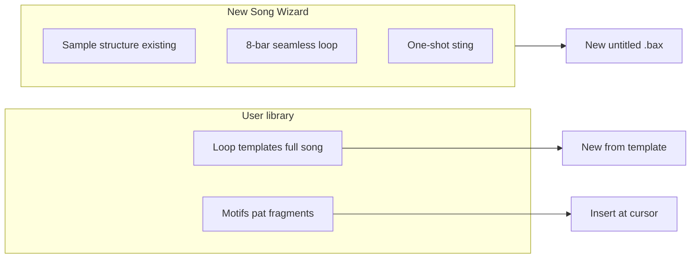

## Summary

Productize the pack-authoring workflow of **copy-me loop skeletons** and **reusable melodic phrases** as first-class BeatBax features, without changing the language.

v1 is **copy-in**:

- New Song Wizard **structure** options for an 8-bar seamless loop and a short one-shot sting (chip-plugin owned).
- A user **loop-template** library: save the current song, then New from that template.
- A user **motif** library: save a `pat` (or selected `pat` lines), then insert the text into another song.

There is **no live link**. Editing a saved motif later does not change songs that already received a copy. Language-level `include` of composition fragments stays on [song-composition-abstractions.md](song-composition-abstractions.md) / issue #125.

## Problem Statement

Composing a set of related chip tracks (title, overworld, town, battle, one-shots) needs two kinds of reuse that BeatBax does not currently expose in the UI:

1. **Loop skeleton.** A shipping Game Boy pack used a copy-me file (`packs/gb-adventure-pack/src/_loop_template.bax`): shared kit import, 8-bar pickup / body / turnaround, four channels of equal length, `play auto repeat`, last bar written to connect to bar 1, no fade. Authors duplicated the file, renamed it, and replaced patterns.
2. **Motif phrases.** The same pack kept a composer bible (`packs/gb-adventure-pack/MOTIFS.md`) for a title hook restated at different note lengths and modes. Authors pasted `pat` lines and rewrote durations. The hook was **not** one shared pattern that every song imported.

What already exists:

| Capability | Status |
|---|---|
| `import` of `.ins` kits (`inst`, `subpat`, `effect`) | Implemented |
| New Song Wizard chip templates (`instruments` / `effects` / `structure`) | Implemented — each chip ships one **sample demo** structure with `play`, not a seamless loop |
| Help panel Insert, Generate Sample Pattern, Duplicate / Extract Pattern | Implemented — generic syntax, not a user library |
| `import` / `include` of patterns, sequences, or `.bax` fragments | **Not implemented.** `.ins` validation rejects `pat` / `seq` / `channel`. |

Gaps:

- Starting a **looping** song means copying files in Explorer or rewriting the wizard demo (which fades conceptually toward a one-shot `play`).
- Reusing a hook means copy-paste. There is no Save / Insert / Preview for named phrases.
- Pack motif bibles are Markdown outside the app. Productizing that as an in-app document viewer is the wrong shape: the useful unit is the **phrase text**, not the prose rules.

Live `include` would keep songs in sync when a shared `pat` changes. That is a different problem. The pack restated the same contour at 16ths, 8ths, quarters, and fragments (`:slow` was often forbidden). Copy-in matches that workflow.

## Proposed Solution

### Summary

Treat motifs and loop templates as **library items whose payload is `.bax` text**. The editor clones or inserts that text. Playback, export, and the parser stay unchanged.



Three slices, in order:

1. **Chip structure templates** — every user, no library store.
2. **User loop templates** — Save Song / New from Template.
3. **User motifs** — Save Pattern / Insert Motif / Preview.

### Design principles

- **Copy-in only.** Saved items are snapshots. No resolver merge of `pat` / `seq`.
- **Text is the source of truth.** No parallel motif model, piano-roll editor, or theme-bible panel.
- **Reuse existing surfaces.** Wizard structure dropdown, command palette, File menu, Help Insert, `insertHelpSnippetBlock`.
- **Chip plugins own starter skeletons.** Core must not hard-code Game Boy notes in the wizard host.
- **Pack files stay pack files.** Do not auto-scan `_*.bax` or ship adventure-pack hooks as built-in motifs.
- **Desktop-first library persistence.** Web-lite may keep a small `localStorage` catalog; command palette remains `advancedEditor` (desktop-full).

### Example Syntax

No new `.bax` grammar. Library payloads use existing syntax.

**Motif fragment** (one or more top-level `pat` lines; optional `seq`):

```bax
# motif: rising triad
pat rise = C5:4 E5:4 G5:4 C6:4
```

**Loop template** (full song, same shape as a wizard result or `_loop_template.bax`):

```bax
song name "Loop Template"
chip gameboy
bpm 128
stepsPerBar 16

# instruments / import / effects …

pat intro_a = …
# …

seq mel  = intro_a intro_b body_a body_b body_c body_d turn_a turn_b
channel 1 => inst lead seq mel
# channels 2–4, equal length

play auto repeat
```

**One-shot sting structure:**

```bax
play auto
```

No `repeat`. The last pattern may end on an authored rest.

### Example Usage

1. File → New → Game Boy → structure **8-bar seamless loop**. Optionally pick kit instruments / `import` later in the file.
2. Replace placeholder notes; keep channel lengths aligned; Save Song as Loop Template (“Adventure loop”).
3. File → New from Loop Template → “Adventure loop” for the next scene; rewrite `song name` and patterns.
4. Cursor on `pat hook = …` → Save Pattern as Motif (“Call 8ths”).
5. In another song, Insert Motif… → “Call 8ths”. If `hook` already exists, insert as `hook_2`.
6. One-shots (fanfare, game over): New → **One-shot sting**, drop `repeat`, do not save as a looping template unless intended.

## Scope

### Included (v1)

| Area | Detail |
|---|---|
| Wizard structures | Per-chip **8-bar seamless loop** and **one-shot sting** next to the existing sample structure |
| Loop form (loop option) | 2-bar pickup + 4-bar body + 2-bar turnaround; `stepsPerBar 16`; equal-length seqs on all channels the chip template uses; `play auto repeat`; comments that bar 8 connects to bar 1 with no fade |
| One-shot form | 2–4 bars; `play auto`; authored end rest |
| Placeholder music | Generic scale-friendly notes (e.g. C/G), **not** a branded pack hook |
| Wizard default | Keep current **sample structure** as default so onboarding still shows more language |
| Save loop template | Current buffer → user library |
| New from loop template | Clone into a new untitled document; rewrite `song name` when present |
| Save motif | `pat` under cursor, or selected `pat` lines |
| Insert motif | Quick-pick → insert as a top-level block; collision suffix `_2`, `_3`, … |
| Preview motif | Audition from the picker using the current song `chip` and a default `inst` when the fragment has none |
| Built-in motifs | Small generic set: 5–1 leap, 1–3–5–8 rise, 4-bar turnaround — not pack IP |
| Help panel | **Motifs** section: built-ins + user items, Insert |
| Persistence | Desktop `userData/library/…`; web-lite size-capped `localStorage` |

### Out of scope (v1)

- Language `include` / importing `.bax` fragments (issue #125 Phase 3).
- Scale-degree construct (`motif call = 5 1 2 3 …`).
- In-app Markdown motif bible / MOTIFS.md viewer.
- Live updates when a library item changes.
- Auto-discovery of `_*.bax` in packs or workspaces.
- Shipping `gb-adventure-pack` as an in-app content pack.
- New visual library manager panel (commands + Help + File menu are enough).
- “My templates” tab inside the New Song Wizard (follow-up; wizard is duplicated in web-ui and desktop).
- Parser, ISM, exporters, CLI play/export behavior.

## Library model

```ts
type LibraryKind = 'motif' | 'loop-template';

interface LibraryItem {
  id: string;
  kind: LibraryKind;
  name: string;
  source: string;
  chip?: string;
  tags?: string[];
  createdAt: string; // ISO-8601
  updatedAt: string;
}
```

- Motif `source` must parse as BeatBax with only `pat` / optional `seq` / comments (no `channel` / `play` required).
- Loop-template `source` is a full song (may include `import`, `inst`, `channel`, `play`).
- **Explicit Save only.** Pack `_loop_template.bax` is not imported unless the user opens it and saves it.

### Storage

| Client | Location |
|---|---|
| Desktop | `app.getPath('userData')/library/loop-templates/<id>.bax`, `…/motifs/<id>.bax`, plus `index.json` |
| Web-lite | `localStorage` key under the existing `beatbax:` prefix; cap item count / payload size so try-it stays usable |

### Commands

| ID | Label | Behavior |
|---|---|---|
| `beatbax.saveAsLoopTemplate` | BeatBax: Save Song as Loop Template… | Prompt for name; store full buffer |
| `beatbax.newFromLoopTemplate` | BeatBax: New Song from Loop Template… | Quick-pick → new untitled buffer |
| `beatbax.savePatternAsMotif` | BeatBax: Save Pattern as Motif… | Cursor `pat` or selected `pat` lines |
| `beatbax.insertMotif` | BeatBax: Insert Motif… | Quick-pick; insert via `insertHelpSnippetBlock`; rename on collision |

Desktop File menu: **Save as Loop Template…**, **New from Loop Template…** next to New / Open.

Insert must not splice a `pat` into the middle of another statement (same contract as Help Insert).

### Preview

Reuse synthetic preview / play-selection. If the motif fragment has no `inst`, wrap with the open song’s `chip` (fallback `gameboy`) and a simple default instrument on one channel, then play the first `pat`. Do not write the wrapper into the editor.

## Future Enhancements

- “My templates” list in the New Song Wizard (after deduping web/desktop wizard or sharing `buildSongSource`).
- Export / import a library folder (share a kit of motifs with a project, still copy-in).
- Insert motif with optional `:oct` / transpose prompt (still copy-in; writes modified text).
- Tag filter in the Insert Motif picker (`chip`, `loop`, `sting`).
- Language `include` for live-shared fragments ([song-composition-abstractions.md](song-composition-abstractions.md) Phase 3) when authors want one `pat` to update every song.
- Scale-degree motif realization (`degrees 5 1 2 3` → notes from `scale`) — separate feature.

## Open Questions

1. Should Save Pattern as Motif include a following `seq` line that only references that pattern, or `pat` only?
2. When New from Loop Template, always force a new untitled tab (desktop) even if the current buffer is empty?
3. Web-lite library: fail at cap vs evict oldest? (Spec currently: fail with a message.)

## References

- Pack workflow (external / pack repo): `packs/gb-adventure-pack/MOTIFS.md`, `packs/gb-adventure-pack/src/_loop_template.bax`
- [`docs/features/complete/new-song-wizard.md`](../../../docs/features/complete/new-song-wizard.md)
- [`docs/features/complete/instrument-imports.md`](../../../docs/features/complete/instrument-imports.md)
- [`docs/features/complete/enhanced-command-palette-commands.md`](../../../docs/features/complete/enhanced-command-palette-commands.md)
- [`docs/features/song-composition-abstractions.md`](../../../docs/features/song-composition-abstractions.md) — `include` is **not** this feature; active SDD: [`008-song-composition-abstractions`](../008-song-composition-abstractions/spec.md)
- [`docs/features/FEATURE_TEMPLATE.md`](../../../docs/features/FEATURE_TEMPLATE.md)

## Additional Notes

The Adventure Call contour (scale degrees 5–1–2–3–5–4–3–1) is pack vocabulary. Built-in motifs must stay generic so BeatBax does not ship that hook as a platform default.
