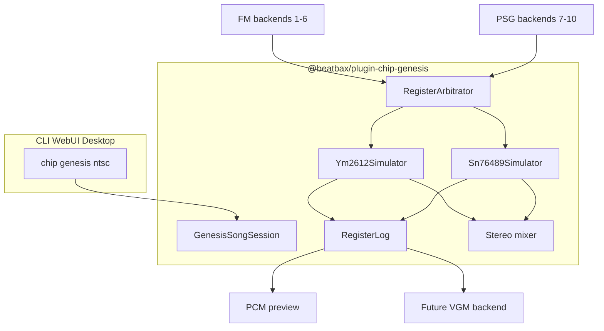

## Summary

Implement `@beatbax/plugin-chip-genesis` as an optional BeatBax chip plugin targeting **Sega Mega Drive / Genesis** audio.

The Mega Drive mixes two chips:

- Yamaha **YM2612** (OPN2) — 6 channels of 4-operator FM, stereo pan, global LFO
- Texas Instruments **SN76489**-compatible PSG (VDP PSG) — 3 square tone channels + 1 noise channel

Users select the backend with `chip genesis` (aliases `megadrive`, `md`) at the top of a `.bax` file. Channel count is fixed at **10**: FM 1–6, then PSG 1–3, then Noise — matching the labels already in `[packages/ui-tokens/src/channel-meta.ts](../../packages/ui-tokens/src/channel-meta.ts)`.

v1 delivers deterministic CLI / Web UI / desktop playback, FM patch authoring, PSG macros at Mega Drive clocks, and a register log for a later VGM backend. Native VGM, DAC/PCM, and Channel 3 special mode are out of scope for v1.

This follows the optional-plugin conventions established by `[sms-psg-chip-plugin.md](complete/sms-psg-chip-plugin.md)` and the shared-chip session pattern from `[zx-spectrum-128-chip-plugin.md](complete/zx-spectrum-128-chip-plugin.md)` / `[c64-sid-chip-plugin.md](c64-sid-chip-plugin.md)`. It is **not** a built-in engine chip.

---

## Problem Statement

BeatBax already ships a Sega Master System / Game Gear **PSG** plugin (`@beatbax/plugin-chip-sms`) and Nintendo built-ins (Game Boy, NES). The Mega Drive — one of the most recognisable 16-bit FM palettes — has no authoring path.

The gap is visible in the repo today:

- `[ROADMAP.md](../../ROADMAP.md)` lists YM2612 + SN76489 as high-priority, high-effort, unimplemented
- `[docs/features/complete/plugin-system.md](complete/plugin-system.md)` already shows `chip genesis` and `@beatbax/plugin-chip-genesis`
- Mixer / Pattern Grid channel colours for `genesis` already exist (10 voices)
- `ChipPlugin.instrumentVolumeRange` documents YM2612 0–127 attenuation
- Effect frame-rate tables already name `genesis` / `megadrive`
- The VGM exporter was designed to grow a YM2612 backend (`0x52` / `0x53` + PSG `0x50`) but has no Genesis chip to consume

Without a spec, implementation would repeat pre-plugin NES friction: unclear FM syntax, mixed FM/PSG volume scales, and preview that cannot later become VGM.

A naive six-oscillator FM backend would also fail hardware fidelity. The YM2612 has **one global LFO**, dual register ports, and a shared chip state. Preview, validation, and future export must share one song-scoped simulator.

Related prior work:

- `[docs/features/complete/sms-psg-chip-plugin.md](complete/sms-psg-chip-plugin.md)` — SN76489 tone/noise, attenuation, macros
- `[docs/features/complete/zx-spectrum-128-chip-plugin.md](complete/zx-spectrum-128-chip-plugin.md)` — plugin-owned song session + register log
- `[docs/features/c64-sid-chip-plugin.md](c64-sid-chip-plugin.md)` — shared-chip architecture
- `[docs/features/complete/vgm-exporter-plugin.md](complete/vgm-exporter-plugin.md)` — VGM backend registry (Genesis follow-up)
- `[docs/features/complete/plugin-system.md](complete/plugin-system.md)` — `ChipPlugin` / `ChipRegistry` contract

---

## Scope


### Included (v1)


| Area                    | Detail                                                                                                            |
| ----------------------- | ----------------------------------------------------------------------------------------------------------------- |
| Optional plugin package | `@beatbax/plugin-chip-genesis` at `packages/plugins/chip-genesis/`                                                |
| Chip directive          | `chip genesis` with aliases `megadrive`, `md`; optional `ntsc` / `pal` region                                     |
| 6 YM2612 FM voices      | BeatBax channels 1–6 → FM 1–6 (`type=fm1`…`fm6`)                                                                  |
| 4 SN76489 voices        | Channels 7–10 → Tone 1–3 + Noise (`type=tone1`…`tone3`, `noise`)                                                  |
| 4-operator FM authoring | Algorithm, feedback, per-operator DT/MUL/TL/KS/AR/DR/SR/RR/SL/SSG-EG/AM                                           |
| Bundled patches         | Optional `patch="@genesis/<name>"` for wizard templates; explicit `op1`–`op4` remain source of truth              |
| Hardware FM envelopes   | Operator AR/DR/SR/RR/SL (and optional SSG-EG)                                                                     |
| Global LFO              | Song- or instrument-level LFO enable/rate; per-channel AMS/FMS                                                    |
| FM stereo pan           | Per-FM-channel `pan=L|C|R` (YM2612 L/R enable bits)                                                               |
| PSG macros              | SMS-style `vol_env`, `arp_env`, `pitch_env`, `noise_rate_env` at Mega Drive clocks                                |
| Register log            | Deterministic per-tick YM2612 + PSG write stream (preview + future VGM)                                           |
| Host wiring             | Workspace, CLI discovery, `[registry-config.ts](../../packages/app-core/src/plugins/registry-config.ts)`, desktop |
| UI                      | `songWizard.ts`, `ui-contributions.ts`, New Song Wizard, Settings → Plugins                                       |
| Sample songs            | `songs/genesis/` demos and smoke tests                                                                            |
| Chip documentation      | `docs/chips/genesis/` (hardware, composition, interesting facts)                                                  |


### Excluded (v1)


| Area                                   | Detail                                                                                                 |
| -------------------------------------- | ------------------------------------------------------------------------------------------------------ |
| Channel 6 DAC / PCM                    | 8-bit DAC mode mutually exclusive with FM 6 — separate feature                                         |
| Channel 3 CSM / special mode           | Four independent operator frequencies — deferred                                                       |
| VGM export                             | Follow-up on `@beatbax/plugin-exporter-vgm` (header clock `0x2C`, commands `0x52`/`0x53` + PSG `0x50`) |
| GYM export                             | Genesis-specific archival format — deferred                                                            |
| DefleMask / Furnace / TFI / DMP import | Out of scope                                                                                           |
| Dual YM2612                            | 32X, arcade, or Mega Drive + extra FM — out of scope                                                   |
| Bit-exact ladder DAC / Nuked-OPN2 WASM | v1 uses a stable, testable FM approximation                                                            |
| Game Gear `gg:pan` on PSG              | Mega Drive PSG is mixed centre; YM2612 pan is FM-only                                                  |
| YM2413 (OPLL)                          | Different 2-op chip (MSX / some SMS); not Mega Drive                                                   |


---

## Proposed Solution


### Summary

1. **Create** `@beatbax/plugin-chip-genesis` implementing the standard `ChipPlugin` interface (`name: 'genesis'`, `channels: 10`).
2. **Register** as an optional plugin (SMS/Spectrum pattern) — not `BUILTIN_CHIP_PLUGINS`.
3. **Drive** one song-scoped YM2612 simulator plus one SN76489 simulator. Channel backends are facades that emit register intents.
4. **Render** preview PCM from the combined register stream. The same log is the contract for a later VGM backend.
5. **Validate** FM operator fields, PSG noise fields, mixed volume ranges, channel count, and unsupported effects at parse/compile time.


### Architecture




The engine still calls `configureForSong()` then `createChannel()`. The plugin owns a module-level session (same pattern as Spectrum 128): `beginSongSession()` resets shared YM2612 + PSG state; `createChannel()` returns facades into that session. **Never** allocate six independent YM2612 cores — the LFO and dual-port register file are chip-global.

### Package Structure

```
packages/plugins/chip-genesis/
├── package.json
├── tsconfig.json
├── src/
│   ├── index.ts                 # ChipPlugin entry; session lifecycle
│   ├── version.ts
│   ├── platform-profiles.ts     # NTSC/PAL master, YM2612, and PSG clocks
│   ├── ym2612-chip.ts           # Shared OPN2 register file + voice step
│   ├── ym2612-fm.ts             # 4-op algorithm, envelopes, LFO
│   ├── ym2612-period.ts         # MIDI note → block + f-number
│   ├── psg-tone.ts              # SN76489 tone (Mega Drive clocks)
│   ├── psg-noise.ts             # SN76489 noise
│   ├── psg-period.ts            # Tone period tables
│   ├── register-intent.ts       # FM + PSG intents per tick
│   ├── register-arbitrator.ts   # Merge intents → one chip frame
│   ├── register-log.ts          # Deterministic tick log
│   ├── channel-backend.ts       # ChipChannelBackend facades
│   ├── mixer.ts                 # FM stereo + centred PSG mix
│   ├── patches.ts               # bundled @genesis/* FM patches
│   ├── validate.ts              # Per-instrument validation
│   ├── validate-song.ts         # Channel count, LFO, DAC/CSM rejection
│   ├── ui-contributions.ts
│   └── songWizard.ts
├── tests/
│   ├── plugin.test.ts
│   ├── ym2612-fm.test.ts
│   ├── ym2612-period.test.ts
│   ├── psg.test.ts
│   ├── register-log.test.ts
│   ├── validate.test.ts
│   └── validate-song.test.ts
└── README.md
```

PSG reuse: duplicate a thin SN76489 module inside this package for v1 (Mega Drive clocks; no `gg:pan`). Extracting a shared engine SN76489 core is a later cleanup, not a v1 blocker. Do not import `@beatbax/plugin-chip-sms` as a runtime dependency.

### Hardware model


| BeatBax channel | Label | Type    | Hardware                                                  |
| --------------- | ----- | ------- | --------------------------------------------------------- |
| 1               | FM 1  | `fm1`   | YM2612 part I, channel 1                                  |
| 2               | FM 2  | `fm2`   | YM2612 part I, channel 2                                  |
| 3               | FM 3  | `fm3`   | YM2612 part I, channel 3 (special/CSM **disabled** in v1) |
| 4               | FM 4  | `fm4`   | YM2612 part II, channel 1                                 |
| 5               | FM 5  | `fm5`   | YM2612 part II, channel 2                                 |
| 6               | FM 6  | `fm6`   | YM2612 part II, channel 3 (DAC **disabled** in v1)        |
| 7               | PSG 1 | `tone1` | SN76489 tone 1                                            |
| 8               | PSG 2 | `tone2` | SN76489 tone 2                                            |
| 9               | PSG 3 | `tone3` | SN76489 tone 3                                            |
| 10              | Noise | `noise` | SN76489 noise                                             |


YM2612 addressing (for the register log and future VGM):


| Port                        | VGM command  | Channels         |
| --------------------------- | ------------ | ---------------- |
| Part I (`0x4000`/`0x4001`)  | `0x52 aa dd` | FM 1–3           |
| Part II (`0x4002`/`0x4003`) | `0x53 aa dd` | FM 4–6           |
| PSG                         | `0x50 dd`    | Tone 1–3 + noise |


**Per-operator registers (v1):**


| Field | Range | Description                              |
| ----- | ----- | ---------------------------------------- |
| `dt`  | 0–7   | Detune                                   |
| `mul` | 0–15  | Frequency multiple (`0` = ×0.5)          |
| `tl`  | 0–127 | Total level (attenuation: `0` = loudest) |
| `ks`  | 0–3   | Key scale / rate scaling                 |
| `ar`  | 0–31  | Attack rate                              |
| `dr`  | 0–31  | Decay rate                               |
| `sr`  | 0–31  | Sustain rate                             |
| `sl`  | 0–15  | Sustain level                            |
| `rr`  | 0–15  | Release rate                             |
| `ssg` | 0–15  | SSG-EG mode (0 = off)                    |
| `am`  | 0–1   | Amplitude modulation enable (LFO AMS)    |


**Per-FM-channel registers (v1):**


| Field | Range           | Description                         |
| ----- | --------------- | ----------------------------------- |
| `alg` | 0–7             | Algorithm (operator routing)        |
| `fb`  | 0–7             | Operator 1 feedback                 |
| `ams` | 0–3             | Amplitude modulation sensitivity    |
| `fms` | 0–7             | Frequency modulation sensitivity    |
| `pan` | `L` | `C` | `R` | L/R output enable bits (`C` = both) |


**Chip-global LFO:**


| Field | Range            | Description                                           |
| ----- | ---------------- | ----------------------------------------------------- |
| `lfo` | `off` or `0`–`7` | LFO disable, or enable at one of eight hardware rates |


LFO is **one register** for the whole YM2612. Conflicting per-instrument `lfo` values on the same tick are a **song-level error** (same rule as SID filter globals). Prefer a song-level `lfo` directive; instrument `lfo` is allowed when all FM instruments agree.

**Critical constraints:**


| Resource        | Scope           | Composers can                | Composers cannot (v1)                                          |
| --------------- | --------------- | ---------------------------- | -------------------------------------------------------------- |
| LFO rate/enable | Global          | One LFO setting for the chip | Two FM instruments requesting different `lfo` on the same tick |
| FM pan          | Per FM channel  | `L` / `C` / `R`              | PSG `gg:pan` or independent PSG stereo                         |
| Channel 6       | FM only         | Normal 4-op FM               | DAC / PCM (`dac=true` is an error)                             |
| Channel 3       | Normal FM       | Standard algorithm FM        | CSM / 4-frequency special mode                                 |
| PSG volume      | Per PSG voice   | Attenuation 0–15             | TL 0–127 on `tone*`/`noise`                                    |
| FM volume       | Per operator TL | Attenuation 0–127            | 4-bit PSG attenuation as FM `tl`                               |


### Platform clocks and tick rate


| Profile          | Master clock  | YM2612 (÷7)  | SN76489 (÷15) | Control tick |
| ---------------- | ------------- | ------------ | ------------- | ------------ |
| `ntsc` (default) | 53,693,175 Hz | 7,670,454 Hz | 3,579,545 Hz  | **60 Hz**    |
| `pal`            | 53,203,424 Hz | 7,600,489 Hz | 3,546,895 Hz  | **50 Hz**    |


F-number from note frequency f:


N = \mathrm{round}\left(f \times 2^{20-block} \div f_{ym}\right)


Clamp N to 0–2047; choose `block` (0–7) so N sits in a usable range. Rebuild period tables in `configureForSong()` when region changes.

Macro/effect stepping uses the **region frame rate** (50/60 Hz), not a hardcoded `CHIP_FRAME_RATES['genesis'] = 60` once PAL songs exist. Engine tables already list `genesis` / `megadrive` at 60 Hz; PAL must override via `configureForSong`.

### Example Syntax

```bax
chip genesis ntsc
bpm 130

; Global YM2612 LFO (one setting for the chip)
lfo 3

; FM lead — 4-op patch, centre pan
inst lead type=fm1 alg=5 fb=6 pan=C ams=2 fms=3
          op1=dt:0,mul:1,tl:28,ar:31,dr:5,sr:2,rr:7,sl:2
          op2=dt:0,mul:1,tl:20,ar:31,dr:8,sr:3,rr:7,sl:1
          op3=dt:3,mul:2,tl:35,ar:28,dr:6,sr:2,rr:8,sl:3
          op4=dt:0,mul:1,tl:10,ar:31,dr:4,sr:1,rr:6,sl:1

; FM bass from a bundled patch, then override TL on the carrier
inst bass type=fm2 patch="@genesis/bass" tl=18 pan=C

; FM pad, left/right pair
inst padL type=fm4 alg=7 fb=2 pan=L
          op1=dt:0,mul:1,tl:32,ar:20,dr:4,sr:1,rr:6,sl:4
          op2=dt:0,mul:1,tl:40,ar:18,dr:5,sr:1,rr:6,sl:5
          op3=dt:0,mul:2,tl:36,ar:22,dr:4,sr:1,rr:7,sl:4
          op4=dt:0,mul:1,tl:24,ar:24,dr:6,sr:2,rr:8,sl:3
inst padR type=fm5 alg=7 fb=2 pan=R
          op1=dt:0,mul:1,tl:32,ar:20,dr:4,sr:1,rr:6,sl:4
          op2=dt:0,mul:1,tl:40,ar:18,dr:5,sr:1,rr:7,sl:5
          op3=dt:0,mul:2,tl:36,ar:22,dr:4,sr:1,rr:7,sl:4
          op4=dt:0,mul:1,tl:24,ar:24,dr:6,sr:2,rr:8,sl:3

; PSG — SMS semantics, Mega Drive clocks, no gg:pan
; vol / vol_env are SN76489 attenuation: 0 = loudest, 15 = mute
inst square type=tone1 vol=2
inst stab   type=tone2 vol=4 vol_env=[0,3,6,9,12,15]
inst kick   type=noise noise_mode=white noise_rate=2 vol_env=[0,4,8,12,15]

channel 1  => inst lead   seq melody
channel 2  => inst bass   seq lowline
channel 4  => inst padL   seq pad
channel 5  => inst padR   seq pad
channel 7  => inst square seq stab
channel 10 => inst kick   seq drums

play
```


### Example Usage

- `chip genesis` selects the Mega Drive backend. Aliases `megadrive` and `md` resolve to the same plugin.
- `chip genesis ntsc` / `chip genesis pal` — optional region qualifier. Defaults to `ntsc`. Extends the existing SMS/NES region-qualifier grammar (today only `sms` and `nes` accept it).
- Channel count is fixed at 10. An 11th `channel` assignment is a validation error. Unused channels are silent.
- `type=fm1`…`fm6` must be assigned to channels 1–6 (mismatch is an error). `type=tone1`…`tone3`/`noise` must be assigned to channels 7–10.
- **FM** `tl`**:** 0–127 attenuation (`0` = loudest). Matches `instrumentVolumeRange` already documented on `ChipPlugin` for Genesis.
- **PSG** `vol` **/** `vol_env`**:** 0–15 attenuation, identical to SMS. A decay envelope counts **up** toward 15.
- `volSlide` **direction:** positive `delta` = louder on **both** FM and PSG (attenuation decreases). Cross-chip BeatBax convention.
- `patch="@genesis/<name>"` loads a bundled FM patch, then optional `opN` / `tl` / `alg` / `fb` fields override it.
- `gg:pan` is a **validation error** under `chip genesis` (Game Gear only). Use FM `pan=L|C|R`.
- `dac`, CSM, and Channel 3 special-mode fields are **errors** in v1 with a diagnostic pointing at this spec.

Programmatic access:

```typescript
import { BeatBaxEngine } from '@beatbax/engine';
import genesisPlugin from '@beatbax/plugin-chip-genesis';

const engine = new BeatBaxEngine();
engine.registerChipPlugin(genesisPlugin);
```


### Mixed volume ranges

The Mega Drive is the first BeatBax chip with **two hardware volume scales** in one plugin:


| Voice | Field                                                     | Range | Convention        |
| ----- | --------------------------------------------------------- | ----- | ----------------- |
| FM    | `tl` (and optional instrument `vol` mapped to carrier TL) | 0–127 | Attenuation       |
| PSG   | `vol` / `vol_env`                                         | 0–15  | Attenuation (SMS) |


`ChipPlugin.instrumentVolumeRange` is chip-wide. v1 sets it to `{ min: 0, max: 127, isAttenuation: true }` (already cited in `[packages/engine/src/chips/types.ts](../../packages/engine/src/chips/types.ts)`) so FM mixer meters are correct. PSG instruments **must** still be validated at 0–15 in `validateInstrument`. `supportsVolumeForChannel(i)` returns true for all ten channels; UI code that assumes one scale should use instrument type, not the chip-level max, when drawing PSG faders.

If the mixer cannot represent mixed scales cleanly, document PSG channels as 0–15 in chip-meta / wizard copy and keep the chip-level field as FM. Extending `ChipPlugin` with per-type ranges is an open question, not a v1 engine redesign.

### Effects Support

YM2612 has **hardware envelopes**, a **global LFO**, and **key on/off**. SN76489 has none of those — PSG effects stay software register writes, as on SMS.

Prefer hardware FM features over baked macros. VGM export is not in v1; the **Mechanism** column is what the register log must contain so a later VGM backend can emit it unchanged.


| Effect          | FM                              | PSG            | Mechanism                                                            | Notes                                                                  |
| --------------- | ------------------------------- | -------------- | -------------------------------------------------------------------- | ---------------------------------------------------------------------- |
| `pan`           | ✅ Supported                     | ❌              | FM L/R enable bits                                                   | PSG `pan` / `gg:pan` is a validation error. Use FM `pan=L|C|R`.        |
| `vib`           | ✅ Native (LFO FMS) or ⚠️ approx | ⚠️ Approximate | FM: enable LFO + `fms`; else per-tick f-number. PSG: per-tick period | Conflicting FM `lfo` rates are a song-level error.                     |
| `trem`          | ✅ Native (LFO AMS) or ⚠️ approx | ⚠️ Approximate | FM: LFO + `ams` / `am` bit; else TL writes. PSG: 4-bit vol writes    | Same global LFO as `vib`.                                              |
| `port` / `bend` | ⚠️ Approximate                  | ⚠️ Approximate | Per-tick f-number / period toward target                             | FM 11-bit f-number is finer than PSG 10-bit period.                    |
| `arp`           | ⚠️ Approximate                  | ⚠️ Approximate | Per-tick pitch cycling or `arp_env`                                  | Classic on both chips.                                                 |
| `volSlide`      | ⚠️ Approximate                  | ⚠️ Approximate | Per-tick carrier TL (FM) or attenuation (PSG)                        | FM 7-bit TL; PSG 4-bit. Positive delta = louder.                       |
| `cut`           | ✅ Supported                     | ✅ Supported    | FM key-off; PSG vol=15                                               | Reliable.                                                              |
| `retrig`        | ✅ Supported                     | ⚠️ Approximate | FM key-off then key-on (envelope restart). PSG period rewrite        | FM retrig is exact. PSG phase-reset is emulator-defined (SMS warning). |
| `sweep`         | ❌                               | ❌              | N/A — Game Boy NR10                                                  | Validation error; use `port` / `pitch_env` / FM envelopes.             |
| `echo`          | ❌                               | ❌              | N/A — no delay buffer                                                | Validation error.                                                      |
| `duty_env`      | ❌                               | ❌              | N/A                                                                  | FM is operators, not squares; PSG duty is fixed 50%.                   |


Software macros:


| Field            | FM                                                         | PSG                                          |
| ---------------- | ---------------------------------------------------------- | -------------------------------------------- |
| `vol_env`        | Optional extra TL macro (supplements hardware AR/DR/SR/RR) | Required for punchy drums (0–15 attenuation) |
| `arp_env`        | ✅                                                          | ✅                                            |
| `pitch_env`      | ✅                                                          | ✅                                            |
| `noise_rate_env` | ❌ (error on FM types)                                      | ✅ SMS semantics                              |


---

## Future Enhancements

- **VGM export** — YM2612 + PSG backend on `@beatbax/plugin-exporter-vgm` (header `0x2C`, `0x52`/`0x53`/`0x50`).
- **Channel 6 DAC** — 8-bit PCM via `resolveSampleAsset` / bundled samples; FM 6 muted while DAC is on.
- **Channel 3 special / CSM** — four independent operator frequencies.
- **GYM export** and DefleMask/Furnace/TFI patch import.
- **Shared SN76489 core** in `@beatbax/engine` used by both SMS and Genesis.
- **Nuked-OPN2-class** optional high-fidelity renderer behind a flag (keep the deterministic core as the test oracle).
- **Per-type** `instrumentVolumeRange` on `ChipPlugin` if mixer UX needs it.

---

## Open Questions

1. Should song-level `lfo` be mandatory when any FM instrument sets `ams`/`fms`/`am`, or default `lfo off` with a warning?
2. Should `type=fm` + channel binding be allowed, or only explicit `fm1`…`fm6` (this spec uses explicit types, matching SMS `tone1`…`tone3`)?
3. Should carrier `vol` be a documented alias for `tl` on FM instruments, or is `tl` the only FM amplitude field?
4. Should bundled `@genesis/*` patches ship as data tables in `patches.ts` or as separate JSON/TFI assets?
5. Should PAL default to 50 Hz ticks (hardware vblank) even though current engine tables list `genesis: 60`?
6. Does `ChipPlugin` need per-channel or per-type volume ranges in v1, or is validate-time splitting enough?

---

## Risks and Mitigations


| Risk                                                  | Mitigation                                                                   |
| ----------------------------------------------------- | ---------------------------------------------------------------------------- |
| FM core complexity delays shipping                    | Phase 2 gate is a one-voice deterministic patch, not bit-exact OPN2          |
| Mixed 0–127 / 0–15 volume confuses UI                 | Per-type validation + wizard copy; chip-level range stays FM                 |
| PSG duplication drifts from SMS                       | Same field names and attenuation convention; shared core later               |
| Global LFO conflicts surprise composers               | Song-level `lfo` in wizard templates; conflict = error, not last-writer-wins |
| VGM expected on day one                               | Explicit v1 exclusion; register log is the export contract                   |
| ROADMAP `plugin-chip-ym2612` vs `plugin-chip-genesis` | This spec is canonical; update ROADMAP at implementation                     |


---

## References

- `[docs/features/complete/sms-psg-chip-plugin.md](complete/sms-psg-chip-plugin.md)` — SN76489 semantics and effects table
- `[docs/features/complete/zx-spectrum-128-chip-plugin.md](complete/zx-spectrum-128-chip-plugin.md)` — song session + register log
- `[docs/features/c64-sid-chip-plugin.md](c64-sid-chip-plugin.md)` — shared-chip plugin
- `[docs/features/complete/plugin-system.md](complete/plugin-system.md)` — `ChipPlugin`, `chip genesis`
- `[docs/features/complete/vgm-exporter-plugin.md](complete/vgm-exporter-plugin.md)` — VGM follow-up
- `[docs/features/complete/vgm-exporter-and-engine-utilities-consolidation.md](complete/vgm-exporter-and-engine-utilities-consolidation.md)` — YM2612 backend note
- `[docs/features/complete/effects-system.md](complete/effects-system.md)` — YM2612 effect mapping
- `[docs/contributing/creating-plugins.md](../contributing/creating-plugins.md)` — plugin catalogue (Genesis planned, 10 channels)
- `[ROADMAP.md](../../ROADMAP.md)` — YM2612 + SN76489 entry
- `[packages/engine/src/chips/types.ts](../../packages/engine/src/chips/types.ts)` — `instrumentVolumeRange` Genesis example
- `[packages/ui-tokens/src/channel-meta.ts](../../packages/ui-tokens/src/channel-meta.ts)` — FM 1–6 + PSG labels
- `[packages/app-core/src/plugins/registry-config.ts](../../packages/app-core/src/plugins/registry-config.ts)` — optional plugin catalogue
- `[.github/ISSUES/sega-mega-drive-chip-plugin.md](../../.github/ISSUES/sega-mega-drive-chip-plugin.md)` — GitHub issue draft
- Yamaha YM2612 Application Manual (OPN2 register map)
- Sega Mega Drive / Genesis Technical Overview (audio clocks)

---

## Additional Notes

- Preserve BeatBax core contracts: deterministic parse → AST → ISM → schedule pipeline; no chip-specific AST mutations; plugin-isolated backend behavior; loud validation for unsupported fields.
- Naming: **Sega Mega Drive** (Europe/Japan) and **Sega Genesis** (North America) are the same hardware. BeatBax chip id is `genesis` because UI tokens, effect tables, and plugin-system docs already use it. User-facing wizard copy should say **Mega Drive / Genesis**.
- Channel 6 DAC and Channel 3 special mode are real hardware features and a major part of some soundtracks (e.g. sampled drums on DAC). They are deferred so v1 can ship a correct FM+PSG authoring loop.
- Wizard templates should always emit `chip genesis ntsc` (or `pal`) and at least one FM + one PSG instrument so composers see the dual-chip layout immediately.
