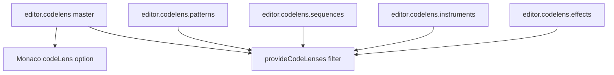

## Summary

Split the single **Show CodeLens previews** editor setting into a master toggle plus per-category controls for **patterns**, **sequences**, **instruments**, and **effects**, so users can hide redundant seq lenses (after Pattern Grid section focus) without losing inst note audition or pat/effect previews.

## Background

### What CodeLens provides today

Registered in `codelens-preview.ts` for each matching source line:

| Line type | Lenses | Playback |
| --- | --- | --- |
| `pat name = …` | ▶ Preview, ↺ Loop | Isolated `Player`, one channel |
| `seq name = …` | ▶ Preview, ↺ Loop | Isolated `Player`, one channel |
| `inst name …` | C3–C7 (or ▶ Sample for DMC) | Isolated `Player` |
| `effect name = …` | ▶ Preview, ▶ Slow, ↺ Loop | Isolated `Player` |

Preview uses a dedicated player that stops when transport play starts. It does not participate in channel mixer mute/solo.

### What Pattern Grid section focus provides

- Multi-channel **arrangement slice** play via `PlaybackManager`
- Section focus, F6 at cursor, Alt+←/→ navigation, Esc exit
- Transport F5/F8 integration and channel mute/solo on the main mix
- Editor highlighting of seq blocks and section comments

See [pattern-combination-preview.md](../../../docs/features/complete/pattern-combination-preview.md).

### Overlap assessment

**Partial overlap** on `seq` ▶/↺ only. Everything else remains CodeLens-only. The features are complementary, not duplicates — but sequence lenses are the most likely to feel redundant for desktop users who live in Pattern Grid.

## Proposed solution

### Settings model

- **Master off:** Monaco `codeLens: false`; provider not visible regardless of sub-flags.
- **Master on:** Monaco `codeLens: true`; provider skips disabled categories.

### Default values

All `true` — no behaviour change for existing installs.

### UI placement

**Settings → Editor**, indented sub-rows under the master toggle (Desktop). Web UI mirrors when advanced editor / CodeLens is available.

Updated master-toggle help text:

> CodeLens adds inline preview actions above `pat`, `seq`, `inst`, and `effect` definitions. Pattern and sequence previews play one item on one channel; use Pattern Grid section focus to hear all channels together.

## Out of scope

- Per-note inst lens granularity
- Context-aware auto-hide (e.g. seq lenses off when Pattern Grid focused)
- Removing CodeLens seq preview entirely
- Engine or export changes

## Tracking

No GitHub issue yet — open one when implementation starts and set `issue` in the frontmatter.
