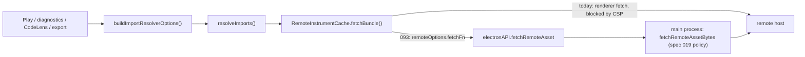

# Implementation Plan: Desktop remote instrument imports through main-process IPC

**Spec**: [spec.md](spec.md) | **Date**: 2026-10-08 | **Branch**: `feat/093-desktop-remote-imports-ipc`

## Summary

On Desktop, `buildImportResolverOptions()` adds `remoteOptions.fetchFn`: a `fetch`-compatible adapter that calls `window.electronAPI.fetchRemoteAsset` and wraps the returned bytes in a `Response`. Every Desktop surface that resolves imports (Play, diagnostics, CodeLens preview, export) already goes through `buildImportResolverOptions()`, so one change covers them all. The main-process policy from spec 019 is reused as is; the CSP stays `connect-src 'self'`.

## Technical context

- **Packages / surfaces**: `packages/app-core` (resolver options), `apps/desktop` (example loader, e2e), `packages/engine` (no behaviour change; `RemoteImportOptions.fetchFn` already exists)
- **Language**: TypeScript (strict), ESM
- **Testing**: Jest via `npm test`; Playwright e2e in `apps/desktop/tests/e2e/`
- **Client profile**: desktop-full only; web-lite and CLI unchanged
- **Constraints**: main-process limits from spec 019 (10 s, 1 MiB, 5 redirects, HTTPS, allowlist)

Existing call path:

## Constitution Check

- [x] No invented syntax or undocumented language behavior (remote imports are spec 048)
- [x] AST / ISM / scheduler / expansion impact: none; only the transport of `.ins` text changes
- [x] Plugins remain isolated; core does not gain plugin dependencies (app-core detects `window.electronAPI` at runtime, as it already does for `local:` file access)
- [x] Determinism and compatibility preserved: same `.ins` text in, same merged AST out; web and CLI unchanged
- [x] Tests planned for new behavior

## Project structure

| Path | Change |
| ---- | ------ |
| `packages/app-core/src/import/desktop-remote-fetch.ts` (new) | `createDesktopRemoteFetch(api)` returning a `typeof fetch` adapter |
| `packages/app-core/src/import/import-resolver-options.ts` | On `desktop-full` with `fetchRemoteAsset` available, set `remoteOptions = { httpsOnly: true, ...overrides.remoteOptions, fetchFn }` unless the caller supplied a `fetchFn` |
| `packages/app-core/tests/import-resolver-options.test.ts` | Desktop sets `fetchFn`; web-lite does not; caller override wins |
| `packages/app-core/tests/desktop-remote-fetch.test.ts` (new) | Adapter: bytes → `Response.text()`, error message passthrough, `Buffer`-shaped payloads |
| `apps/desktop/src/renderer/src/lib/load-example-song.ts` | Fallback: `github:` / `https:` paths load through `fetchRemoteAsset`; relative paths keep `loadRemote` |
| `apps/desktop/tests/e2e/desktop-integration.spec.ts` | Keep the CSP-block test; add a remote-import test with the main-process fetch stubbed |
| `docs/grammar/import-security.md`, `docs/features/complete/remote-imports.md` | Desktop note: HTTPS-only, allowlist, where to add hosts |

## Implementation

### AST changes

None.

### Parser / grammar changes

None.

### CLI changes

None.

### Desktop / web UI changes

- **Adapter.** `createDesktopRemoteFetch(api)` returns `async (input, init) => Response`. It reads the URL from `input`, calls `api.fetchRemoteAsset({ url })` (main-process defaults: 10 s, 1 MiB), converts the payload to `Uint8Array` (accept `Uint8Array`, `ArrayBuffer`, number arrays and `{ type: 'Buffer', data }`, as `packages/engine/src/chips/nes/dmc.ts` does), and returns `new Response(bytes, { status: 200 })`. Errors from the bridge are rethrown unchanged; the preload already strips the Electron IPC prefix. `init.signal` is honoured by rejecting with an `AbortError` if it fires before the bridge resolves, so the engine's own timeout message still works.
- **Options.** `buildImportResolverOptions()` adds the adapter only for `desktop-full` and only when `window.electronAPI.fetchRemoteAsset` exists. `httpsOnly: true` makes the engine reject `http://` before any IPC call; the main process re-checks.
- **Example loader.** In `loadExampleSong`, when `openBundledExample` fails and the path is `github:` or absolute `https:`, resolve the GitHub shorthand with the existing `loadRemote` helper logic and fetch the text through `fetchRemoteAsset`. Relative `/songs/...` paths keep the current `loadRemote` call.
- No Settings UI change: the allowlist editor from spec 019 already exists and is read per request.

### Export changes

None beyond using the shared resolver options (spec 083 path).

### Documentation updates

- `docs/grammar/import-security.md`: a Desktop section (HTTPS only, default host `raw.githubusercontent.com`, add hosts under Settings → Advanced → Remote host allowlist, same list as DMC samples).
- `docs/features/complete/remote-imports.md`: one line pointing to that section.
- `specs/complete/019-desktop-dmc-main-process-ipc/spec.md` open question 3: mark resolved by spec 093.

## Testing strategy

### Unit tests

- Adapter: success path returns the `.ins` text; policy error (`Remote asset host 'example.com' is not in the Desktop allowlist…`) propagates verbatim; `Buffer`-shaped payload decodes; aborted signal rejects with `AbortError`.
- Resolver options: desktop-full + bridge → `remoteOptions.fetchFn` set and `httpsOnly: true`; web-lite → no `fetchFn`; caller `remoteOptions.fetchFn` is kept.
- Engine integration (app-core test): `resolveImports` with a `github:` import and a stubbed bridge merges the kit's instruments.

### Integration tests

- e2e: launch Desktop with the main-process fetch stubbed (E2E override env var serving a fixture `.ins` for `raw.githubusercontent.com`), open a song with a `github:` import, and assert the instruments resolve with no `securitypolicyviolation` event. Keep `renderer CSP blocks direct remote fetches`.
- e2e: an import from a non-allowlisted host shows the allowlist message.

### Manual / QA

- Packaged build: open `songs/features/remote_import_example.bax`, Play and export to UGE; add/remove a custom host in Settings and retry. Add to `docs/qa/desktop-release-qa.md`.

## Migration and compatibility

Desktop songs with remote imports start working. `http://` imports and non-allowlisted hosts fail on Desktop with explicit messages (they failed before with a generic CSP error). Web and CLI are unchanged.

## Open implementation questions

- The e2e stub needs a test-only hook in the main process (similar to `BEATBAX_E2E_LOGS_DIR` in spec 091). Name and shape to be settled in T030.
